## About this lab { #about data-toc-label="About this lab" }

<p class="tagline"><del>From using AI</del> <span>to working with AI.</span></p>

In this hands-on lab, you will unlock the potential of **Artificial Intelligence (AI)** across the entire **Webex Suite**. As **AI** continues to redefine the modern workplace, this lab shows you how these technologies transform collaboration, communication, and customer interactions. You will explore how **Webex AI** gives administrators better oversight, makes employees more productive through smarter workflows, and delights customers with more personalized experiences.

Throughout this lab, you will gain practical experience in the following areas:

- **Administration:** Setting up the Cisco AI Assistant in Control Hub for advanced management and analytics.
- **Communication:** Leveraging AI-powered Webex Calling features, including smart audio, live transcriptions, and automated call summaries.
- **Collaboration:** Enhancing Webex Meetings and Messaging with real-time insights, "Catch Me Up" summaries, and smart message rewriting.
- **Meetings:** Webex Meetings uses **AI** to provide real-time transcription, meeting summaries, and action items, helping participants stay informed without manual notetaking.

### Lab at a glance { #glance data-toc-label="Lab at a glance" }

<div class="glance time" markdown>

| | Module | Time |
|---|---|---|
| — | [Accessing your lab](#access) | 5 min |
| 1 | [Set up your lab environment](#module-1) | 30 min |
| 2 | [Enhancing Messaging with Webex AI](#module-2) | 20 min |
| 3 | [AI-powered features in Webex Calling](#module-3) | 25 min |
| 4 | [AI-powered Webex Meetings](#module-4) | 35 min |
| | **Total** | **~114 min** |

</div>

### How to use this guide { #how-to data-toc-label="How to use this guide" }

The whole lab lives on this **one page**. Scroll down and work through it in order.

- The **TREE** on the left shows where you are. The progress bar under it fills up as you scroll.
- Press <kbd>J</kbd> / <kbd>K</kbd> to jump to the next or previous section.
- When you finish a task, click **Mark complete** at the end of it. You get a ✓ in the tree, and your progress is saved in this browser.
- Click **Notes** (bottom-right) to keep your pod credentials, phone numbers and anything else close at hand. Notes stay in this browser only.
- Click any screenshot to zoom in.

### Your lab proctor { #proctors data-toc-label="Your lab proctor" }

Need help? Raise your hand or reach out to me.

<div class="people" markdown>

<div class="person"><span class="nm">Omer Ilyas</span><span class="rl">Principal Technical Marketing Engineer</span><span class="em">oilyas@cisco.com</span></div>

</div>

<p class="eyebrow">Before you start · ≈ 5 min</p>

## Accessing your lab { #access data-toc-label="Accessing your lab" data-task="access" }

1. Open a browser on your laptop and go to [https://dcloud.cisco.com](https://dcloud.cisco.com){:target="_blank" rel="noopener"}.
2. Click **Login** at the top-right corner and log in with your Cisco.com credentials.
3. Once logged in, open a new browser tab and paste the **event URL** for your lab:
   [https://dcloud2-sjc.cisco.com/event/399490/access](https://dcloud2-sjc.cisco.com/event/399490/access){:target="_blank" rel="noopener"}
4. You will be automatically assigned to a lab pod and taken to the **Lab topology** page, as shown below.

    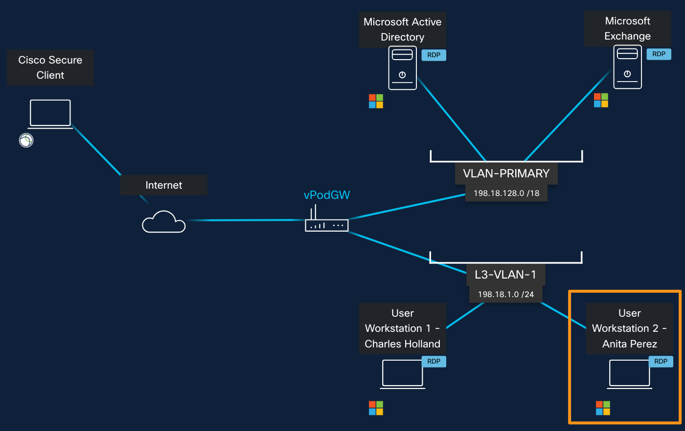{ loading=lazy }

    /// caption
    The dCloud lab topology. User Workstation 2 (Anita Perez) is highlighted.
    ///

5. Click the **User Workstation 2** icon on the topology page. The **Info** fly-out opens on the left with Workstation 2 details. Expand the **Remote Access** section to see Workstation 2's **IP address**, **username**, and **password**, as shown below.

    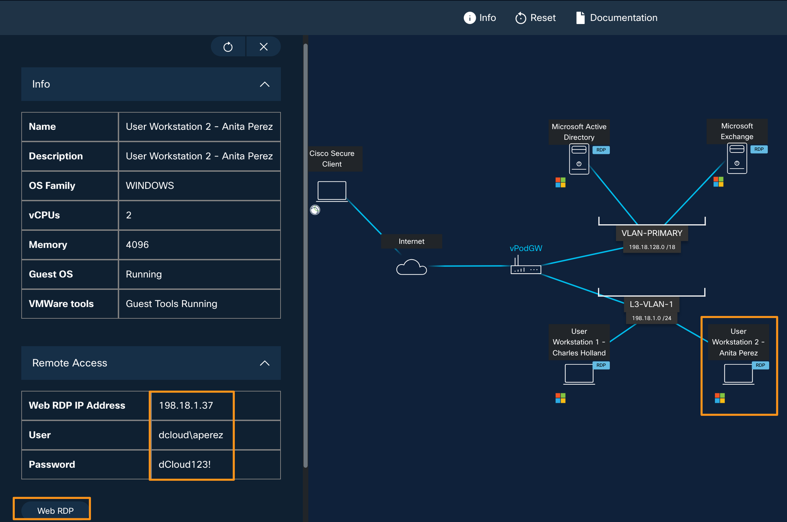{ loading=lazy }

    /// caption
    Info fly-out for User Workstation 2, with its Remote Access details.
    ///

6. Similarly, you can click any other virtual machine on the topology page to see its details.

In this lab you will sign in to the Webex clients as two users, **Charles Holland** and **Anita Perez**, to complete all the modules. Some modules need a working microphone. So **Charles Holland** uses the **attendee workstation** (the physical laptop in front of you), where the microphone is available. **Anita Perez** signs in on **User Workstation 2** (a virtual workstation reached over remote desktop) in the demo.

### Accessing Anita Perez's workstation (Workstation 2) { #access-wkst2 data-toc-label="Anita's workstation" }

1. You will access **User Workstation 2** (through **WebRDP**) for user Anita Perez, and sign in to the Webex App and Control Hub from that workstation whenever you are working as Anita.
2. To access Workstation 2 over **WebRDP**, click the **Workstation 2** icon on the topology page. When the fly-out opens on the left, click **Remote Access > Web RDP**. A new browser tab opens and connects you to **Workstation 2**.

    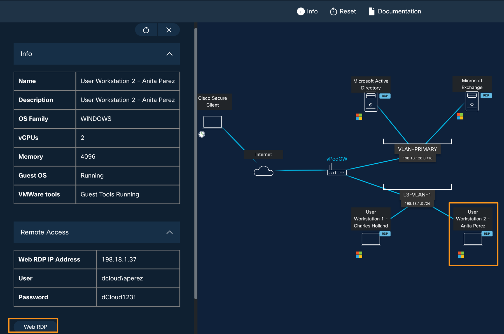{ loading=lazy }

    /// caption
    Remote Access > Web RDP opens Workstation 2 in a new browser tab.
    ///

3. Once you are connected to Workstation 2, you will see a text file called `Session_Info.txt` on the desktop. Open it and keep it handy. It contains all the credentials you need to complete this lab, such as for Control Hub and the Webex App.

    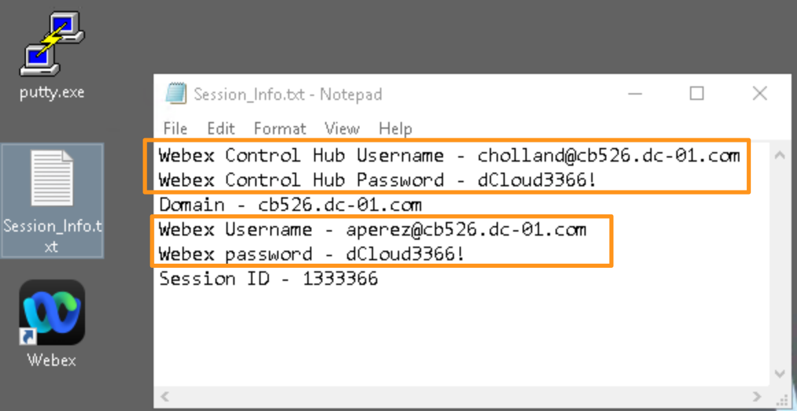{ loading=lazy }

    /// caption
    Session_Info.txt on the Workstation 2 desktop.
    ///

4. While you are on **Anita Perez's** workstation, copy the credentials from `Session_Info.txt`. You only need the **Collaboration Control Hub Username**, **Collaboration Control Hub Password** and **Domain**. For **Charles Holland**, the **Collaboration Control Hub** and **Webex App** credentials are the same. We will save these credentials on the physical/attendee workstation for easier access.

    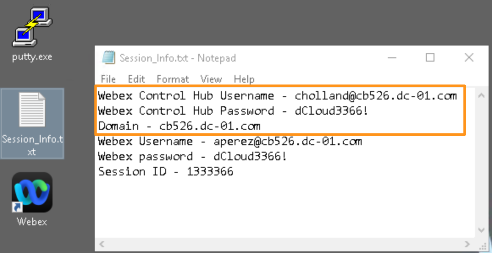{ loading=lazy }

    /// caption
    Copy the Control Hub username, password and domain.
    ///

    !!! tip "Tip: save them in the Notes panel"
        Once you have copied the credentials, you can also paste them into this guide's **Notes** panel (the **NOTES** button in the bottom-right corner) for easy access as you work through the lab.

5. Now, on the physical/attendee workstation, open a text editor, paste the copied credentials, and save the file with any name, for example `Session_Info.txt`.

<p class="eyebrow">Module 1 · ≈ 30 min</p>

## Set up your lab environment { #module-1 data-toc-label="Module 1 · Lab setup" }

Before you can experience the transformative power of AI-driven collaboration, administrators must first lay the groundwork. This module focuses on the essential steps:

- Activating and configuring the **Cisco AI Assistant** and its associated features within **Collaboration Control Hub**
- The **AI Assistant** in Control Hub
- Ordering phone numbers (DIDs) for users with the **Cisco Calling Plan** in Collaboration Control Hub
- Assigning a **Webex Calling license** and a phone number to users
- Signing in to the **Webex** clients

<p class="eyebrow sub">Module 1a · ≈ 5 min</p>

### Activating and configuring the Cisco AI Assistant and its associated features within Collaboration Control Hub { #module-1a data-toc-label="1a · Activate AI features" data-task="1a" }

Collaboration Control Hub is the central command center for **Webex AI**. As an administrator, you decide which AI capabilities are enabled, so they align with your organization's policies while maximizing productivity. In this module, you will learn how to navigate the AI settings to enable the suite-wide features that power the rest of this lab.

1. Open a new browser tab on your physical/attendee workstation and go to [https://admin.webex.com](https://admin.webex.com){:target="_blank" rel="noopener"}.
2. Log in to Collaboration Control Hub with the **Charles Holland** credentials. These are the credentials you saved on the physical/attendee workstation in the previous section. Refer to the screenshot below.

    !!! warning "Very important"
        Every session/pod has its own credentials. The screenshot below is for **reference** only. Use the credentials from your own session/pod.

    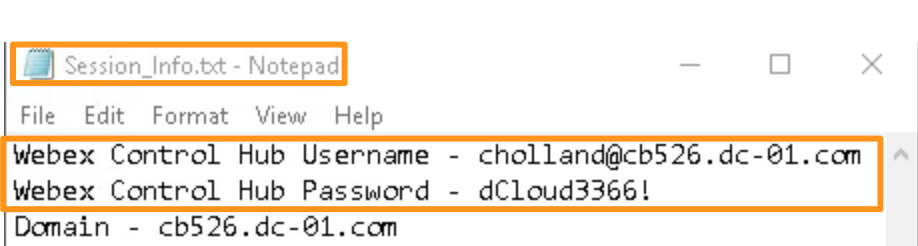{ loading=lazy }

    /// caption
    Example Session_Info.txt. Use the Control Hub credentials from your own pod.
    ///

3. For security reasons, **Collaboration Control Hub** signs you out after 20 minutes of inactivity by default. For this lab, make the idle timeout longer so Control Hub doesn't keep signing you out. Go to **MANAGEMENT > Organization Settings > Control Hub's idle timeout**. Open the **Control Hub idle timeout** drop-down, select **12 hours** or **No timeout**, and click **Save**.

    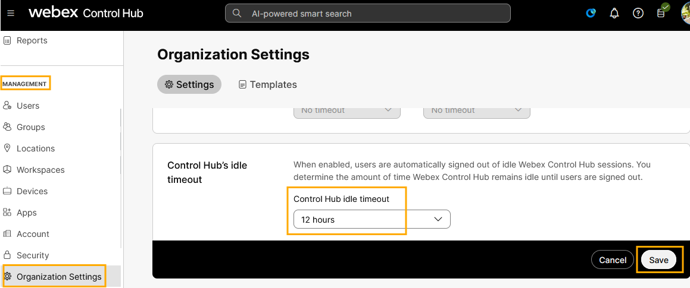{ loading=lazy }

    /// caption
    Organization Settings: set Control Hub's idle timeout to 12 hours.
    ///

4. Next, turn on AI features, including the Cisco AI Assistant, for your pod's Webex tenant. Still on the **Organization Settings** page, scroll down to **Cisco AI Assistant & AI features** and click **Customize AI Assistant & AI features**, as shown below.

    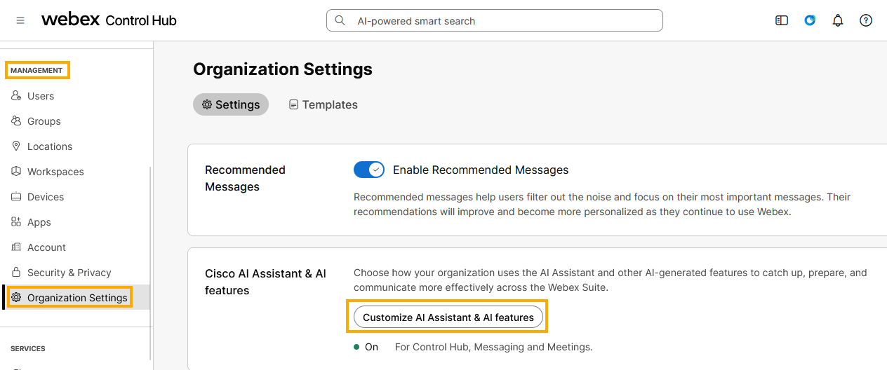{ loading=lazy }

    /// caption
    Cisco AI Assistant & AI features: Customize AI Assistant & AI features.
    ///

5. Make sure all the toggles are turned **ON** except **AI Assistant Integrations**, **External sources (General AI Settings)** and **AI Assistant workflow automations**.

    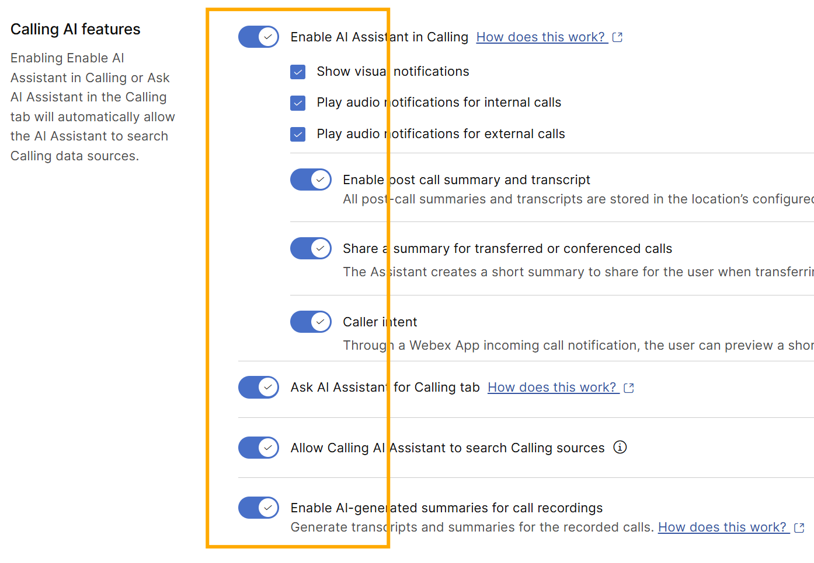{ loading=lazy }

    /// caption
    Calling AI features: all toggles on.
    ///

    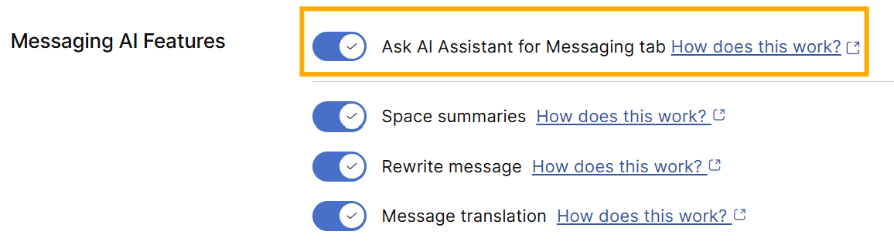{ loading=lazy }

    /// caption
    Messaging AI features: all toggles on.
    ///

    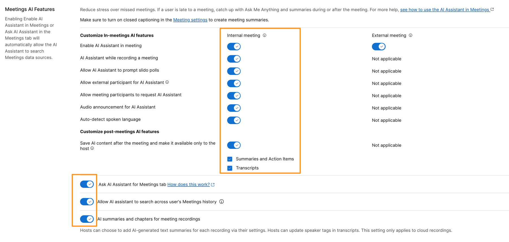{ loading=lazy }

    /// caption
    Meetings AI features: all toggles on.
    ///

    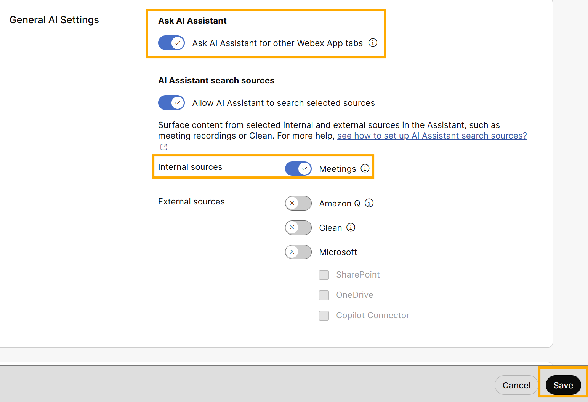{ loading=lazy }

    /// caption
    General AI settings: leave the external sources off, then click Save.
    ///

6. Click **Save** at the bottom right to save these settings. If you skip this step, none of the AI features you just turned on are applied.

7. This completes **Activating and configuring the Cisco AI Assistant and its associated features within Collaboration Control Hub**.

!!! note "AI Assistant Integrations"
    This lab does not use the external **AI Assistant Integrations**, such as **Amazon Q**, **Glean** or **Jira**, so you can leave them turned off. You are welcome to explore them on your own, but no lab task depends on them and leaving them off has no impact on the rest of the lab.

<p class="eyebrow sub">Module 1b · ≈ 5 min</p>

### AI Assistant in Control Hub { #module-1b data-toc-label="1b · AI Assistant in Control Hub" data-task="1b" }

One of the toggles you enabled in the previous module is called **Allow the Assistant in Control Hub**.

This AI Assistant lets you ask **"how can I…"** questions about setting up and configuring the **Webex Suite**.

You can also see your previous conversation history, play it back, and ask follow-up questions, while keeping the full context of your previous interactions.

The Cisco AI Assistant in Control Hub can answer questions about the **Webex Suite**, which includes products such as **Messaging**, **Meetings**, **Calling**, and **Contact Center**. The AI Assistant searches all of the Webex help pages to give you an accurate answer.

Let's quickly explore how to use this AI Assistant in Collaboration Control Hub.

1. Continuing on the physical/attendee workstation, go to the browser tab where you are logged in to **Collaboration Control Hub**.
2. Click **AI Assistant** { .icon } toward the top-right corner.

    !!! note "Note"
        You might see an **Add context** option above the question box. Don't worry about it for now: just run the example in the next step. We will look at **Add context** in the next steps.

        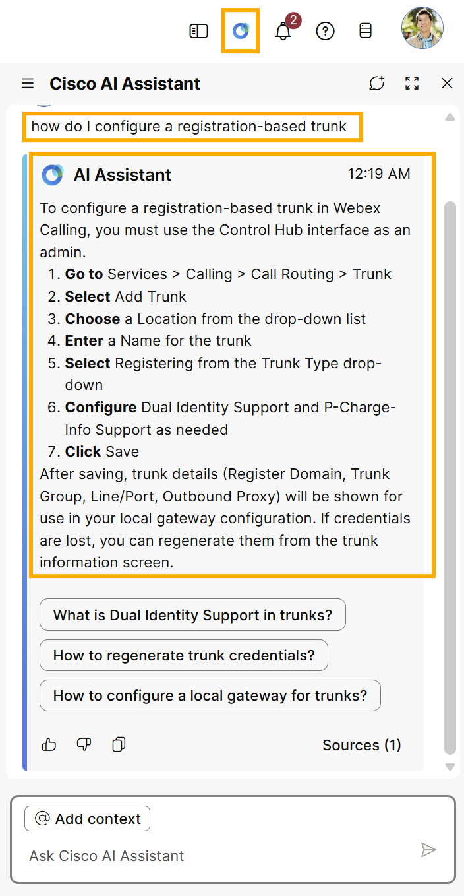{ loading=lazy }

        /// caption
        The Add context option in the AI Assistant question box.
        ///

3. The **AI Assistant** fly-out opens on the right. Ask any Collaboration Control Hub question, for example: **how do I configure a registration-based trunk?**

    { loading=lazy }

    /// caption
    Asking the Control Hub AI Assistant how to configure a registration-based trunk.
    ///

4. Now let's try **Add context**. With context, you can ask questions about specific data, explore reports, diagnose workspaces, and investigate issues across technology domains. This reduces the effort it takes to move from question to insight, and from issue to action. Click **Add context** above the question box to see the options: **Data**, **Reports** and **Workspaces**.

    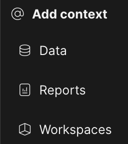{ loading=lazy }

    /// caption
    Add context options: Data, Reports and Workspaces.
    ///

5. Select **Workspaces** as the context, then ask: **show me my workspaces**. The AI Assistant lists the workspaces in your organization.

    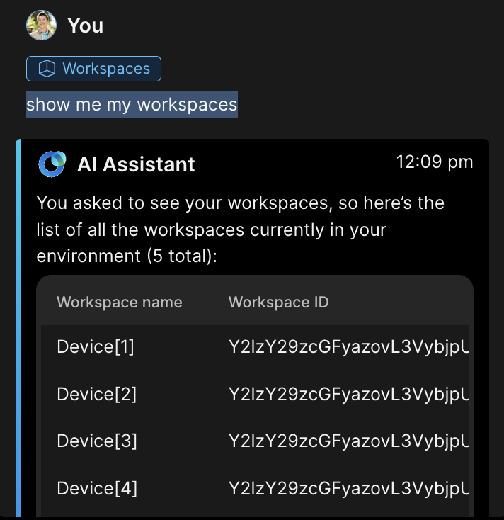{ loading=lazy }

    /// caption
    Workspaces selected as context: asking the AI Assistant to show my workspaces.
    ///

    !!! note "Note"
        The workspaces in your lab pod are placeholder workspaces created for this session, not real devices in use. Some responses, such as status or usage details, may be limited or look generic. Keep this in mind as you explore.

6. Once you get a response, ask a follow-up question about one of the workspaces, for example: **tell me more about Device[1]**. This is **contextual Q&A with recall**: the AI Assistant keeps the context from your earlier questions, so you can follow up naturally without repeating details or starting your search over.

7. Feel free to ask more questions. When you're done, move on to the next module.

<p class="eyebrow sub">Module 1c · ≈ 10 min</p>

### Ordering phone numbers (DIDs) for users using Cisco Calling Plan on Collaboration Control Hub { #module-1c data-toc-label="1c · Order phone numbers" data-task="1c" }

!!! note "Note"
    Your lab pod runs in **Cisco dCloud**. The steps and screenshots in this module come from a pod in a **US data center**, so they show US states, area codes and **+1** numbers. Apart from the phone numbers themselves, the process and configuration are exactly the same wherever you are.

    Depending on your region, some resources, such as available phone numbers, may occasionally be limited. If something doesn't match what you expect, check with your proctor.

In this module you will order new DID numbers with **Cisco Calling Plan**, and then assign one of them as the **Main number** for the location in Control Hub.

In customer environments that already have a PSTN provider and DID numbers, you can import all your DID numbers into Control Hub and assign them as the Main number and/or to any user for Webex Calling.

1. Continuing on the physical/attendee workstation, go back to the browser where you are logged in to **Collaboration Control Hub**.
2. In Collaboration Control Hub, navigate to **SERVICES > PSTN & Routing**. Open the **Manage** drop-down and choose **Add**.

    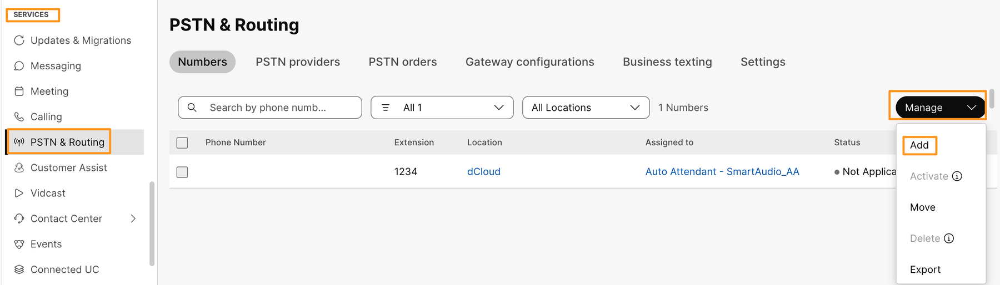{ loading=lazy }

    /// caption
    PSTN & Routing > Manage > Add.
    ///

    !!! note "Note"
        If you don't see the **Add** option under the **Manage** drop-down, click **Add a number** instead.

3. On the **Add Numbers** page, open the **Location** drop-down and choose **dCloud**. Because you are setting up this location for the first time, you first need to select its PSTN connection. Click **Edit PSTN**.

    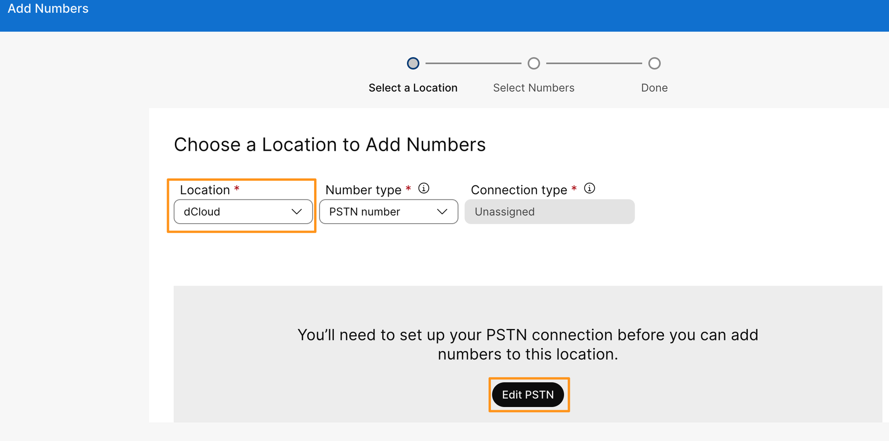{ loading=lazy }

    /// caption
    Add Numbers: choose the dCloud location, then click Edit PSTN.
    ///

4. The **Edit PSTN connection for dCloud** (location) page opens. Choose **Cisco Calling Plans** as the connection type and click **Next**.

    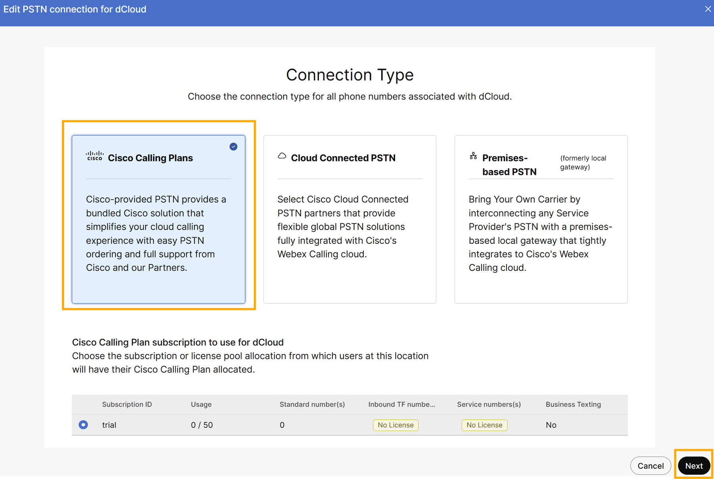{ loading=lazy }

    /// caption
    Connection type: Cisco Calling Plans.
    ///

5. On the next page, fill in the **Contract Information** with the details below, then click **Next**.
    1. **Company Name:** keep the value shown by default.
    2. **First Name:** Charles
    3. **Last Name:** Holland
    4. **Email Address:** `cholland@cbXXX.dc-YY.com`, where `XXX` and `YY` are specific to your pod, as explained in Module 1a.
    5. **Confirm Email Address:** `cholland@cbXXX.dc-YY.com`, where `XXX` and `YY` are specific to your pod, as explained in Module 1a.
    6. **Billing Telephone Number:** leave blank.

    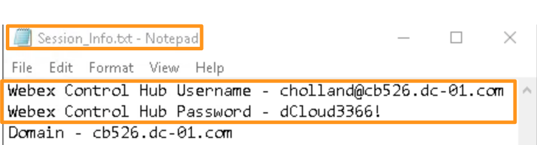{ loading=lazy }

    /// caption
    Your pod's domain (cbXXX.dc-YY.com) is in Session_Info.txt.
    ///

    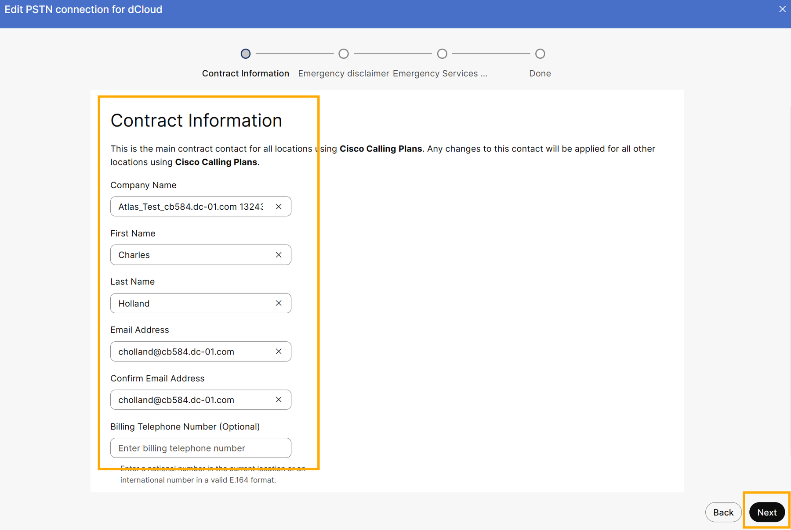{ loading=lazy }

    /// caption
    Contract information for Charles Holland.
    ///

6. If a pop-up asks you to confirm the **Contract Information Update**, click **Yes, Change**.

    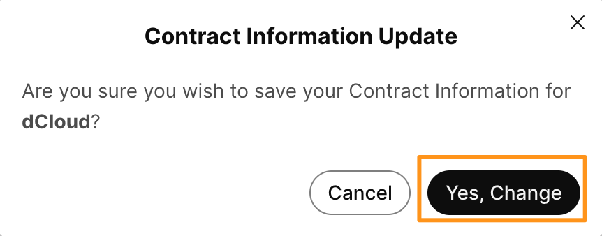{ loading=lazy }

    /// caption
    Confirm the contract information update.
    ///

7. The **Emergency Disclaimer** page opens. Scroll all the way down the contract agreement, fill in the following information, and click **Agree and Continue**.
    1. **Authorized Contact:** Charles Holland
    2. **Job Title:** Engineer

    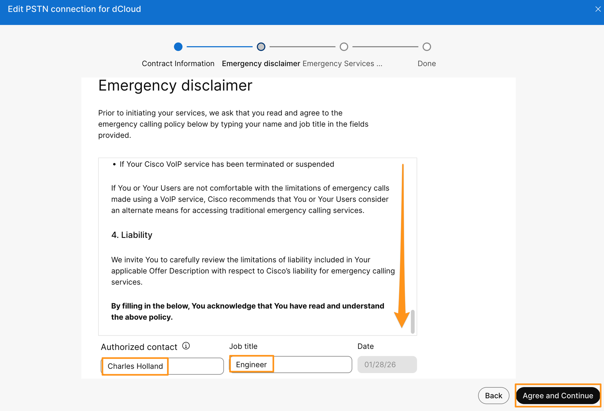{ loading=lazy }

    /// caption
    Emergency disclaimer: authorized contact and job title.
    ///

8. On the next page, in the **Emergency Services Address** window, leave all fields at their defaults and click **Save**.

    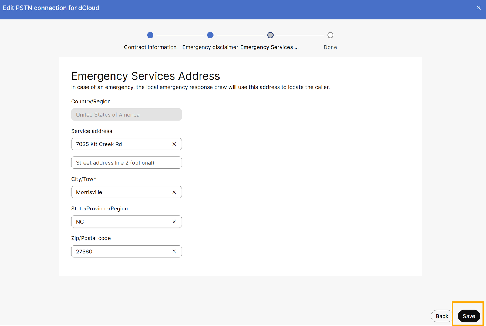{ loading=lazy }

    /// caption
    Emergency services address: keep the defaults and click Save.
    ///

9. In the **PSTN connection saved** window, click **Add numbers**.

    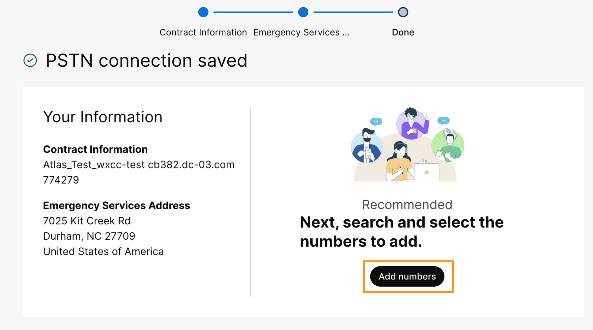{ loading=lazy }

    /// caption
    PSTN connection saved: click Add numbers.
    ///

10. In the **Choose a Location to Add Numbers** window, make sure the location is **dCloud** and the number type is **PSTN number**. Keep **Order New Numbers** selected and click **Next**.

    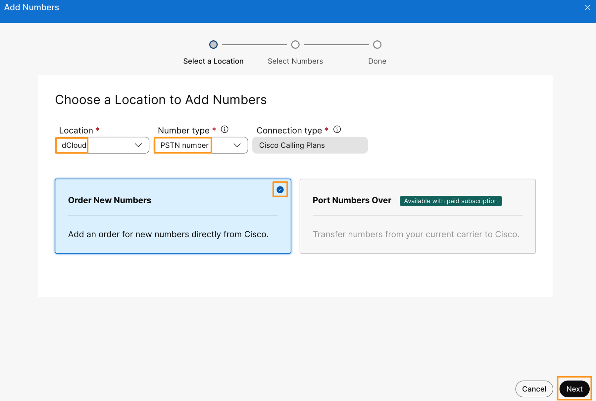{ loading=lazy }

    /// caption
    Location dCloud, number type PSTN number, Order New Numbers.
    ///

11. On the **Specify the numbers you want to order** page, select any state from the **State/Province/Region** drop-down.
12. For **Search by**, keep **Area Code** selected.
13. From the **Area Code** drop-down, select any available area code.
14. In the **How many numbers do you want auto-selected for you?** field, enter **3** and click **Search**.

    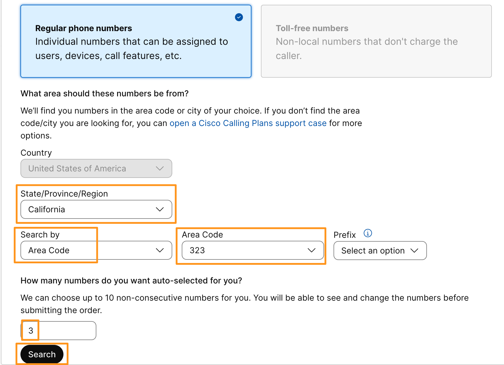{ loading=lazy }

    /// caption
    Search by state and area code, with 3 numbers auto-selected.
    ///

15. Three available numbers are selected for you. Click **Order**.

    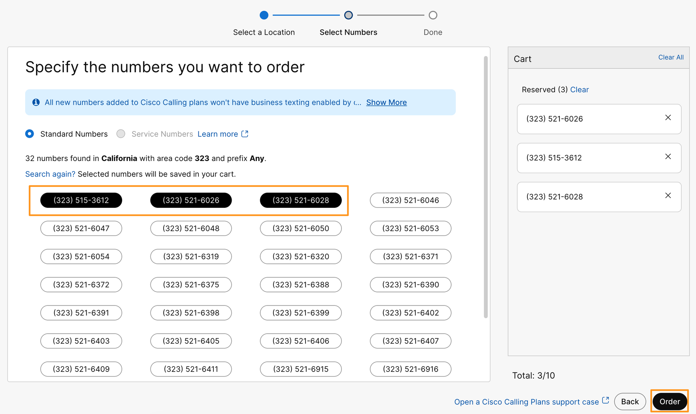{ loading=lazy }

    /// caption
    Three numbers reserved in the cart. Click Order.
    ///

16. Click **View Orders**. You're taken to the **PSTN orders** tab of the **PSTN & Routing** page. Verify that the order status is now **Pending**.

    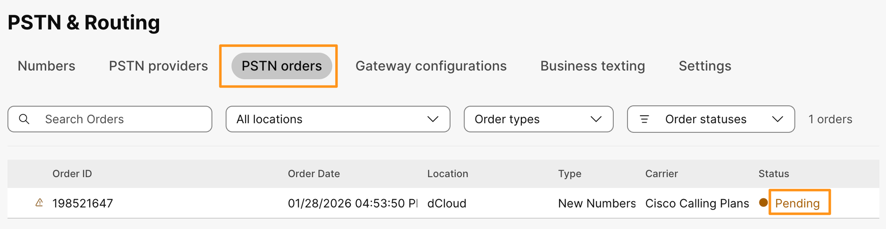{ loading=lazy }

    /// caption
    PSTN orders tab: the order status is Pending.
    ///

17. Click the order to open a fly-out on the right. In the fly-out, verify that the order status is **Provisioned**, then close the fly-out (x).

    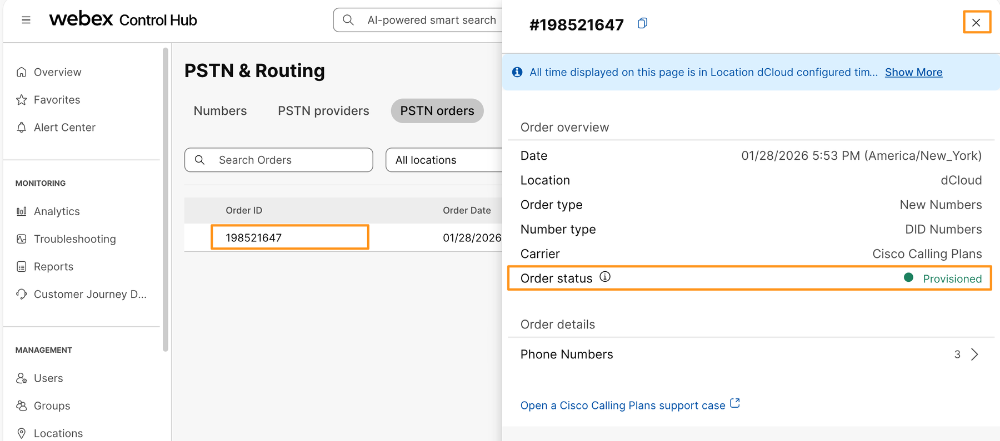{ loading=lazy }

    /// caption
    Order details fly-out: the order status is Provisioned.
    ///

18. That completes ordering the phone numbers. Now assign one of them to the location as the **Main number**. Navigate to **MANAGEMENT > Locations** and select the **dCloud** location.
19. On the **dCloud** location page, go to the **PSTN** tab.
20. In the **PSTN Configuration** section, open the **Main number** drop-down, choose any of the available numbers, and click **Save**.

    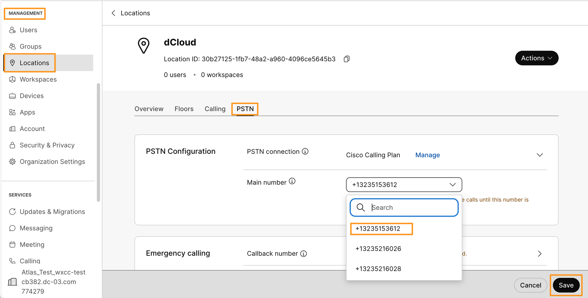{ loading=lazy }

    /// caption
    dCloud location > PSTN tab: set the Main number.
    ///

21. The other two numbers will be assigned to the Webex users **Charles Holland** and **Anita Perez** in a later module, for the rest of the lab.
22. This completes **Ordering phone numbers (DIDs) for users using Cisco Calling Plan on Collaboration Control Hub**.

<p class="eyebrow sub">Module 1d · ≈ 5 min</p>

### Assigning Webex Calling license and phone number to users { #module-1d data-toc-label="1d · Assign licenses & numbers" data-task="1d" }

#### Webex Calling licenses

Webex Calling is available through the Cisco Collaboration Flex Plan. You must purchase an Enterprise Agreement (EA) plan or a Named User (NU) plan.

Webex Calling provides three license types:

- **Professional:** These licenses provide a full feature set for your entire organization. This offer includes unified communications (Webex Calling), mobility (desktop and mobile clients with support for multiple devices), team collaboration in the Webex App, and the option to bundle meetings with up to 1000 participants per meeting.
- **Standard:** Designed for users who need standard calling on a single device. This license lets users use either one hardware device (for example, an IP phone) or soft clients (mobile, desktop, or tablet) across platforms. It includes essential features like voicemail and hot desking profiles, but it doesn't support advanced functionality such as virtual lines, Voice Queues agent configuration, or Microsoft Teams calling integration.
- **Workspaces** (also known as Common Area): Choose this option if you're looking for a basic dial tone with a limited set of calling features, appropriate for areas such as break rooms, lobbies, and conference rooms.

In this lab, we will explore the **Professional** license option only.

#### Steps

1. Continuing on the physical/attendee workstation, go back to the browser where you are logged in to Collaboration Control Hub.
2. Go to **MANAGEMENT > Users**.
3. Select the user **Charles Holland** from the list of users.
4. On the user **Summary** page, scroll down and click **Edit Licenses**.
5. On the next page, go to the **Calling** tab and check **Webex Calling** and **Professional**. Click **Save**.

    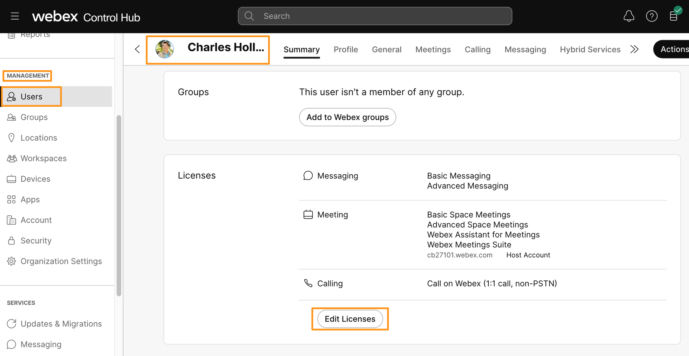{ loading=lazy }

    /// caption
    Charles Holland > Summary > Edit Licenses.
    ///

    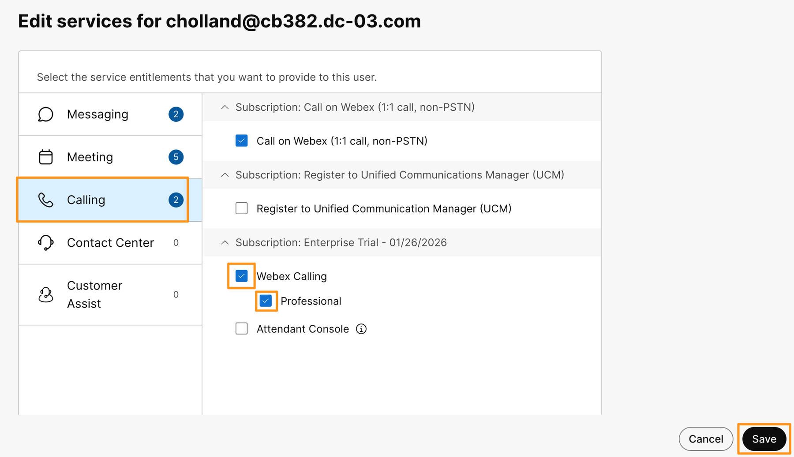{ loading=lazy }

    /// caption
    Calling tab: Webex Calling with a Professional license.
    ///

6. On the **Calling Configuration – Assign numbers** page, open the **Location** drop-down and choose **dCloud**. Then open the **Phone Number** drop-down and choose one of the available phone numbers **other than** the location's **Main number**. For **Extension**, enter the last 4 digits of the phone number assigned to the user. Click **Save**.

    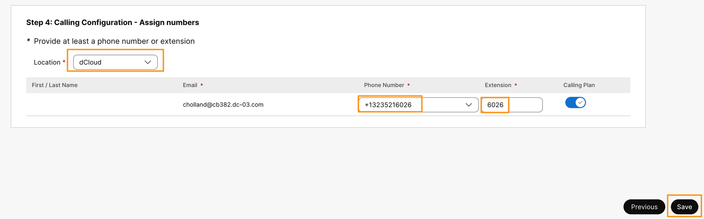{ loading=lazy }

    /// caption
    Assign a phone number and extension in the dCloud location.
    ///

7. The **Webex Calling Professional** license is assigned, and a summary of all the licenses currently assigned to **Charles Holland** is shown. Click **Close**.
8. Repeat steps 1 through 6 to assign a **Webex Calling Professional** license, **phone number** and **extension** to **Anita Perez** as well. Make sure you assign a number other than the location's Main number.
9. Write down the phone numbers assigned to **Charles Holland** and **Anita Perez** (the **Notes** panel works well for this). You will use those numbers to make outbound calls in later modules.

You have now successfully assigned a **Webex Calling** license and a phone number to the users **Charles Holland** and **Anita Perez**.

<p class="eyebrow sub">Module 1e · ≈ 5 min</p>

### Login to Webex clients { #module-1e data-toc-label="1e · Sign in to Webex" data-task="1e" }

You're almost done setting up the lab environment and ready to explore the AI features. As a last step, sign in to the Webex clients and have them ready.

!!! note "Which user goes where"
    Sign in as **Charles Holland** on your own laptop, because it has a microphone. Make sure the Webex App is installed and sign in to it as **Charles Holland**. Use the Webex desktop App, not Webex in a browser: the **Cisco AI Assistant** features in this lab are only available in the app.

    Sign in as **Anita Perez** in the Webex App on Workstation 2 (WKST 2), which you reach over WebRDP. **The Webex App in WebRDP has no microphone.** So for every call where you need to speak, you will speak as **Charles Holland** from your own laptop.

1. Continuing on the physical/attendee workstation (your own laptop), minimize the browser and launch the Webex App. Click **Agree** on the **IMPORTANT NOTICES AND DISCLAIMERS** pop-up.
2. Click **Sign in** and use the **Charles Holland** credentials from `Session_Info.txt` on your physical/attendee workstation.

    { loading=lazy }

    /// caption
    Charles Holland's credentials in Session_Info.txt.
    ///

    !!! note "Note"
        The credentials in the image above are for reference only. Your credentials will be different: enter the ones from the `Session_Info.txt` of the session assigned to you.

3. Once you're signed in, a pop-up about **Emergency Calling Notification** appears. Click **OK**. Webex is now signed in and ready to use on the physical/attendee workstation.

    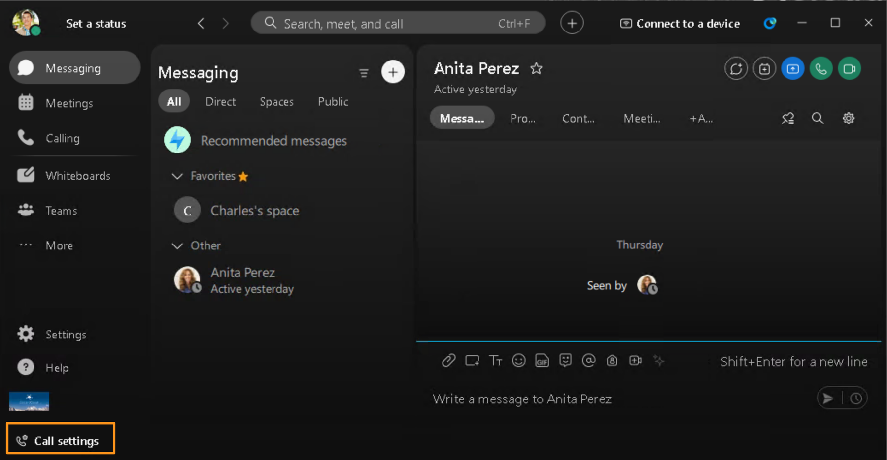{ loading=lazy }

    /// caption
    Charles Holland signed in to the Webex App.
    ///

4. Now access Workstation 2 (WKST 2) over WebRDP. If the WebRDP tab for WKST 2 is still open in your browser, switch to it. If you closed it, open a new browser tab, go back to your dCloud session, and open **Remote Access > Web RDP** for Workstation 2 again, as described in [Accessing Anita Perez's workstation](#access-wkst2). Launch the Webex App on WKST 2 and sign in as Anita Perez, using the **Anita Perez** credentials from `Session_Info.txt` on the WKST 2 desktop. Refer to the screenshot below.

    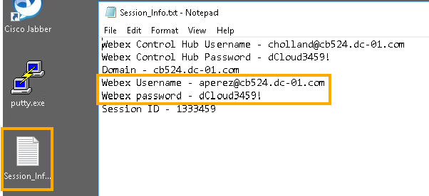{ loading=lazy }

    /// caption
    Anita Perez's Webex credentials in Session_Info.txt on WKST 2.
    ///

5. Before you continue, make sure both your Webex clients are signed in: **Charles Holland** and **Anita Perez**.

<p class="eyebrow">Module 2 · ≈ 20 min</p>

## Enhancing Messaging with Webex AI { #module-2 data-toc-label="Module 2 · Messaging AI" }

In this module you'll use the Cisco AI Assistant in Webex Messaging to ask questions about a space, summarize conversations, rewrite messages, and translate them in real time.

<p class="eyebrow sub">Module 2a · ≈ 5 min</p>

### Ask Me Anything: AI Assistant for Messaging { #module-2a data-toc-label="2a · Ask Me Anything" data-task="2a" }

The **Ask Me Anything** (AMA) feature in Webex Messaging is part of the **Cisco AI Assistant**. It helps users quickly find information in their conversation spaces. Users can ask questions about recent discussions, content, or context directly within a space. The questions you ask and the answers you get are visible only to you and aren't saved in the space.

!!! note
    The Webex App for **Charles Holland** on the physical/attendee workstation may already be preloaded with some chat. If not, have a short back-and-forth chat with Anita Perez (the Webex App on virtual Workstation 2).

    **Can't see the other user?** Before you start chatting, check that **Charles Holland** and **Anita Perez** can see each other in the Webex App:

    - In **Charles Holland's** Webex App, look for **Anita Perez** in your spaces list. If Anita isn't listed, use the search bar at the top to search for **Anita Perez** by name or email address, open a direct space, and send a first message.
    - In **Anita Perez's** Webex App, do the same for **Charles Holland**.

    Once each user can see the other, continue with the chat and the steps below.

1. Continuing on the physical/attendee workstation, bring up the Webex App (signed in as **Charles Holland**).
2. In the app header (top-right corner), click **AI Assistant** { .icon }. Then select a space from your spaces list.
3. In the Cisco AI Assistant panel, select:
    - **Ask AI Assistant.** Ask the AI Assistant questions to search for, or find out more about, conversations and content discussed in the space.
    - Answers come with highlighted citation links. Click one to go directly to the source message and get more detail.
    - Click **More** { .icon } and select **Copy** { .icon } to copy the answer and share it elsewhere.
    - Click **Stop generating** to cancel an AI Assistant reply.

    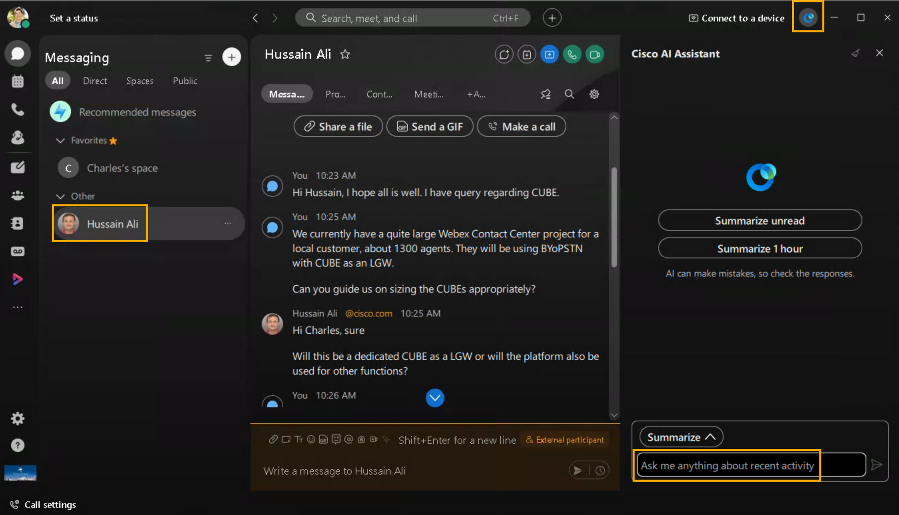{ loading=lazy }

    /// caption
    Open the Cisco AI Assistant from the app header while in a space.
    ///

    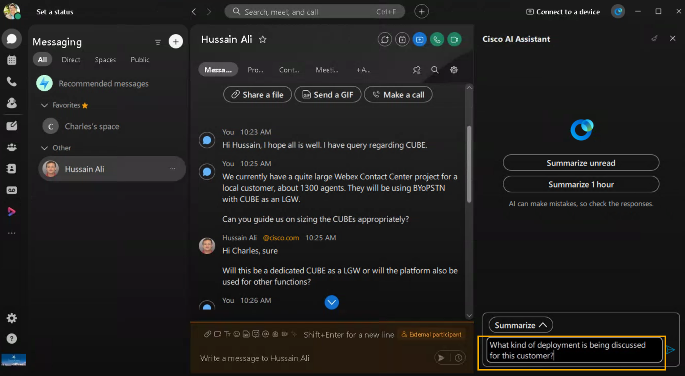{ loading=lazy }

    /// caption
    Ask a question about the space's recent activity.
    ///

    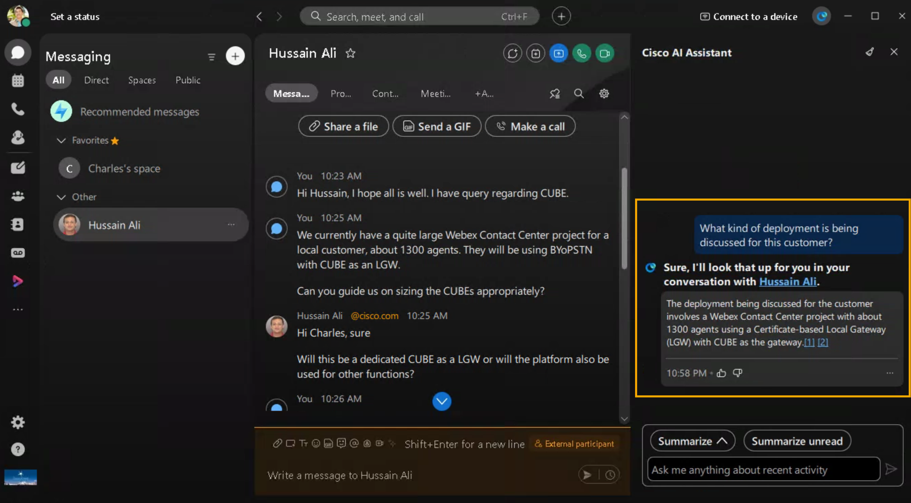{ loading=lazy }

    /// caption
    The answer, with citation links back to the source messages.
    ///

    !!! note "Note"
        The screenshots above are only an example. If your Webex App didn't have a preloaded chat and you started your own conversation, your space and messages will look different. You can ask the AI Assistant anything about what was discussed in the space, or ask it to summarize the conversation. Just make sure **Charles Holland** and **Anita Perez** have exchanged a few messages first, so the AI Assistant has something to work with.

<p class="eyebrow sub">Module 2b · ≈ 5 min</p>

### Space Summaries: Automated Conversation Overviews { #module-2b data-toc-label="2b · Space summaries" data-task="2b" }

When you're busy, or you've been away from the office, catching up with all your spaces can be hard. The AI Assistant can generate space summaries to help you quickly catch up on missed messages and conversations. Stay informed on decisions and key points, and get up to date with the discussion at a glance.

1. Continuing on the physical/attendee workstation, in the Cisco AI Assistant in Webex, click **Summarize** as shown below and select **1 hour** or **1 week**.

    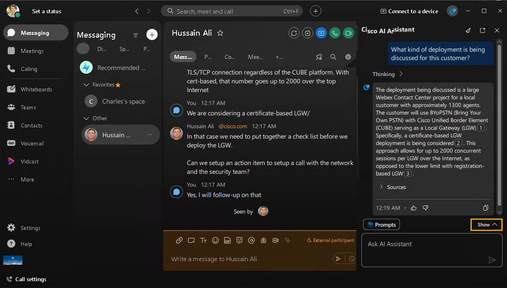{ loading=lazy }

    /// caption
    Open the prompts in the AI Assistant panel.
    ///

    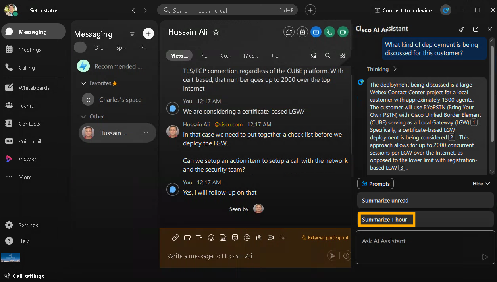{ loading=lazy }

    /// caption
    Choose Summarize 1 hour.
    ///

2. Your summary is displayed in the Cisco AI Assistant panel.

    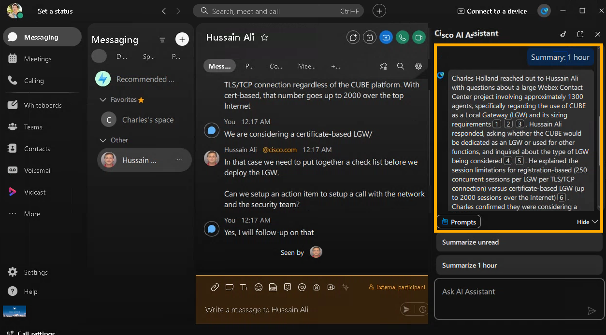{ loading=lazy }

    /// caption
    The space summary in the AI Assistant panel.
    ///

<p class="eyebrow sub">Module 2c · ≈ 5 min</p>

### Smart Rewrite: AI-Powered Message Refinement { #module-2c data-toc-label="2c · Smart rewrite" data-task="2c" }

Improve how you communicate and collaborate with your team using AI-powered message rewrites. The AI Assistant analyzes your message and offers options to adapt its style, tone, and content quality, so you communicate more effectively.

1. Continuing on the physical/attendee workstation in Webex, type a message in the chat window and click **Rewrite message** { .icon }. For example:

    ```text
    I want the call to happen asap
    ```

    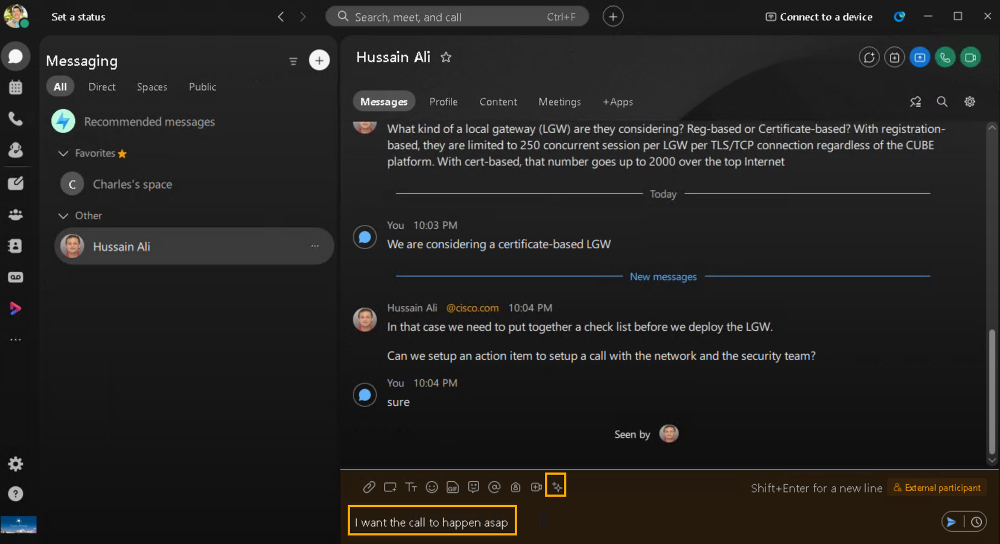{ loading=lazy }

    /// caption
    Type a message, then click Rewrite message.
    ///

    The AI Assistant analyzes your message and offers options to fix mistakes, improve spelling and grammar, update format and style, and change the tone of the message.

2. The **Rewrite message** pop-up opens. Choose any of the drop-down options to rewrite your message, then click **Apply** to generate a preview. Click { .icon } to generate more preview versions, and use the left and right arrows to move between versions. When you're happy with a new version, click **Update message**. To keep your original message instead, discard all changes by clicking **Cancel**. For now, keep the AI-generated message (with your chosen options) and press **Enter** to send it. See the screenshots below for an example.

    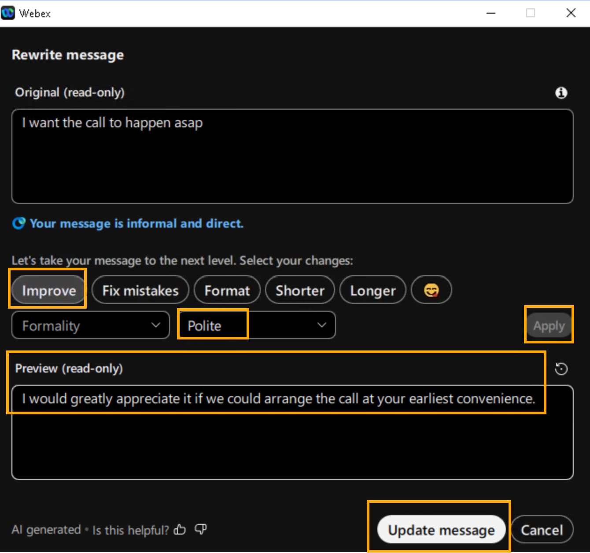{ loading=lazy }

    /// caption
    Rewrite options: pick a style and tone, click Apply, then Update message.
    ///

    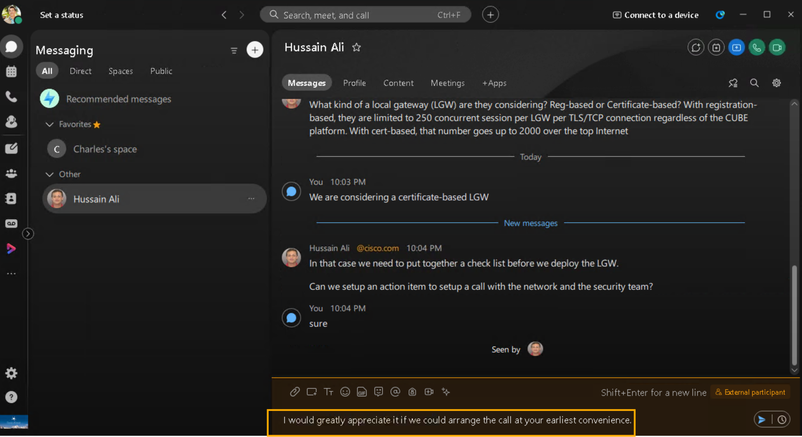{ loading=lazy }

    /// caption
    The rewritten message, ready to send.
    ///

<p class="eyebrow sub">Module 2d · ≈ 5 min</p>

### Real-Time Message Translation { #module-2d data-toc-label="2d · Real-time translation" data-task="2d" }

Communicate more effectively and break down language barriers in your direct or group spaces with the translation feature. Set your target language in your settings, then translate individual messages, or all messages in a direct or group space, in real time.

To translate messages in a space from any language into your language, first select your language in your settings.

1. Continuing on the physical/attendee workstation, in the Webex App click your **profile picture** (top-left corner) and go to **Settings**.

    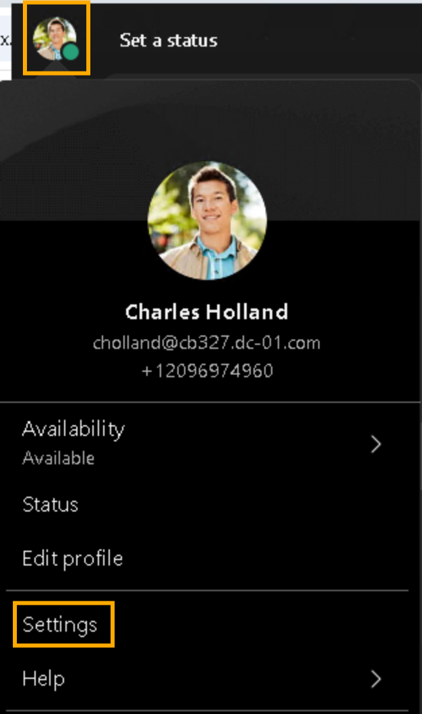{ loading=lazy }

    /// caption
    Profile picture > Settings.
    ///

2. The Webex **Settings** window opens. Select **General > Translation language**, choose your preferred translation language from the drop-down list, and click **Save**.

    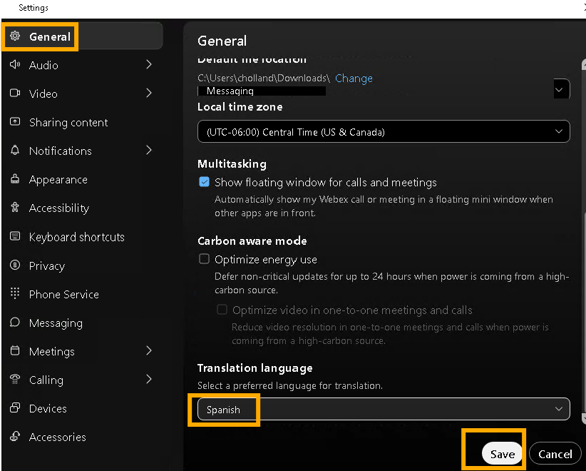{ loading=lazy }

    /// caption
    General > Translation language: choose a language and click Save.
    ///

3. Now you can either translate an **individual** message in a space into your selected language, or translate all the messages in a space by opening the **space settings menu** and selecting **Start live translation**. See the screenshots below for reference.

    !!! note "Note"
        To translate an individual message, first hover over or select the message, then click the **More** { .icon } (three dots) that appears next to it. The **Translate** option only shows up in that message menu.

    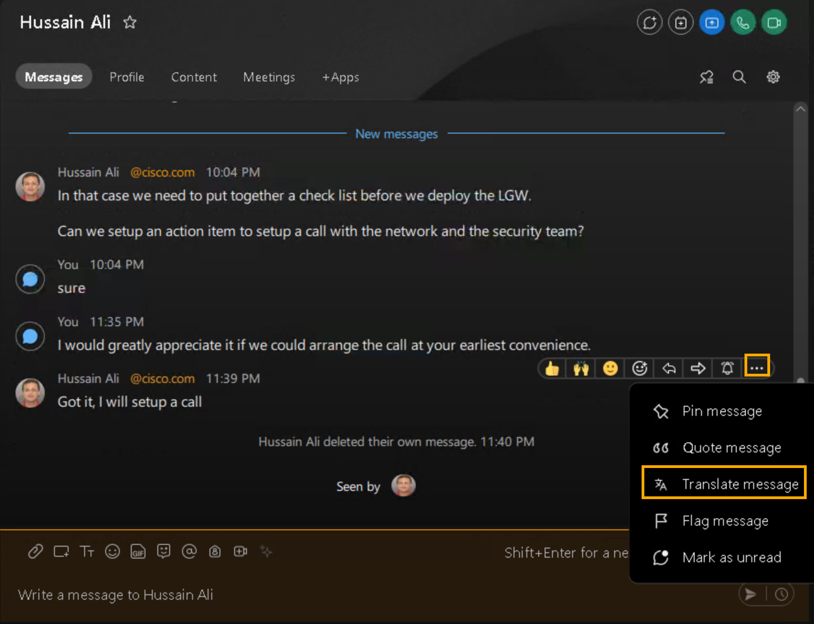{ loading=lazy }

    /// caption
    Translate a single message from its message menu.
    ///

    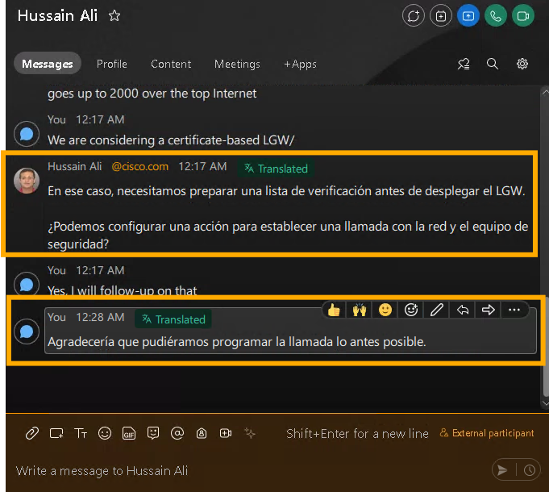{ loading=lazy }

    /// caption
    Individually translated messages.
    ///

    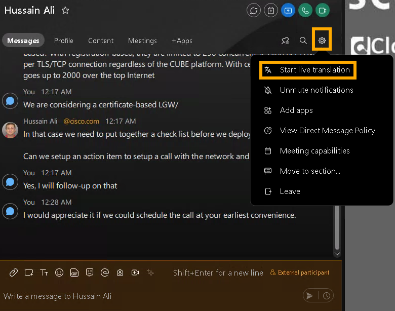{ loading=lazy }

    /// caption
    Space settings > Start live translation.
    ///

    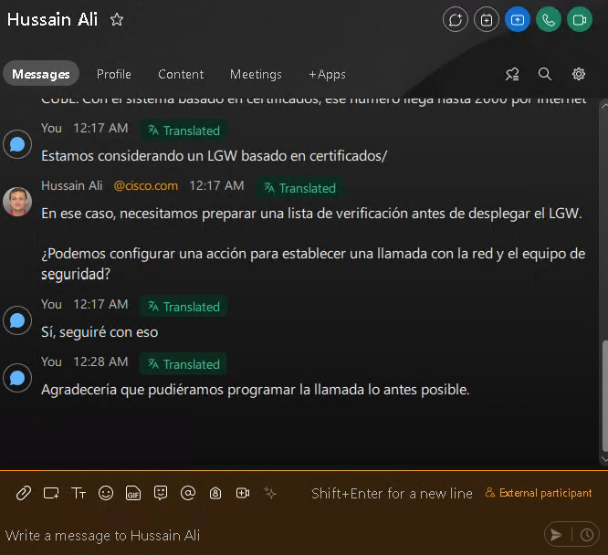{ loading=lazy }

    /// caption
    Live translation applied to every message in the space.
    ///

!!! note
    Live translation sometimes takes a few seconds, or a few messages, to start working.

This completes Module 2.

<p class="eyebrow">Module 3 · ≈ 25 min</p>

## AI-Powered Features in Webex Calling { #module-3 data-toc-label="Module 3 · Calling AI" }

In this module you'll hear what AI audio intelligence does on a live call, then turn on AI-generated closed captions, live transcripts and recording summaries for Webex Calling.

<p class="eyebrow sub">Module 3a · ≈ 10 min</p>

### AI Audio Intelligence in the Webex App { #module-3a data-toc-label="3a · AI audio intelligence" data-task="3a" }

Webex uses AI-powered audio intelligence to significantly improve call clarity. It removes background noise from both outgoing and incoming audio, and enhances narrowband audio into wideband for a richer, more natural sound. This smart audio processing reduces distractions and makes conversations clearer, even in noisy environments. Users can also adjust **AI noise removal** and **voice optimization** settings directly in the phone or Webex App for tailored audio quality. Together, these capabilities give you clearer communication and a better voice experience on every call.

The **Smart Audio** settings within the Webex App give you these **AI-powered audio intelligence** options:

**Microphone audio:** 4 options to enhance the audio from your microphone (what the remote party hears).

- **Noise removal (default):** Removes all noise detected on the Webex user's end of the conversation. Ideal for calls, meetings or webinars in a noisy environment.
- **Optimize for my voice:** Removes all noise and background voices. Ideal for calls, meetings or webinars in an open office space.
- **Optimize for all voices:** Removes all noise and enhances background voices. Ideal when collaborating with a group of people in a conference room.
- **Music mode:** Optimizes the audio for vocal and instrumental music. Ideal when original audio with music needs to be preserved.

**External audio:** 2 options to enhance incoming audio, especially when you hear noise.

- **Optimize for external party's voice (default):** Converts low-fidelity audio to high definition and removes background noise. Relevant non-speech sounds, such as tones and music on hold, are preserved. Useful when the external caller is in a noisy environment or the telephony network uses a narrowband codec.
- **Original:** Preserves all audio, including music and background noise.

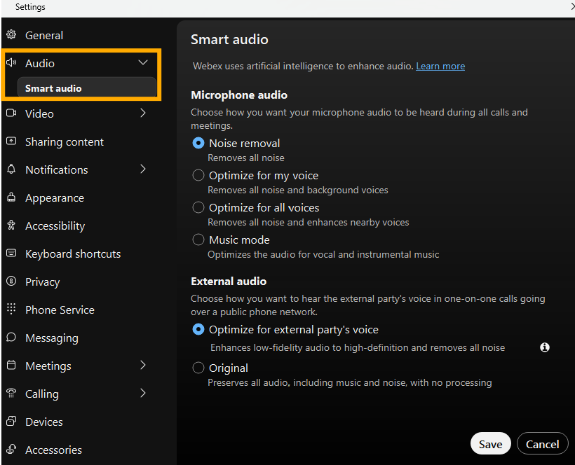{ loading=lazy }

/// caption
Smart audio settings: microphone and external audio options.
///

#### Microphone audio

First, explore **AI-powered audio intelligence** on the audio coming from the **Webex App's microphone** (what the remote/called party hears).

1. Continuing on the physical/attendee workstation, in Webex, click **Settings** (gear icon) in the left navigation pane, toward the bottom left.

    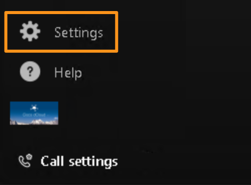{ loading=lazy }

    /// caption
    Settings (gear icon) at the bottom left of the Webex App.
    ///

2. The Webex **Settings** window opens. Select **Audio > Smart Audio** and go to **Microphone audio**.
3. Select **Music mode** and click **Save**.
4. Now, from the Webex App, call a mobile phone (it **must** be a US phone number). If you don't have a US phone number, ask one of the proctors; they will share a number you can call.

    **Or:** team up with the attendee next to you. Ask them to set **External audio** to **Original**, as shown below, and click **Save**.

    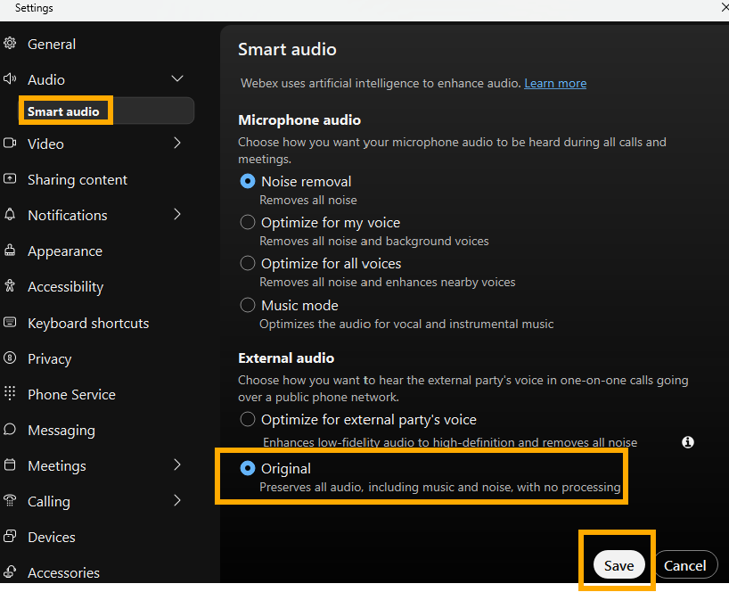{ loading=lazy }

    /// caption
    Your partner's setting: External audio > Original, then Save.
    ///

5. Answer the call on the mobile phone or on the other attendee's Webex App. Once the call is answered, mute the microphone on the mobile phone (or on the other attendee's Webex App).
6. Now, while talking into the Webex App you placed the call from, add some background noise, like snapping your fingers or tapping the table, and listen on the remote phone (the mobile phone or the other attendee's Webex App).
7. Notice that you hear both **your voice** and the **background noise** (snapping or tapping).
8. Still on the call, in your Webex App go to **Settings** (gear icon) **> Audio > Smart Audio > Microphone audio**, select **Noise removal**, and click **Save**.

    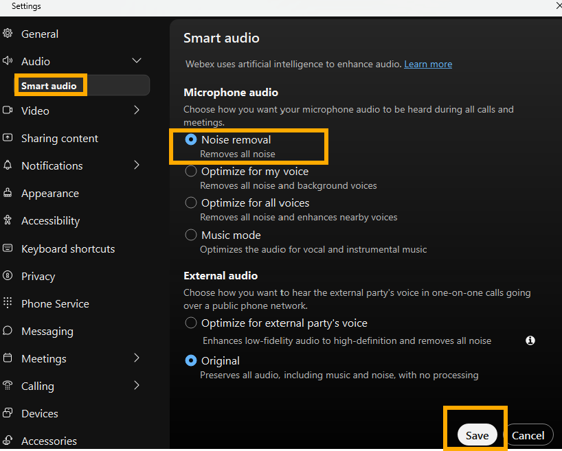{ loading=lazy }

    /// caption
    Microphone audio > Noise removal.
    ///

9. Talk into your Webex App again while adding background noise, like snapping your fingers or tapping the table, and listen on the remote phone.
10. Notice that you no longer hear the snapping or tapping on the remote phone. The Webex App uses **AI-powered audio intelligence** to remove that noise before sending the audio to the remote party.
11. Similarly, in your Webex App go to **Settings** (gear icon) **> Audio > Smart Audio > Microphone audio** and select **Optimize for my voice**.
12. Talk through your Webex App again, but this time have a proctor or another attendee say something while standing a little away from the microphone.
13. Notice that **AI-powered audio intelligence** optimizes the audio for **your voice** (closest to the microphone), and the remote party can't hear (or only partly hears) the other person talking.

    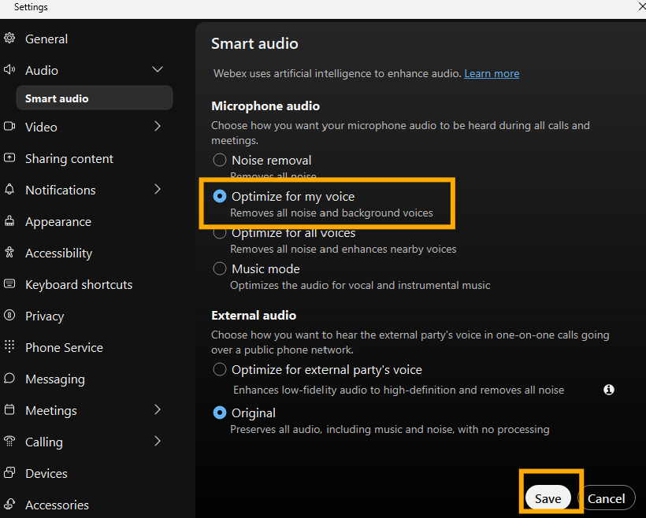{ loading=lazy }

    /// caption
    Microphone audio > Optimize for my voice.
    ///

14. Once you have explored all four options, hang up the call and thank your fellow attendee.

#### External audio

Now explore **AI-powered audio intelligence** on **External audio** (the audio coming from the remote/called party).

1. In the Webex App on the physical/attendee workstation, navigate to **Settings** (gear icon) **> Audio > Smart Audio > External audio**, select **Original**, and click **Save**.

    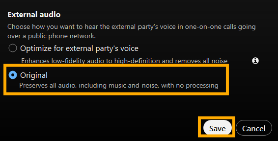{ loading=lazy }

    /// caption
    External audio > Original.
    ///

2. Now, from your Webex App, dial the extension of the pre-configured Auto Attendant, **1234**. When the call connects, notice the background noise in the audio, which sounds like an airport or a crowded place. Once you've heard the noise, hang up the call.

    !!! note
        The noisy audio is played by a pre-configured Auto Attendant. After the full recording plays, there is a brief silence before it plays again, three times in total. If you don't want to wait through the silence, just hang up and dial **1234** again.

3. Bring up the Webex **Settings** (gear icon) again, navigate to **Audio > Smart Audio > External audio**, select **Optimize for external party's voice**, and click **Save**.

    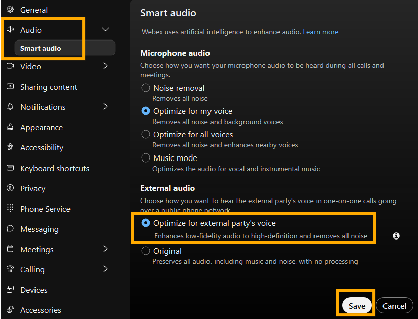{ loading=lazy }

    /// caption
    External audio > Optimize for external party's voice.
    ///

4. Dial the Auto Attendant **1234** from Webex again. Notice that **AI-powered audio intelligence** removes the **background noise** from the **external audio**, so you hear better than with the **Original** option. Switch between **Original** and **Optimize for external party's voice** a couple of times and listen to the difference in the incoming audio.

<p class="eyebrow sub">Module 3b · ≈ 5 min</p>

### AI-generated Closed Captions and Call Transcriptions { #module-3b data-toc-label="3b · Captions & transcripts setup" data-task="3b" }

Closed captions (CC) display the spoken content of a live call as text. Call transcription converts speech into written text in real time; it typically includes only the spoken words, not sounds or signals, and updates instantly as participants speak. Each user on a call can turn on call transcription independently, and it appears only for that user.

Closed captions and call transcription make live calls more accessible and inclusive for users who are hard of hearing. They also help users with different language proficiencies have more engaging and productive conversations.

Closed captions and call transcription can be enabled at:

- the user level,
- the location level, and
- the organization level.

In this lab, you will enable CC and call transcription for **the user Charles Holland** in your Webex org. Proceed as follows.

1. Continuing on the physical/attendee workstation, bring up the browser where you are logged in to **Collaboration Control Hub**.
2. In Collaboration Control Hub, navigate to **MANAGEMENT > Users**. Select the user **Charles Holland**, and on the user page go to the **Calling** tab.

    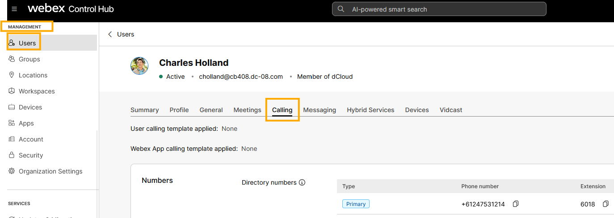{ loading=lazy }

    /// caption
    Control Hub > Users > Charles Holland > Calling.
    ///

3. On the **Calling** page, go to **User call experience > In-call feature access** and scroll to the **Captions for Webex Calling** section at the bottom of the page.

    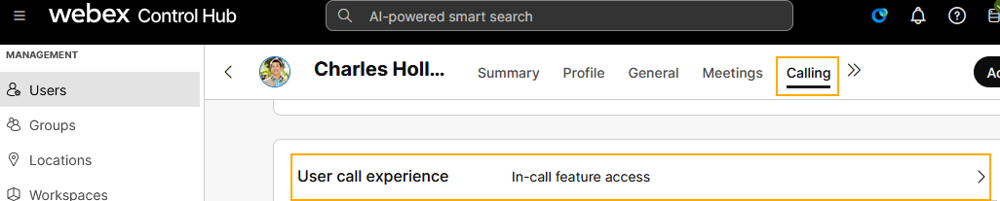{ loading=lazy }

    /// caption
    User call experience > In-call feature access.
    ///

4. Select **Use custom settings** and turn on both **Enable closed captions** and **Enable call transcripts**. Click **Save**, then click **Override** in the pop-up to confirm.

    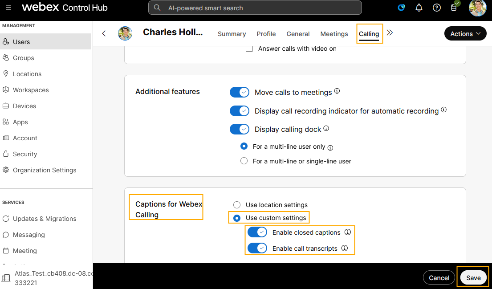{ loading=lazy }

    /// caption
    Captions for Webex Calling: custom settings with captions and transcripts on.
    ///

5. Now bring up the Webex App on the physical/attendee workstation (your own laptop).
6. Go to the **Calling** tab on the left and dial the Cisco TAC number: **+1 800 553 2447**.

    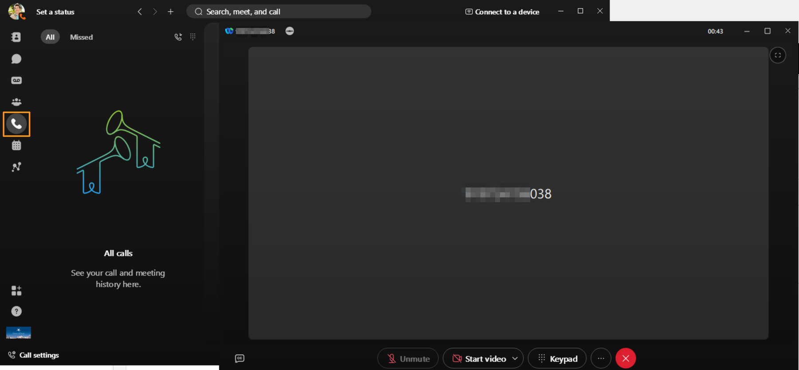{ loading=lazy }

    /// caption
    The Calling tab in the Webex App. Dial Cisco TAC.
    ///

7. The call is answered by an IVR. If you hear the IVR message, the call is connected. You don't need to make any selection in the IVR. Keep the call active and continue to the next module. **Do not** hang up.

<p class="eyebrow sub">Module 3c · ≈ 5 min</p>

### Test Closed Captions and AI generated call transcription { #module-3c data-toc-label="3c · Test captions & transcripts" data-task="3c" }

1. Make sure the call to Cisco TAC is still active. If it was disconnected, redial **+1 800 553 2447**.
2. In the call window, click **Closed Captions** { .icon } (toward the bottom left). Closed captions are displayed as shown below.

    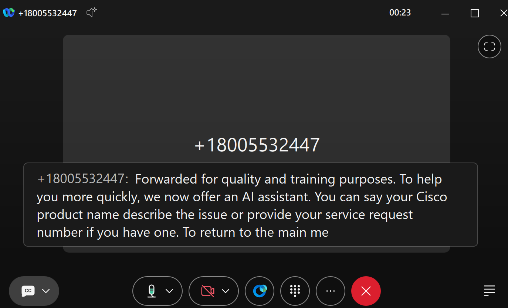{ loading=lazy }

    /// caption
    Live closed captions on the call.
    ///

3. Now click the **Transcript** option (toward the bottom-right corner) in the call window, as shown below.

    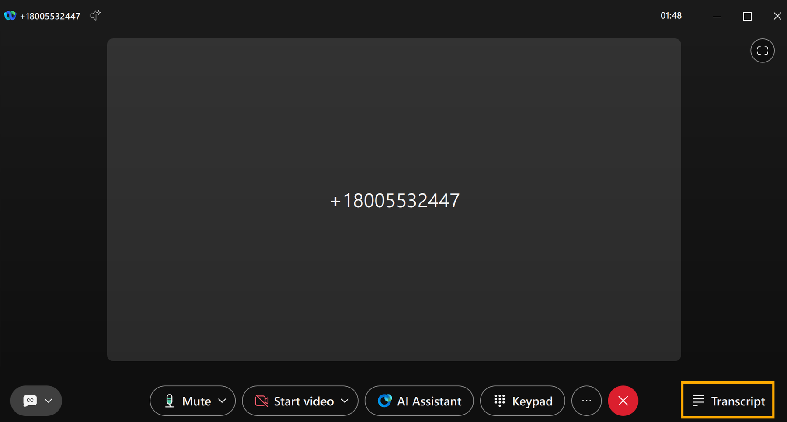{ loading=lazy }

    /// caption
    The Transcript button in the call window.
    ///

4. You can see the AI-generated transcript of the call.

    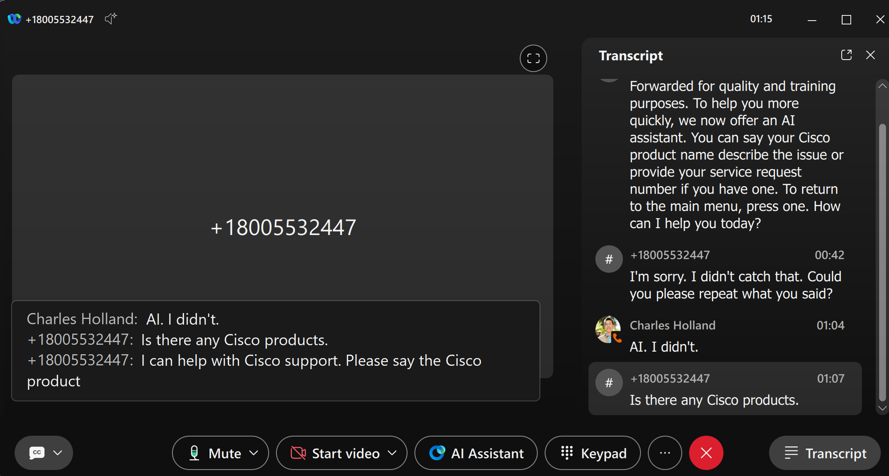{ loading=lazy }

    /// caption
    The AI-generated live call transcript.
    ///

<p class="eyebrow sub">Module 3d · ≈ 5 min</p>

### AI-generated Closed Captions and Call Transcriptions for Call Recordings { #module-3d data-toc-label="3d · Recording transcripts" data-task="3d" }

You can configure automatic transcription for recorded calls. Users can see the transcript in the player when they play the recording from the Webex App or User Hub. Transcripts are currently available only for calls recorded by the Webex call recording provider, and only when the call is in English.

First, enable call recording at the user level for the user **Charles Holland** in your organization.

1. Continuing on the physical/attendee workstation, in Control Hub navigate to **MANAGEMENT > Users**. Select the user **Charles Holland** and go to the **Calling** tab. On the **Calling** page, scroll down to **User call experience** and select **Call recording**.

    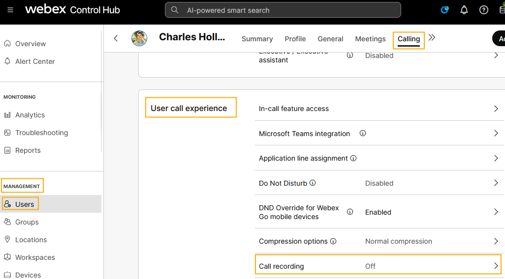{ loading=lazy }

    /// caption
    User call experience > Call recording.
    ///

2. Turn **ON** call recording. Once it's on, you'll see options for your recordings. Configure them as shown in the screenshot below and click **Save**.

    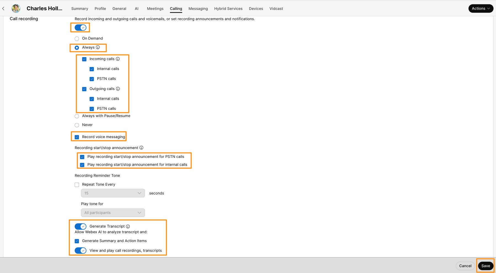{ loading=lazy }

    /// caption
    Call recording settings for Charles Holland.
    ///

3. Now minimize the browser and bring up the Webex App. Restart the Webex App so the **Recordings** tab appears.
4. Dial the Cisco TAC number **+1 800 553 2447** from Webex again. The call is answered by the IVR. Keep the call active for 45 seconds to 1 minute, then hang up. You'll hear the call recording announcement because the call is being recorded.
5. Now, in the **Webex** App, go to the **Calling** tab, and on the **Calling** page go to the **Recordings** tab.

    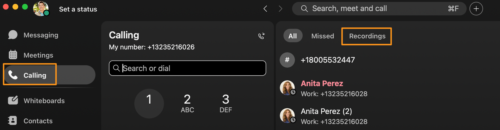{ loading=lazy }

    /// caption
    Calling > Recordings tab.
    ///

    !!! note
        If you don't see the **Recordings** tab, exit Webex (click your profile picture and select **Exit**), then relaunch it. Recordings can take a while to show up. If you still don't see the recording of your call after 2–3 minutes, continue with the next modules and come back to the next two steps later.

6. On the **Recordings** page, select the available recording. Within a few seconds, the **AI-generated** summary of the recording appears. Once you have reviewed the summary, click the play button for the recording.

    !!! note "Note"
        It can take a few minutes for a recording to be processed and appear on the **Recordings** page. If you've just finished the call to Cisco TAC and don't see the recording yet, carry on with the lab and come back to this page later. The recording and its AI-generated summary will be waiting for you here.

    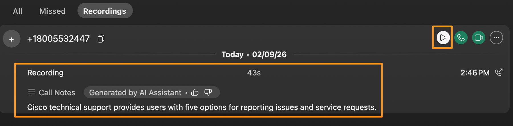{ loading=lazy }

    /// caption
    The recording, with AI-generated call notes.
    ///

7. A pop-up window opens to play the recording. On the right side of the pop-up, notice the two tabs: the **AI-generated** summary and the full transcript of the recording.

    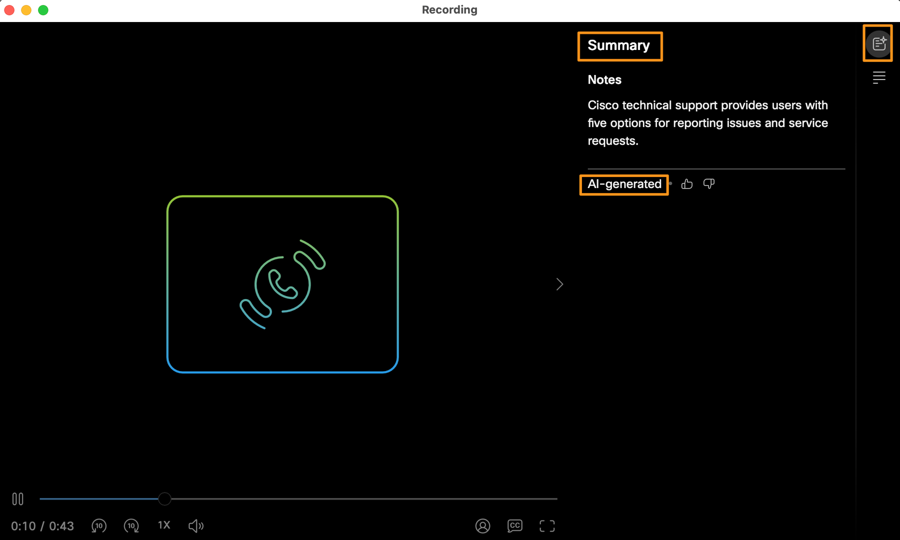{ loading=lazy }

    /// caption
    Recording player: the AI-generated summary.
    ///

    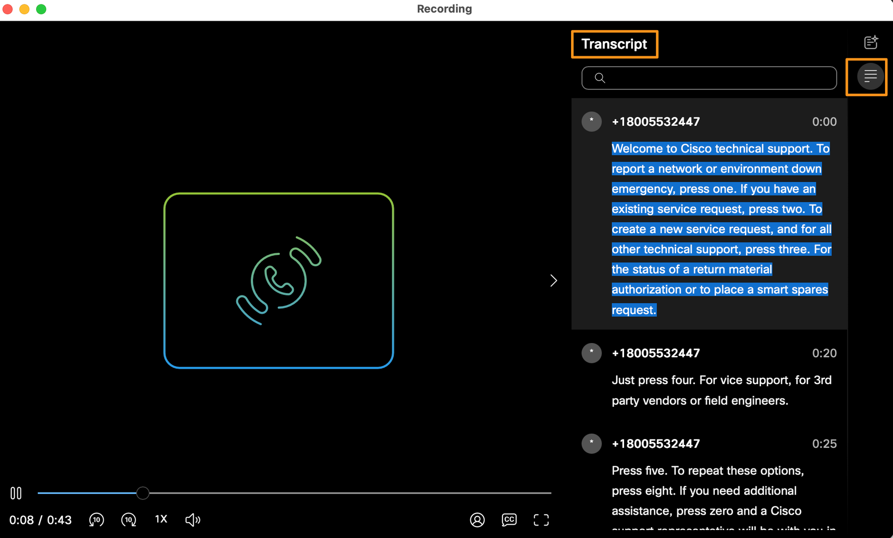{ loading=lazy }

    /// caption
    Recording player: the full transcript.
    ///

<p class="eyebrow">Module 4 · ≈ 35 min</p>

## AI-Powered Webex Meetings { #module-4 data-toc-label="Module 4 · Meetings AI" }

In **Webex Meetings**, Webex uses AI-based speech recognition models in the cloud to analyze live meeting audio and automatically detect the language being spoken, using acoustic and linguistic patterns. Once the language is detected, neural speech-to-text models generate a real-time transcription, which runs continuously in the background.

Closed captions are the visible layer that shows this transcribed text during the meeting. Participants can turn them on or off.

For multilingual meetings, Webex uses neural machine translation models to translate the transcribed text from the detected source language into a selected target language, enabling real-time translation between languages. It also uses contextual **Natural Language Processing (NLP)**, an advanced AI technique that understands words from their surrounding context rather than in isolation. This allows it to interpret meaning accurately, improve grammar, and choose the right words in transcription or translation. By "reading between the words," it handles ambiguity, idioms, and nuanced language more like a human would. Large language models and contextual NLP further strengthen language detection, disambiguation, and dynamic language switching.

On top of this foundation, the AI Assistant adds a higher layer of intelligence. It analyzes meeting content to generate summaries, highlights, and action items, and enables features like "Catch me up" and "Ask me anything" during meetings. AI also improves media quality by reducing background noise, optimizing audio and video, and improving framing and visuals. Emerging AI agents extend this further by automating follow-ups, suggesting engagement tools, and helping with scheduling, making meetings more productive, inclusive, and proactive.

AI is also used for **Webex meeting recordings**. It analyzes the captured audio and content and converts spoken conversations into time-aligned text with neural speech-to-text engines. The system automatically detects the spoken language, identifies speakers, and enriches the recording with searchable transcripts and captions. After the meeting, large language models interpret the transcript and meeting context to understand topic flow, intent, and key moments. When the Cisco AI Assistant is enabled, these models generate summaries, highlights, action items, and chapters. This turns recordings from passive videos into searchable, contextual, and actionable meeting assets.

!!! info "Learn more"
    To learn more about the AI models and architecture behind these features, visit the [Cisco Trust Portal](https://trustportal.cisco.com/c/r/ctp/home.html){:target="_blank" rel="noopener"}.

<p class="eyebrow sub">Module 4a · ≈ 10 min</p>

### Schedule your meetings with Cisco AI Assistant { #module-4a data-toc-label="4a · Schedule with AI Assistant" data-task="4a" }

Webex meetings can be scheduled in several ways:

- directly from the app, with the **Schedule a Meeting** button;
- from Microsoft Outlook, either through the Hybrid Calendar Service (by putting "@webex" in the meeting location) or through the Webex integration for Microsoft Outlook;
- from the Webex site itself; or
- through the APIs.

In this lab you'll use the newest method to schedule a Webex meeting: the Cisco AI Assistant. You talk to the Assistant in natural language and tell it the meeting name, who should attend, the duration, and a suggested time. The Assistant gathers this information, looks up the attendees, and suggests three suitable times close to the one you asked for. It takes everyone's free/busy calendar status, time zone and working hours into account.

1. Continuing on your physical/attendee workstation, bring up Webex.
2. In the Webex App, open the **Meetings** tab and expand the **Cisco AI Assistant** (top-right corner).

    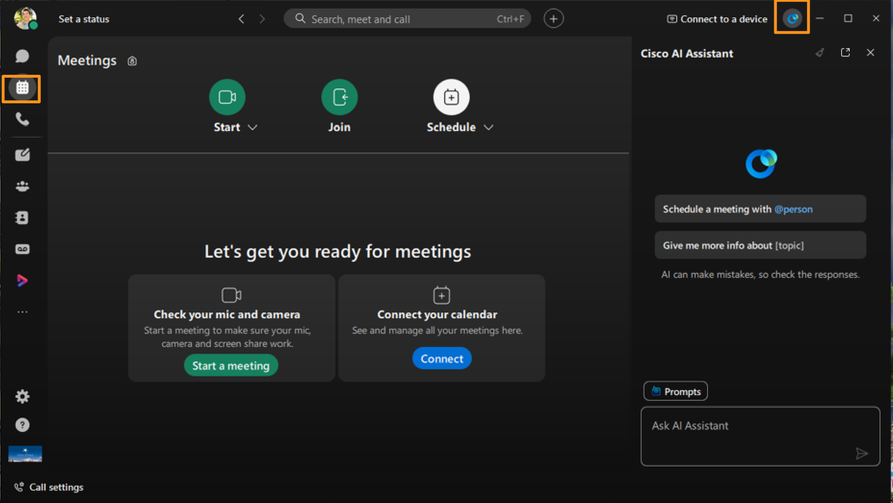{ loading=lazy }

    /// caption
    The Meetings tab with the Cisco AI Assistant open.
    ///

3. In the **Ask AI Assistant** window, ask the Assistant to schedule a meeting for you. Here is an example of what you can type:

    ```text
    Schedule a meeting with @Anita Perez on XX/XX/XXXX at XX:XX, for 60min. With title Project AI by Design.
    ```

    !!! note
        Replace the **XX** placeholders with a date and time of your choice, for example later today. You can also change the duration and title if you like.

4. The Assistant captures the information and summarizes the request. It may suggest other times if the requested time doesn't suit all attendees. Feel free to change anything by continuing the conversation, or confirm.

    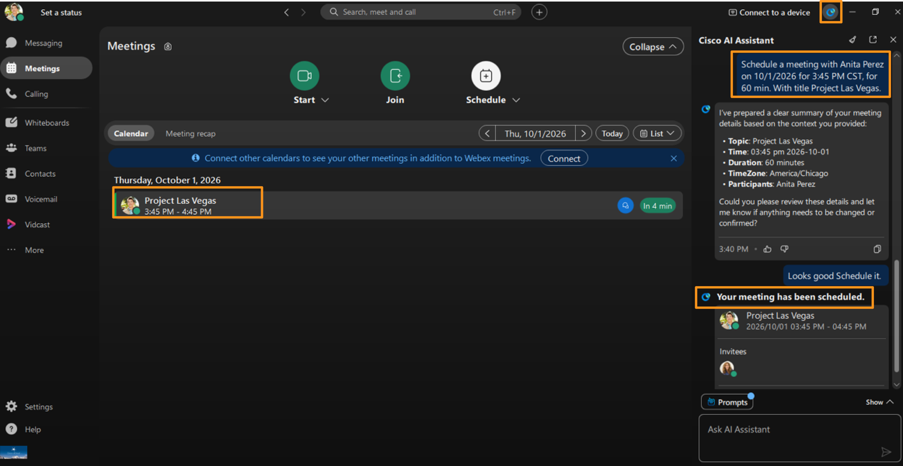{ loading=lazy }

    /// caption
    The Assistant confirms and schedules the meeting.
    ///

5. The Assistant goes ahead and schedules the Webex meeting.

<p class="eyebrow sub">Module 4b · ≈ 10 min</p>

### Language detection, Closed Captions and Real time translation { #module-4b data-toc-label="4b · Captions & translation" data-task="4b" }

In AI-powered Webex Meetings, Webex automatically detects the language being spoken, so you don't have to set or guess it yourself. Once the speech is recognized, real-time closed captions appear on screen, helping everyone follow along, even if the audio is unclear or there is background noise. When participants speak different languages, Webex AI can instantly translate what's being said, so everyone sees the conversation in a language they understand. That keeps communication smooth and inclusive, wherever participants are in the world.

1. Continuing on the physical/attendee workstation, go back to the browser tab where you are logged in to Control Hub. Navigate to **SERVICES > Meetings** and select your site (`cbXXXYY.webex.com`).
2. On the meeting site, go to **Common Settings > Site Options**.

    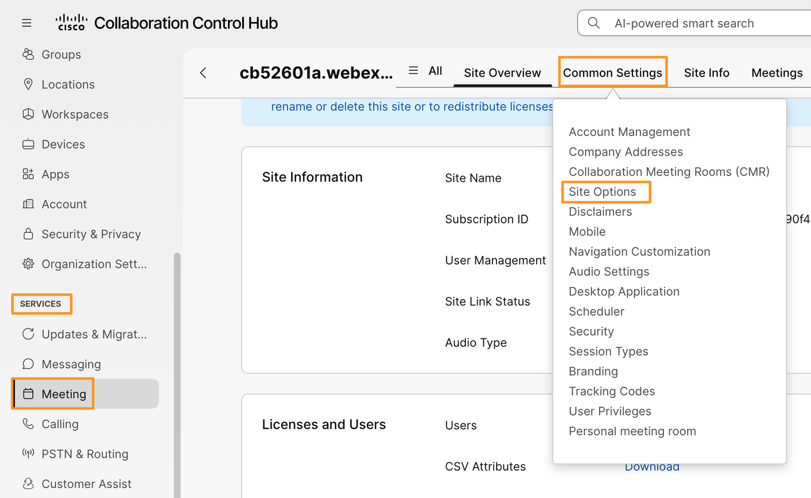{ loading=lazy }

    /// caption
    Control Hub > meeting site > Common Settings > Site Options.
    ///

3. On the **Site Options** page, scroll down to **Closed captioning configuration**, turn on **Allow real-time translation and transcription in multiple languages**, and click **Save**.

    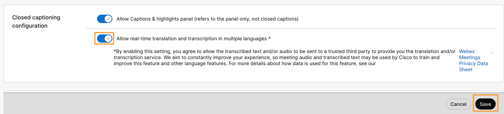{ loading=lazy }

    /// caption
    Turn on Allow real-time translation and transcription in multiple languages.
    ///

    !!! info "Learn more"
        To learn how Webex Meetings processes, stores and protects meeting data, including transcriptions and translations, see the [Webex Meetings Privacy Data Sheet](https://trustportal.cisco.com/c/r/ctp/trust-portal.html#/1554085468927155){:target="_blank" rel="noopener"} on the Cisco Trust Portal.

4. Now quit the Webex App on both workstations (physical and virtual) and relaunch Webex. To quit Webex, click your **profile picture** and select **Exit Webex**. **Make sure** you exit and relaunch Webex before continuing.
5. On your physical/attendee workstation, bring up Webex. The meeting you scheduled in the previous module shows a **One Button to Join** (OBTJ) button. Click **Start** to start the meeting. When the meeting window opens, click **Start meeting**. Once the meeting has started, click **Closed Captions** { .icon } (toward the bottom left of the meeting window).
6. Now go to the browser tab where you are connected to Anita Perez's workstation (virtual workstation) over WebRDP. A meeting reminder (notification) appears; click **Join** on it. When the meeting window opens, click **Start meeting**.

    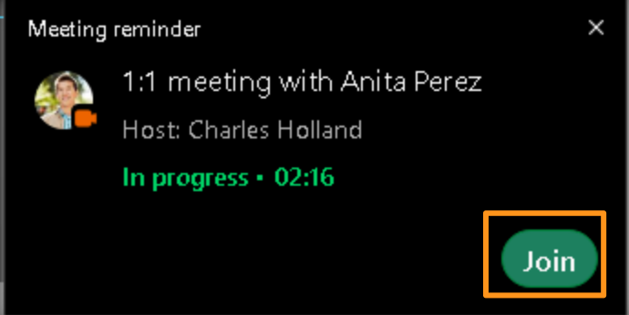{ loading=lazy }

    /// caption
    The meeting reminder on Anita's workstation. Click Join.
    ///

7. **Ignore** the microphone warning on the virtual workstation. Click **Join meeting** in the meeting window. Once you've joined, click **Closed Captions** { .icon } (toward the bottom-left corner of the meeting window) on Anita's workstation (virtual workstation) as well.
8. Once closed captions are enabled on Anita's workstation, notice the options for **Spoken language** and **Caption language**. Make sure **Caption language** is set to **English**.

    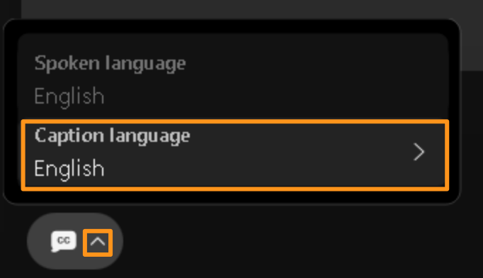{ loading=lazy }

    /// caption
    Caption language set to English on Anita's workstation.
    ///

9. Go back to the Webex meeting window on the physical/attendee workstation (as Charles Holland) and click the drop-down arrow next to the **Closed Captions** icon { .icon } to see the current **Spoken language** and **Caption language**. **Do not** change any settings.

    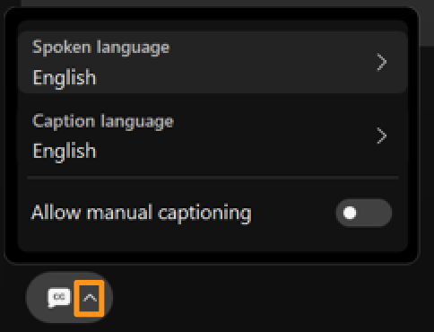{ loading=lazy }

    /// caption
    Current spoken and caption languages in Charles's meeting window.
    ///

10. Now, in the meeting window on the physical/attendee workstation (as Charles Holland), say a few sentences in a different language (for example **French**, **German** or **Hindi**). After about 3 to 5 sentences, notice that Webex AI auto-detects the **Spoken language** and updates it on Anita's workstation under { .icon }. And because the caption language is **English**, Webex AI translates what you say into English and displays it on both workstations.

    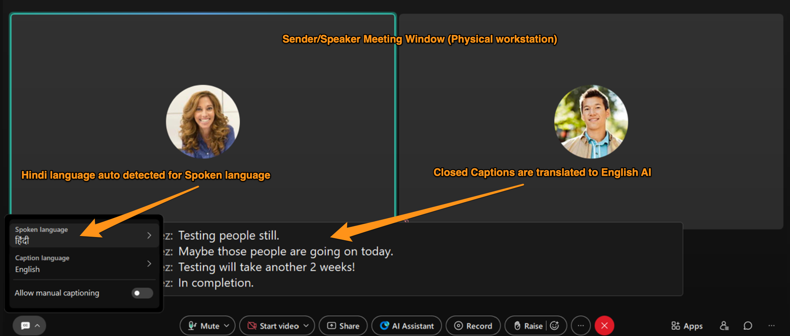{ loading=lazy }

    /// caption
    Speaker side: Hindi auto-detected as the spoken language, with captions translated into English.
    ///

    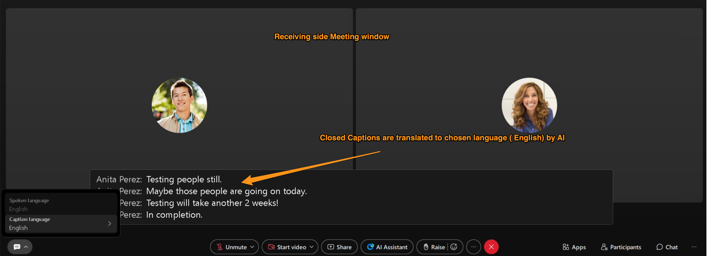{ loading=lazy }

    /// caption
    Receiving side: captions translated into the chosen language (English).
    ///

    !!! tip "Language not detected?"
        If Webex AI takes a long time to detect the spoken language (for example, because of background noise or a crowded room), open the **Spoken language** and **Caption language** drop-downs and select the languages manually from the supported list. For the current list of supported languages, see [Show real-time translation and transcription in meetings and webinars](https://help.webex.com/en-us/article/nqzpeei/Show-real-time-translation-and-transcription-in-meetings-and-webinars){:target="_blank" rel="noopener"}.

11. Now switch back to Anita's workstation (virtual workstation) over WebRDP, open the **Caption language** drop-down, and set it to one of the available languages, for example **bosanski/Bosnian**.

    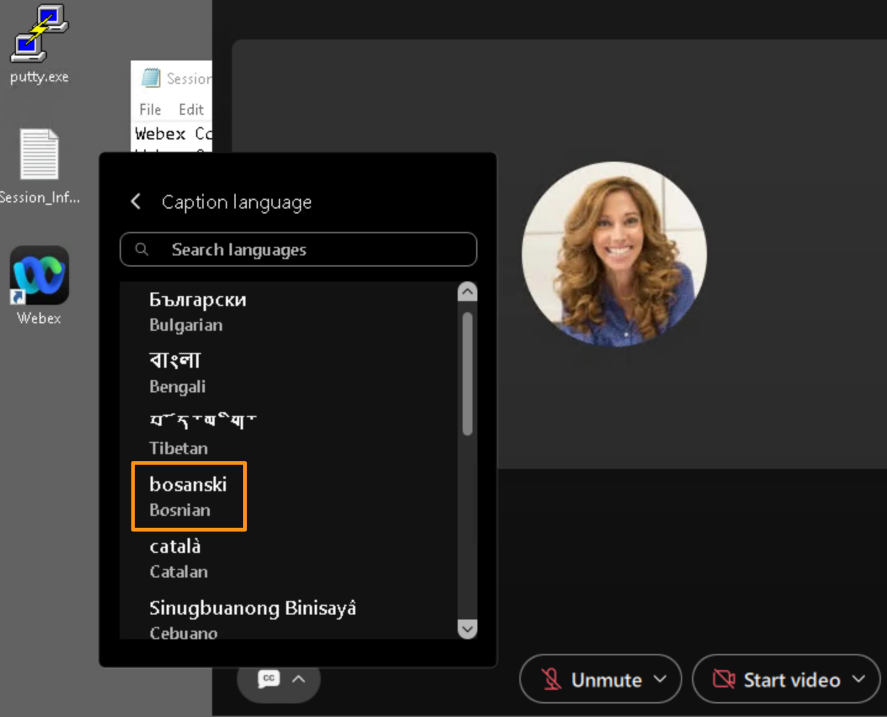{ loading=lazy }

    /// caption
    Choosing Bosnian as the caption language.
    ///

12. In Charles's meeting window (physical/attendee workstation), manually set the **Spoken language** to **English** (or any other language) and change the **Caption language** to **French** (or any other language). Once the languages are set, start talking in **English**.
13. Notice that each workstation displays captions in its own selected caption language.

    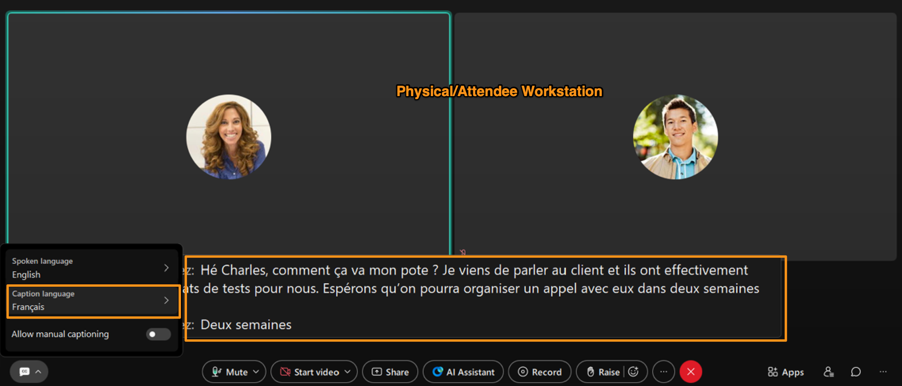{ loading=lazy }

    /// caption
    The physical/attendee workstation shows captions in French.
    ///

    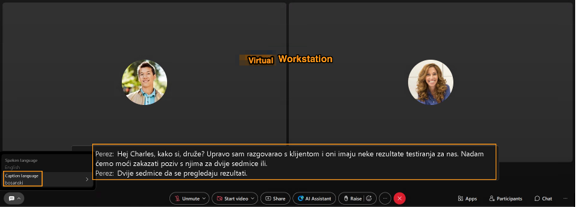{ loading=lazy }

    /// caption
    The virtual workstation shows captions in Bosnian.
    ///

14. To explore further, choose any other set of languages and notice that **Webex AI** auto-detects the **Spoken language** (or you can set it manually) and translates it into the chosen **Caption language**.
15. **Keep the meeting running and go to the next module.**

<p class="eyebrow sub">Module 4c · ≈ 10 min</p>

### AI Assistant in Webex Meetings { #module-4c data-toc-label="4c · AI Assistant in meetings" data-task="4c" }

Now add the Cisco AI Assistant to this meeting and see how it automatically captures meeting highlights, action items, and summaries, so participants stay aligned without taking notes by hand. During the meeting, the **AI Assistant** identifies key discussion points and important moments, even for people who join late. After the meeting, it generates a concise summary of what was discussed and the overall context, and extracts clear action items so the team knows what to do next. In the backend, the AI Assistant uses cloud-based speech-to-text and large language models to listen to the meeting audio, understand the conversation's context, and extract decisions, tasks, and key moments, turning live conversations into structured meeting notes.

1. Make sure the meeting from the previous module is still running.
2. In the meeting window on the physical/attendee workstation, click **AI Assistant**. A pop-up asks you to **Start** the **AI Assistant for this meeting**. Click **Start**.

    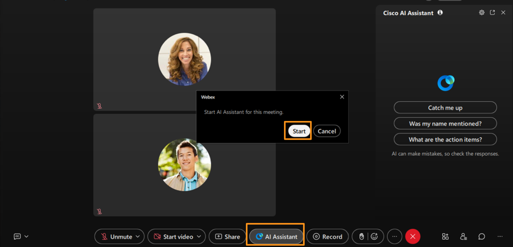{ loading=lazy }

    /// caption
    Start the AI Assistant for this meeting.
    ///

3. The **AI Assistant** starts for this meeting and plays an announcement that "this meeting is being transcribed and summarized."

    !!! info
        In Control Hub, the administrator can enable automatic AI Assistant summarization for recordings, so the AI Assistant starts summarizing automatically whenever a recording starts.

4. Now click the **Record** button in the meeting window to start recording the meeting. A pop-up shows the recording options. Leave all the defaults and click **Record** again in the pop-up.

    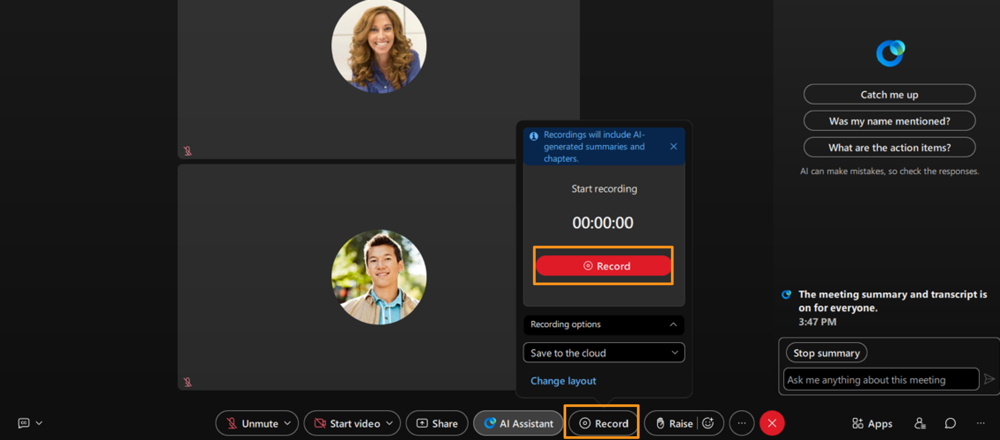{ loading=lazy }

    /// caption
    Start recording the meeting.
    ///

5. You'll use this meeting recording in the next module. For now, make sure recording is on and continue with this module.
6. Now, on the physical/attendee workstation, start talking and mention **Anita Perez's** name along with some action items, for example: **"Anita, we need to push the software release deadline,"** **"Anita, send a follow-up email to the customer,"** or **"Anita, we need to check on the shipment delivery."**
7. Now go to Anita's workstation (virtual workstation) over WebRDP and the current meeting window. Try any of the **AI Assistant** options available: **Catch me up**, **Was my name mentioned?** or **What are the action items?**

    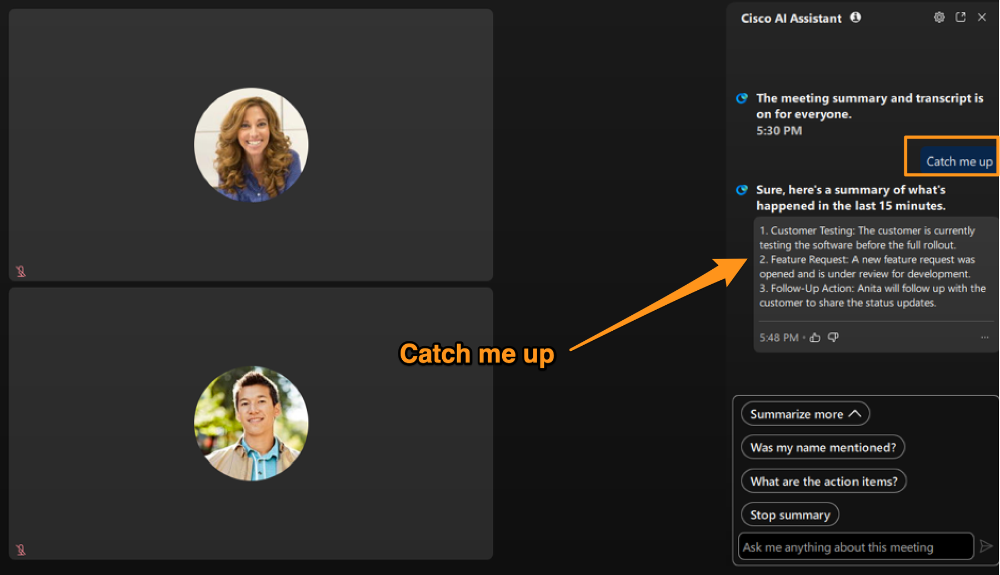{ loading=lazy }

    /// caption
    Catch me up.
    ///

    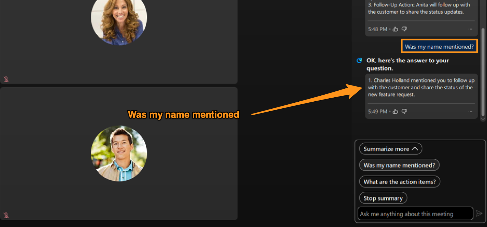{ loading=lazy }

    /// caption
    Was my name mentioned?
    ///

    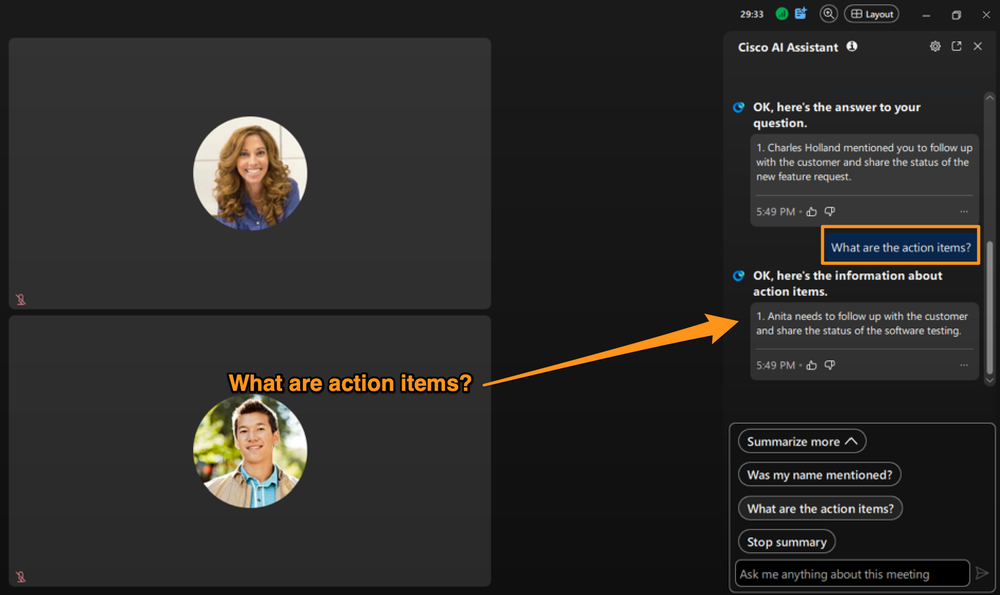{ loading=lazy }

    /// caption
    What are the action items?
    ///

8. You can also ask anything about this meeting, such as what the **highlights** were or how the **customer responded**. In the current meeting window, type your question in the **Ask me anything about this meeting** box. The **AI Assistant** answers based on the information available in this meeting's summary.

    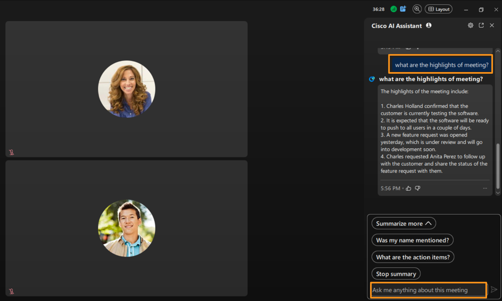{ loading=lazy }

    /// caption
    Ask anything: the meeting highlights.
    ///

    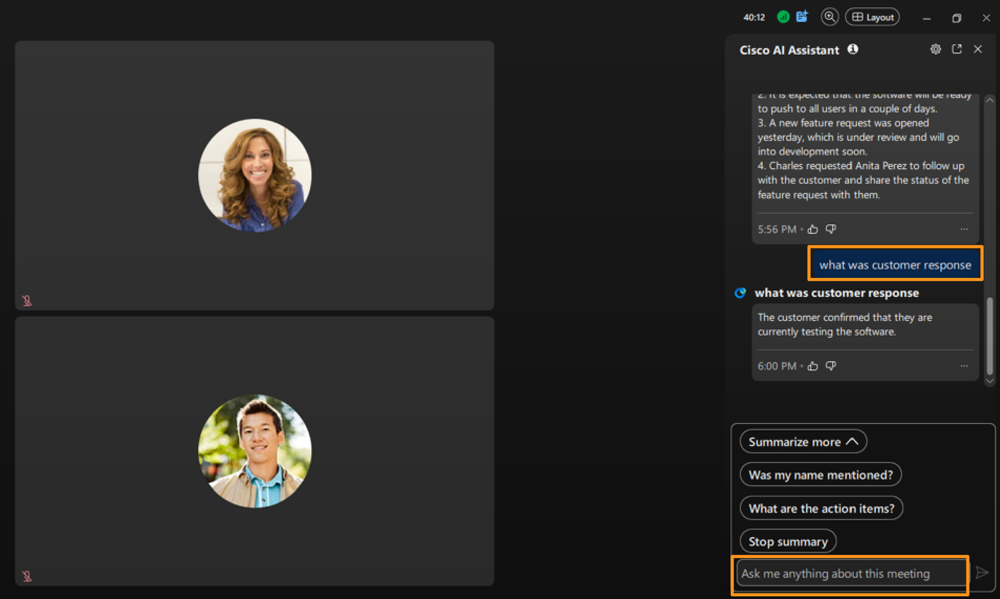{ loading=lazy }

    /// caption
    Ask anything: the customer's response.
    ///

9. Keep exploring and asking questions about the meeting. When you're done, end the meeting { .icon } on both workstations.
10. Within a minute or two of the meeting ending, a pop-up on the attendee workstation (physical workstation) says the "meeting summary is ready." Click **View**.
11. The Webex meeting summary and transcript open, as shown below.

    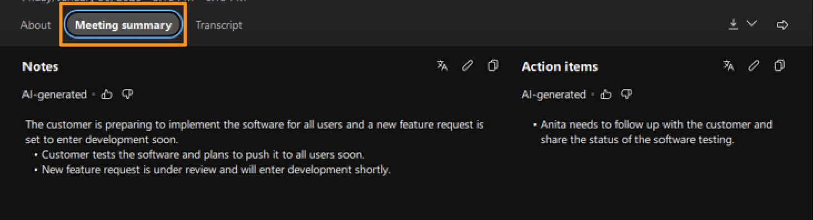{ loading=lazy }

    /// caption
    After the meeting: the summary, with notes and action items.
    ///

    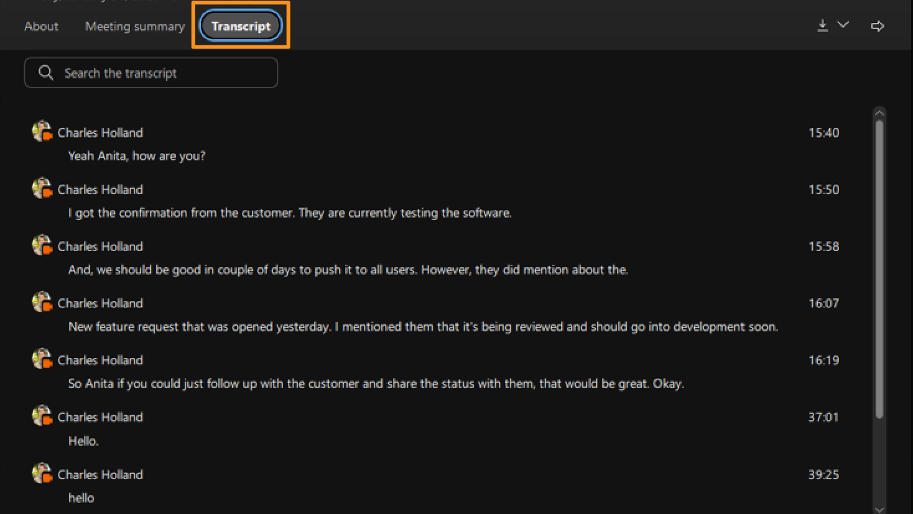{ loading=lazy }

    /// caption
    After the meeting: the full transcript.
    ///

<p class="eyebrow sub">Module 4d · ≈ 5 min</p>

### AI Intelligence in Webex Recordings { #module-4d data-toc-label="4d · AI in recordings" data-task="4d" }

When a **Webex meeting** is recorded with the **AI Assistant** enabled, AI processes the meeting recording after the meeting ends and creates the following:

- **Automatic transcription and captions:** AI converts recorded audio into accurate, time-synced text with speaker identification and language detection.
- **Searchable and navigable recordings:** Transcripts are indexed so users can search for keywords and jump directly to relevant moments in the recording.
- **Intelligent meeting insights:** With the Cisco AI Assistant enabled, AI analyzes the transcript to generate summaries, highlights, action items, and chapters.
- **Improved accessibility and audio quality:** AI improves the clarity of the recorded audio and provides captions, making recordings easier for everyone to consume.

!!! note
    After the meeting ends, the meeting summary and transcript appear fairly quickly (within 2 or 3 minutes). The meeting recording and chapters take longer (up to an hour), depending on the load in the Webex cloud. For AI to create useful chapters, the meeting must be long enough, cover several different topics, and have several attendees. You may not be able to generate chapters live in this lab; the screenshots below are from other meeting recordings, for reference.

1. Continuing on the attendee workstation (physical workstation) as Charles, in Webex go to **Meetings > Meeting recap**.

    You will find your recorded meeting. Notice that it now has a meeting summary, a transcript (which you saw in the last module), and a recording.

2. Click the recording to open it. You probably **won't** see chapters for your recording yet. However, notice that you (as the meeting host) can create chapters manually, or edit existing ones.

    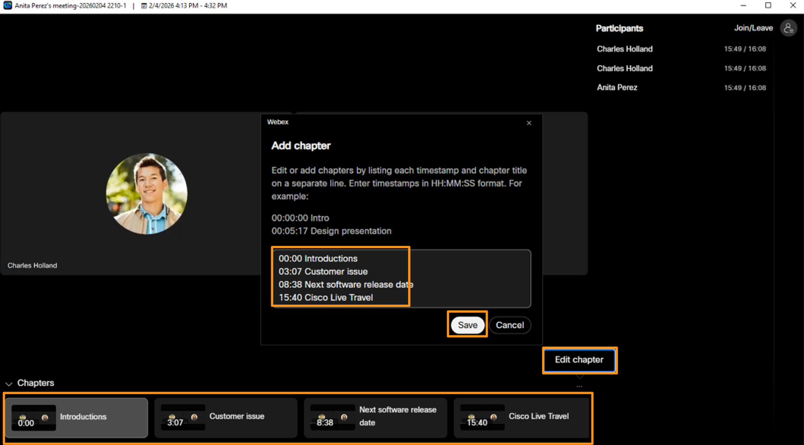{ loading=lazy }

    /// caption
    Adding chapters to a recording manually.
    ///

3. If the meeting was long enough and covered several different topics, AI creates the chapters as shown below. This screenshot is not from this lab; it's for **reference** only.

    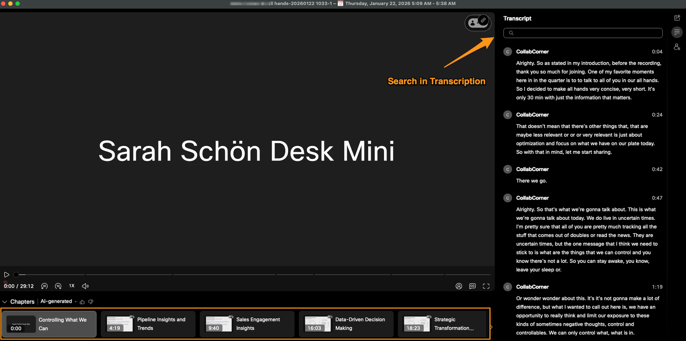{ loading=lazy }

    /// caption
    AI-generated chapters and a searchable transcript (from a reference recording).
    ///

4. This completes **Module 4: AI-Powered Webex Meetings**.

<p class="eyebrow">Up next · Part 2</p>

## What's next { #next data-toc-label="Next · Part 2 (MCP lab)" }

This completes Module 4 and the Webex AI portion of the lab. Next, look behind the scenes: in **Part 2** you connect Webex Messaging to an AI client through the **Webex MCP server**, and in **Part 3** you use LangChain and the Webex APIs to build AI-powered messaging workflows yourself.

<a class="next-card" href="part-2/">
  <span class="nc-k">Part 2 · Lab guide</span>
  <span class="nc-t">Webex MCP for AI Clients</span>
  <span class="nc-u">Part 2 →</span>
</a>
