## About this lab { #about data-toc-label="About this lab" }

In [Part 1](../index.md) of the Webex AI lab you explored how Cisco Webex uses Artificial Intelligence to enhance collaboration across Messaging, Calling, and Meetings. You experienced capabilities such as AI-powered message assistance, conversation summaries, smart rewrites, live translations, meeting intelligence, captions, transcriptions, and AI-generated insights. In [Part 2](../part-2/index.md) you connected Webex Messaging to an AI client through the Webex MCP server.

While these features demonstrate what AI can do inside Webex, the next logical step is to understand how these experiences are actually built.

In this hands-on lab, we will take a step further and explore how modern AI frameworks (such as **LangChain**) can be used alongside the **Webex APIs** to build intelligent messaging workflows and agentic experiences.

You will learn how developers and architects can leverage AI models, orchestration frameworks, and APIs to create real-world conversational solutions within Webex Messaging.

Throughout this lab, you will explore:

- **Webex Messaging APIs:** Understanding how applications interact with Webex spaces, users, and messages programmatically.
- **LangChain Fundamentals:** Learning how LangChain orchestrates prompts, memory, tools, and workflows to power AI applications.
- **Building AI-Powered Messaging Workflows:** Creating logic that can read, process, and respond to Webex messages intelligently.
- **Introduction to AI Agents:** Understanding how agents can reason, make decisions, and perform actions based on context and instructions.
- **Prompt Engineering & LLM Integration:** Connecting Large Language Models (LLMs) to Webex workflows for intelligent responses.

By the end of this lab, you will not only understand how AI features appear inside Webex, but also gain insight into how AI-powered experiences are designed, orchestrated, and built using frameworks like LangChain and Webex APIs.

!!! tip "The shift in mindset"
    Think of this lab as moving from **"using AI"** to **"building AI."**

This lab is designed to provide a practical and approachable introduction to the foundations of **agentic AI**, helping you understand the core building blocks behind intelligent collaboration experiences.

### Lab at a glance { #glance data-toc-label="Lab at a glance" }

<div class="glance time" markdown>

| | Module | Time |
|---|---|---|
| 1 | [Set up your lab environment](#module-1) | 30 min |
| 2 | [LangChain for Messaging Intelligence](#module-2) | 90 min |
| | **Total** | **~120 min** |

</div>

### How to use this guide { #how-to data-toc-label="How to use this guide" }

The whole lab lives on this **one page**. Scroll down and work through it in order.

- The **TREE** on the left shows where you are. The progress bar under it fills up as you scroll.
- Press <kbd>J</kbd> / <kbd>K</kbd> to jump to the next or previous section.
- When you finish a task, click **Mark complete** at the end of it. You get a ✓ in the tree, and your progress is saved in this browser.
- Every code block has a **copy** button in its top-right corner. Paste the code into a new Colab cell and run it.
- Click any screenshot to zoom in.

### Lab notes { #lab-notes data-toc-label="Lab notes" }

Click **Notes** (bottom-right) to open a scratchpad that stays with you on both parts of the lab guide. Use it to keep the things you'll need throughout the lab close at hand:

- your **Webex Bearer token** (so you don't have to re-grab it from the Developer Portal every time it expires)
- your **Webex Space (Room) ID**
- your **OpenAI API key**
- your **ngrok auth token**
- any **dCloud-assigned values** (the `cbXXX.dc-YY.com` domain, pod number, passwords)
- snippets, scratch notes, or anything else you want to remember

!!! warning "Where your notes live"
    Notes are saved **only in your browser** (localStorage on this device). They will be **lost** if you:

    - clear your browser data,
    - use a different browser or computer,
    - open the lab in a private/incognito window.

    Treat the notepad as a temporary scratchpad for the duration of the lab. If you need notes that survive long-term, copy them to a personal note-taking app at the end of the session.

!!! danger "Be mindful with secrets"
    Even though the notepad is local to your browser, treat any **API keys, tokens, or passwords** the way you would on any shared workstation. If you're on a shared/dCloud machine, **clear your notes** before logging out so the next user can't see them.

### Your lab proctor { #proctors data-toc-label="Your lab proctor" }

Need help? Raise your hand or reach out to me.

<div class="people" markdown>

<div class="person"><span class="nm">Omer Ilyas</span><span class="rl">Principal Technical Marketing Engineer</span><span class="em">oilyas@cisco.com</span></div>

</div>

<p class="eyebrow">Module 1 · ≈ 30 min</p>

## Set up your lab environment { #module-1 data-toc-label="Module 1 · Lab setup" }

Before you start building AI-powered messaging workflows, this module gets your foundation in place: a Webex API access token tied to your assigned account, a place to run Python notebooks, and an OpenAI API key for the LangChain pieces of the lab. Tasks 1d and 1e (Streamlit and ngrok) are optional background reading for future use; they are not used in this lab.

<div class="glance time" markdown>

| | Task | Time |
|---|---|---|
| 1a | [Webex Developer Portal setup](#module-1a) | 10 min |
| 1b | [Google Colab setup](#module-1b) | 5 min |
| 1c | [Managing API keys in Colab](#module-1c) | 5 min |
| 1d | [Introduction to Streamlit](#module-1d) *(optional)* | 5 min |
| 1e | [Introduction to ngrok](#module-1e) *(optional)* | 5 min |

</div>

<p class="eyebrow sub">Module 1a · ≈ 10 min</p>

### Webex Developer Portal Setup { #module-1a data-toc-label="1a · Webex Developer Portal" data-task="1a" }

To interact with Webex programmatically (for example, to send messages), you'll need to authenticate using a **Webex API access token** (Bearer token). This token acts like a digital key that allows your script to securely access your Webex account and perform actions on your behalf, like sending messages, listing spaces, etc. Without it, any API call to Webex will be rejected.

You can find more information on the [Webex Developer Portal](https://developer.webex.com/){:target="_blank" rel="noopener"}.

#### Steps

##### Step 1: Log in to the Webex Developer Portal { #t1a-step-1 }

Go to the [Webex Developer Portal](https://developer.webex.com/){:target="_blank" rel="noopener"} and click **Log in**.

!!! warning "Important: Use your assigned Charles Holland account"
    Please use the **Charles Holland** account assigned to your demo pod throughout this lab.

    The username will follow the format: `cholland@cbXXX.dc-YY.com`, where `XXX` and `YY` are unique to your dCloud environment.

    **Example:** 👉 `cholland@cb123.dc-01.com`

    The credentials for your assigned account for this lab can be found in the **`Session_Info.txt`** file on Workstation 1's desktop.

##### Step 2: Copy your Bearer token { #t1a-step-2 }

After logging in, click on your **profile picture** (top-right corner). Under **"Bearer"**, copy the displayed token. This is the one you'll use in the upcoming tasks.

{ loading=lazy }

/// caption
Copy your Bearer token from the Webex Developer Portal.
///

##### Step 3: Log in to the Webex App { #t1a-step-3 }

Use your assigned Charles Holland account (`cholland@cbXXX.dc-YY.com`) to log in to the **Webex App** that is pre-installed on your laptop.

##### Step 4: Create a Webex Space { #t1a-step-4 }

Once logged in, create a new Webex Space and name it something like **"Webex AI Lab"**.

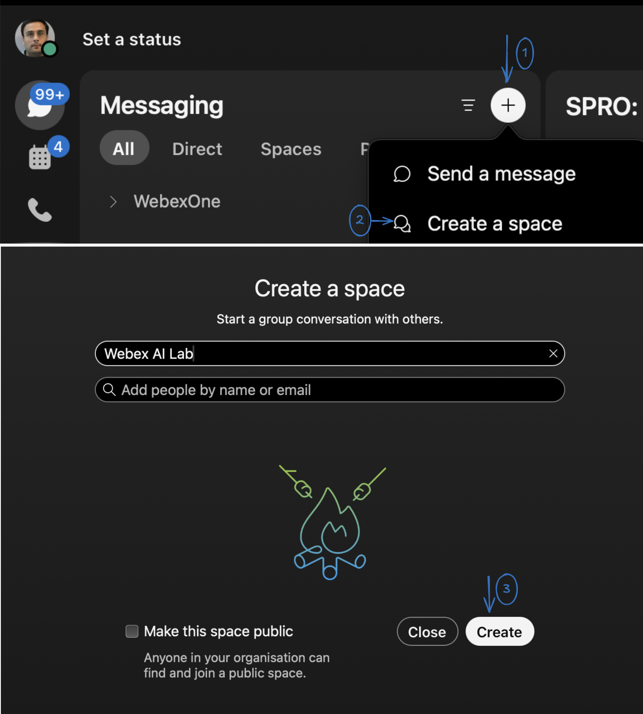{ loading=lazy }

/// caption
Create a new Webex Space named "Webex AI Lab".
///

!!! info "You'll need this Space ID later"
    After the space is created, we will retrieve its ID. This will be used in a later step.

##### Step 5: Retrieve the Space ID via the Developer Portal { #t1a-step-5 }

Go back to the [Webex Developer Portal](https://developer.webex.com/){:target="_blank" rel="noopener"} and log in again.

Click on **Documentation > Webex Messaging**.

{ loading=lazy }

/// caption
Navigate to Documentation, Webex Messaging.
///

Select **All APIs**, then navigate to **Rooms > List Rooms**, and press **Run**.

{ loading=lazy }

/// caption
Run the List Rooms API.
///

In the response, you will find a list of rooms associated with your account. Locate the room you just created (e.g., **"Webex AI Lab"**) and copy its corresponding **`id`**. This will be used in a later step.

{ loading=lazy }

/// caption
Copy the room ID for "Webex AI Lab".
///

<p class="eyebrow sub">Module 1b · ≈ 5 min</p>

### Google Colab Setup { #module-1b data-toc-label="1b · Google Colab" data-task="1b" }

Google Colab is a cloud-based platform for running Python notebooks. If you want to build a machine learning model but don't have a computer that can handle the workload, Google Colab is a great option. In this lab, we will use Google Colab to test and run our code. If you have your own Python environment and prefer to run the code locally, feel free to do so.

Here are some reasons why Google Colab is useful for this lab:

* **Free access to GPUs and TPUs:** Colab offers free access to powerful GPUs and TPUs, which can significantly speed up training and fine-tuning of machine learning models.
* **No setup required:** Everything runs in the cloud, so you don't need to install or configure anything on your local machine.
* **Easy collaboration:** Notebooks can be shared with team members, making it ideal for collaborative projects.
* **Google Drive integration:** Colab saves your work directly to Google Drive.
* **Pre-installed libraries:** Popular libraries such as TensorFlow and PyTorch come pre-installed, so you can start working right away.

#### Steps

##### Step 1: Sign in and open Colab { #t1b-step-1 }

Log in to your Google account, then open [Google Colab](https://colab.research.google.com/){:target="_blank" rel="noopener"} in a new tab.

!!! info "Use your personal Google account"
    You can use your personal Google account (Gmail) for this lab.

##### Step 2: Create a new notebook { #t1b-step-2 }

From the Colab welcome screen, click **File > New notebook** to create a new Jupyter notebook.

{ loading=lazy }

/// caption
Create a new notebook in Google Colab.
///

The new notebook will be named **`Untitled0.ipynb`** by default and saved to your Google Drive in a folder called **`Colab Notebooks`**. Since it is a Jupyter notebook, all standard Jupyter notebook commands work here.

{ loading=lazy }

/// caption
New Colab notebook titled Untitled0.ipynb.
///

##### Step 3: Choose your runtime environment { #t1b-step-3 }

!!! note "When to change the runtime"
    There may be times when you need to fine-tune models or run tasks that benefit from a specific runtime environment. Colab lets you pick a Python version and a hardware accelerator that matches your workload.

    * **Python version:** Choose the Python version that matches your code and library compatibility (Python 2 or Python 3). We will use **Python 3** for this lab.
    * **Hardware accelerator:** Pick the option that fits your workload:
        * **None:** No hardware acceleration. Good for basic tasks.
        * **GPU:** Speeds up computations using a Graphics Processing Unit.
        * **TPU:** Uses a Tensor Processing Unit for even faster performance, especially for deep learning.

Click the arrow next to **Connect** to open the dropdown.

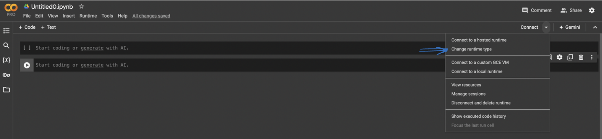{ loading=lazy }

/// caption
Open the Connect dropdown in Colab.
///

Then follow these steps:

1. Select **Change runtime type** to open the runtime configuration dialog.
2. From the **Runtime type** dropdown, choose **Python 3**.
3. From the **Hardware accelerator** dropdown, choose **GPU** or **TPU**.
4. Click **Save** to apply the changes.

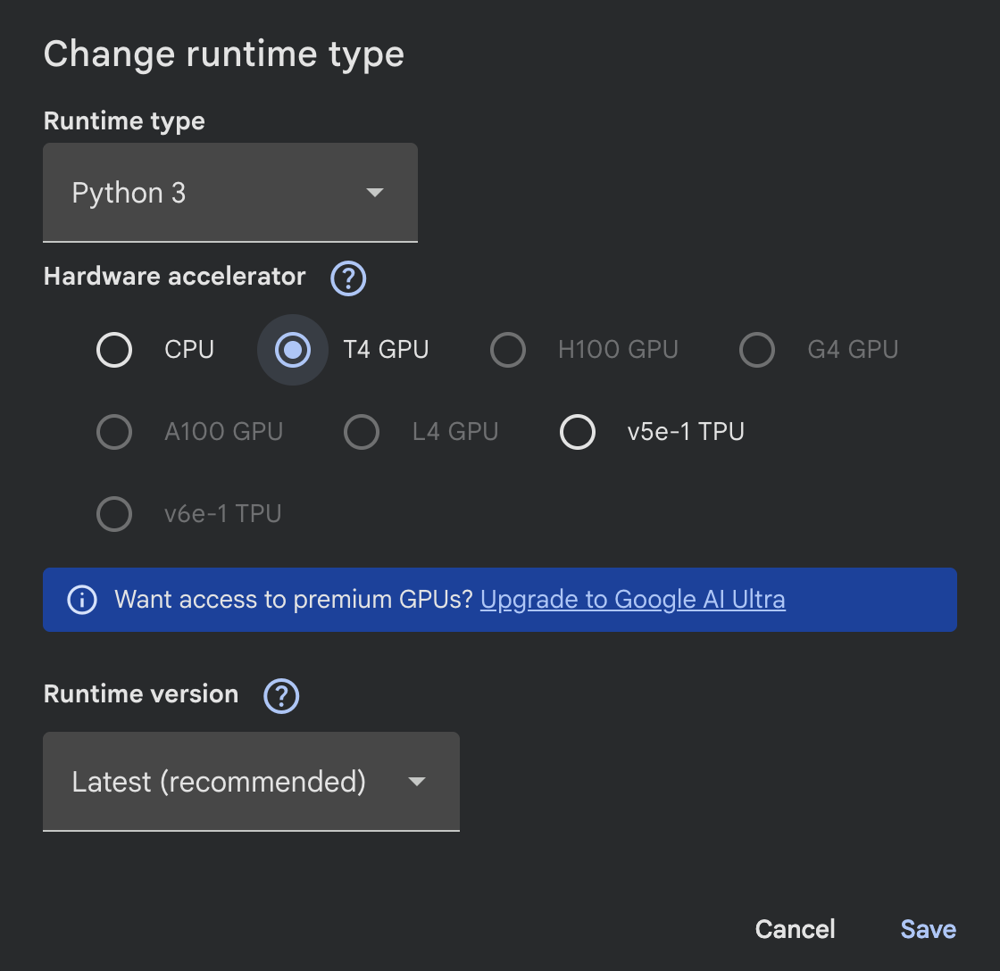{ loading=lazy }

/// caption
Change runtime type dialog in Colab.
///

##### Step 4: Add a new code cell { #t1b-step-4 }

Whenever you want to copy code into Colab and run it, click **+ Code** to add a new code cell.

{ loading=lazy }

/// caption
Add a new code cell in Colab.
///

##### Step 5: Run your code { #t1b-step-5 }

Click the **play button** to the left of the cell, or press **Command/Ctrl + Enter** while the cell is selected.

{ loading=lazy }

/// caption
Execute a code cell in Colab.
///

<p class="eyebrow sub">Module 1c · ≈ 5 min</p>

### Managing API Keys in Google Colab { #module-1c data-toc-label="1c · API keys in Colab" data-task="1c" }

When working with frameworks like **LangChain** and large language model providers like **OpenAI**, your code needs an API key to authenticate. Hard-coding keys directly inside your notebook is not safe (the key can be shared by accident or pushed to a public repo). Google Colab provides a built-in **Secrets** feature that lets you store keys securely and reference them from any notebook in your account.

In this task, you will add the **OpenAI API key** to Colab Secrets so the rest of the lab can use it.

#### Steps

##### Step 1: Open the Secrets panel { #t1c-step-1 }

Inside your existing Google Colab notebook, click the **key icon** in the left sidebar to open the **Secrets** section.

{ loading=lazy }

/// caption
Open the Secrets panel in Google Colab.
///

##### Step 2: Get your OpenAI API key { #t1c-step-2 }

Before you can add the secret, you need an actual key to paste in.

For this lab, we have set up a small webpage that will hand you a temporary OpenAI API key. Open this URL in a new tab:

[https://cs.co/AiByDesign](https://cs.co/AiByDesign){:target="_blank" rel="noopener"}

Enter your email address on the page and submit. The API key will be displayed on the screen, and a copy will also be sent to your email so you have it for the rest of the session.

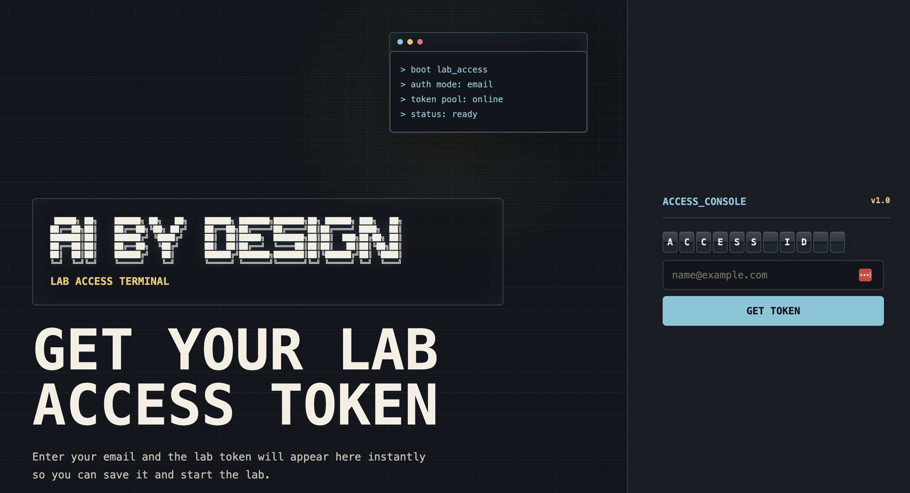{ loading=lazy }

/// caption
The AI by Design key page where you enter your email to get an OpenAI API key.
///

Copy the key shown on screen. You will paste it into Colab in the next step.

!!! note "If the page is not reachable"
    If you cannot access [https://cs.co/AiByDesign](https://cs.co/AiByDesign){:target="_blank" rel="noopener"} from your lab pod, please ask one of your **lab proctors**. They will hand you a key directly so you can keep moving.

##### Step 3: Add the key as a Colab secret { #t1c-step-3 }

Back in your Colab notebook, in the **Secrets** panel from the previous step, click **+ Add new secret** and fill in the following:

* **Name:** `OPENAI_API_KEY`
* **Value:** the OpenAI API key you just copied (from `cs.co/AiByDesign` or from your proctor)

!!! warning "Use the exact name `OPENAI_API_KEY`"
    The lab code references this key by name. Make sure you enter it exactly as **`OPENAI_API_KEY`** (uppercase, with the underscore). If the name does not match, the notebook will not be able to find the key and your code will fail.

##### Step 4: Grant notebook access { #t1c-step-4 }

Your secrets are stored once and shared across all your notebooks. For each notebook that needs to use a secret, you have to turn on the **Notebook access** toggle next to that secret.

Toggle **Notebook access** on for `OPENAI_API_KEY` so the current notebook can read it.

{ loading=lazy }

/// caption
Grant notebook access to the OPENAI_API_KEY secret.
///

!!! note "About the lab API key"
    The OpenAI API key provided to you is for **lab use only** and will be valid only for the duration of this session. You're welcome to continue exploring on your own after the lab by using your personal OpenAI API key in place of the one provided here.

<p class="eyebrow sub">Module 1d · optional, read only · ≈ 5 min</p>

### Introduction to Streamlit { #module-1d data-toc-label="1d · Streamlit (optional)" data-task="1d" }

Toward the end of this lab, you'll wrap everything you've built (reading Webex messages, asking questions about a space, generating summaries, rewriting messages, and orchestrating an agent) into a small web app that you can actually click through. The framework we'll use for that web app is **Streamlit**.

This task is a quick read, no clicks required. Its purpose is to give you a mental model of what Streamlit is so the later modules feel familiar when you see it appear.

#### What is Streamlit?

Streamlit is an open-source Python library that turns plain Python scripts into interactive web apps. Instead of writing HTML, CSS, and JavaScript, you write regular Python code and Streamlit renders it as a browser-based UI: text inputs, buttons, chat windows, charts, file uploads, and more.

A typical Streamlit app is a single `.py` file. You run it with one command, and a local web app opens in your browser.

```python
import streamlit as st

st.title("My First App")
name = st.text_input("What's your name?")
if name:
    st.write(f"Hello, {name}!")
```

That's it. No web server boilerplate, no front-end framework, no build step.

#### Why we use it in this lab

Streamlit is a great fit for AI labs and proof-of-concept work because:

* **Fast to build:** Most of the AI logic you'll write in this lab is already Python. Streamlit lets you put a UI on top of it without context-switching to a different language or framework.
* **Built-in chat components:** Streamlit ships with `st.chat_input` and `st.chat_message`, which are designed exactly for LLM-powered chat experiences like the one you'll build for Webex.
* **Live reload:** As you edit your Python file, Streamlit re-renders the app automatically. The feedback loop is short, which is ideal for experimenting with prompts and chains.
* **Demo-friendly:** You can share your running app over the network so others can try it. Later in the lab, we'll pair Streamlit with **ngrok** to give your app a public URL that anyone can open.

#### How it fits in the bigger picture

Throughout the lab you will:

1. Connect to Webex and pull messages (using the Webex APIs and your Bearer token from [1a](#module-1a)).
2. Use **LangChain** plus the OpenAI key from [1c](#module-1c) to summarize, answer questions, rewrite, and run an agent over those messages.
3. Wrap that LangChain logic in a **Streamlit** app so it feels like a real product, not a notebook.

You don't need to install or configure anything for Streamlit right now. We'll install it inside Colab when we get to the UI module, and the lab will provide the starter code. For now, just remember: **Streamlit = Python, but in a browser.**

!!! tip "Want to explore on your own?"
    The official Streamlit documentation is at [docs.streamlit.io](https://docs.streamlit.io){:target="_blank" rel="noopener"}. The "Get started" and "API reference" pages are the most useful.

<p class="eyebrow sub">Module 1e · optional, read only · ≈ 5 min</p>

### Introduction to ngrok { #module-1e data-toc-label="1e · ngrok (optional)" data-task="1e" }

When you build the Streamlit app at the end of the lab, it will run inside your Google Colab notebook. By default that app is only reachable from inside the Colab environment, which means you can't open it in your browser, share it with a teammate, or have Webex send notifications to it. To get around that, we'll use **ngrok**.

This task is a quick read, no clicks required. Its purpose is to give you a mental model of what ngrok is so the later modules feel familiar when you see it appear. We'll walk through the actual login and auth-token steps in the module that uses ngrok.

#### What is ngrok?

ngrok is a reverse proxy service that gives any app running on your local machine (or, in our case, inside Colab) a **public URL** on the internet. You start your app, point ngrok at it, and ngrok hands you back a URL like `https://omer.ngrok-free.app` that anyone can open in their browser. Behind the scenes, ngrok forwards that traffic through a secure tunnel to your app.

In short: **ngrok takes something private and makes it reachable, without you having to open firewall ports or deploy anywhere.**

#### Why we use it in this lab

* **Reach your Streamlit app from outside Colab.** Colab notebooks run in a sandboxed environment. ngrok puts a public URL in front of your Streamlit app so you can actually click through it in a real browser.
* **Receive Webex webhooks.** If you want Webex to push events (like new messages) to your app, Webex needs a public URL to call. ngrok provides exactly that.
* **No infrastructure setup.** No cloud account, no DNS, no deployment pipeline. One command and your app is reachable.

#### What you'll do later (preview only)

In a later module we'll walk through these steps in detail. For now, here's what to expect:

1. Browse to [ngrok.com](https://ngrok.com){:target="_blank" rel="noopener"} and click **Login** (the "Login with Google" option works well, but use whichever sign-in method you prefer).

    { loading=lazy }

    /// caption
    ngrok login page with sign-in options.
    ///

    !!! info "Reuse your Google account"
        You can sign in with the same Google account you used for [Google Colab](#module-1b). Keeping both accounts in sync makes it easier to switch between Colab and the ngrok dashboard during the lab.

2. Once logged in, copy your **ngrok auth token** from the dashboard. You'll paste this into your Colab notebook in a later step.

    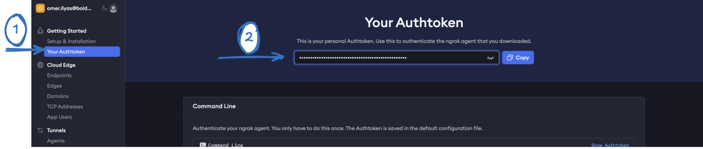{ loading=lazy }

    /// caption
    ngrok dashboard showing your auth token.
    ///

3. We'll start the Streamlit app in a later section and use ngrok to expose it via a public URL.

!!! tip "Want to explore on your own?"
    The official ngrok docs are at [ngrok.com/docs](https://ngrok.com/docs){:target="_blank" rel="noopener"}. The "Getting Started" section is the fastest way to see what's possible.

<p class="eyebrow">Module 2 · ≈ 90 min</p>

## LangChain for Messaging Intelligence { #module-2 data-toc-label="Module 2 · LangChain" }

In Part 1 you explored Cisco AI Assistant features such as **Ask Me Anything**, **Space Summaries**, **Smart Rewrite**, and **Translation**. These features show how AI can help users understand conversations, catch up quickly, improve communication, and work across languages.

In this module, we will take a step further and explore how AI frameworks like **LangChain** can be used to build simplified versions of these experiences using the **Webex Messaging APIs**.

Rather than treating AI as magic or a black box, we will break the experience down into building blocks:

- how to connect to Webex
- how to authenticate using an API token
- how to retrieve messages from a Webex space
- how to convert those messages into LangChain documents
- how those documents can later be used for RAG, summaries, rewrite, and agents

By the end of this module, you will understand how prompts, chains, retrievers, vector databases, tools, and agents come together to create intelligent messaging experiences.

#### What you will build

You will build a simplified **Webex Messaging Intelligence Assistant** using LangChain. Each task stacks on the last, until you have a real, working AI assistant for your Webex spaces.

<div class="glance build time" markdown>

| | Task | You'll learn | Time |
|---|---|---|---|
| 2a | [Read Webex messages](#module-2a) | API access, authentication, data ingestion, LangChain documents | 15 min |
| 2b | [Ask Me Anything for Webex spaces](#module-2b) | RAG, embeddings, vector database | 30 min |
| 2c | [Generate space summaries](#module-2c) | Prompt templates, chains | 20 min |
| 2d | [Rewrite Webex messages](#module-2d) | Prompt engineering | 25 min |

</div>

!!! warning "Use one Colab notebook for the whole module"
    Each task builds on variables created in the task before it (for example, `webex_documents` from Task 1). Work through 2a → 2d **in order, in the same Google Colab notebook**, and keep the runtime connected.

<p class="eyebrow sub">Module 2a · Task 1 · ≈ 15 min</p>

### Connect LangChain to Webex Messaging { #module-2a data-toc-label="2a · Read Webex messages" data-task="2a" }

<p class="lede">Read Webex messages as AI context.</p>


#### Goal

In this task, we will connect to the **Webex Messaging API**, retrieve recent messages from a Webex space, and convert those messages into **LangChain Documents**.

This is the foundation for everything we will build later. Before an AI assistant can summarize, answer questions, rewrite messages, or act as an agent, it first needs access to context.

!!! tip "Teaching moment"
    Before AI can reason, it first needs **context** and **data**.

#### What you will learn

By the end of this task, you will understand:

* how to call the **Webex Messages API** from Google Colab
* how to retrieve recent messages from a Webex space
* how to inspect raw Webex message data
* how to convert Webex messages into **LangChain Documents**

!!! info "Already covered in Module 1"
    A few foundations for this task were set up earlier in [Module 1: Setup your Lab Environment](#module-1). If anything below feels unfamiliar, jump back and review:

    * Accessing the Webex Developer Portal, retrieving your **personal access token**, and locating your **Webex Space ID**: covered in [1a: Webex Developer Portal Setup](#module-1a).
    * Creating a Google Colab notebook and connecting to a runtime: covered in [1b: Google Colab Setup](#module-1b).
    * Storing API keys safely as **Colab Secrets**: covered in [1c: Managing API Keys in Colab](#module-1c).

The Webex Messages API lets developers list, create, update, and delete messages. Messages include text, sender information, timestamps, and other metadata. The API requires the user to be a member of the Webex room being accessed.

#### Prerequisites

Before starting this task, make sure you have:

* access to **Google Colab**
* a **Webex** account
* an **OpenAI API key** (used in later LangChain tasks)
* a **Webex personal access token**

!!! info "About personal access tokens"
    For testing and lab use, Webex personal access tokens can be copied from the Webex Developer Portal. These tokens are short-lived and are intended for development and testing, not production applications.

#### Steps

##### Step 1: Open Google Colab { #t2a-step-1 }

Open Google Colab and create a new notebook.

In Google Colab:

1. Click **File**.
2. Click **New notebook**.
3. Rename the notebook to `LangChain_Webex_Messaging_Task1`.

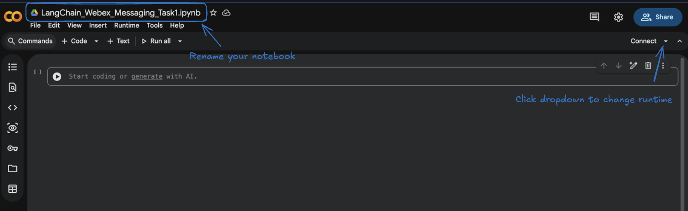{ loading=lazy }

/// caption
Create a new notebook from File > New notebook in Google Colab.
///

Make sure you are connected to a runtime. For this task, a **CPU runtime** is enough (no GPU required).

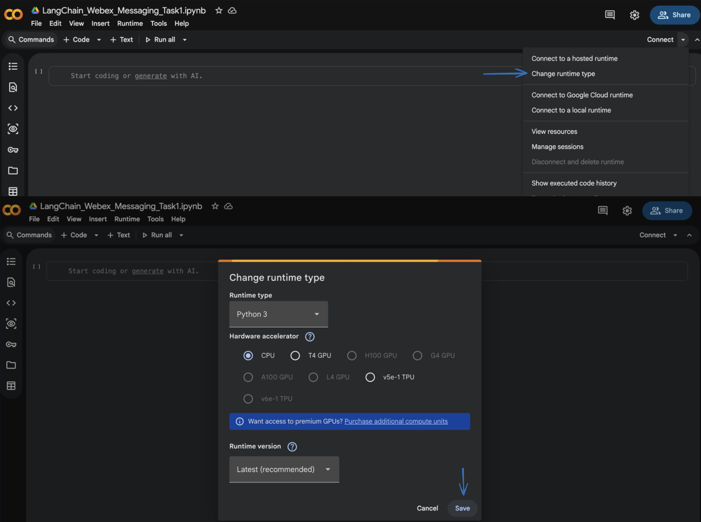{ loading=lazy }

/// caption
Confirm a runtime is connected in the top-right of the Colab notebook.
///

##### Step 2: Add Secrets in Google Colab { #t2a-step-2 }

Open the **Secrets** section from the left sidebar in Colab and add the following secret:

* `WEBEX_ACCESS_TOKEN`

!!! note "Don't have your token yet?"
    For now, just create the secret with the name `WEBEX_ACCESS_TOKEN` and leave the **Value** empty. You'll copy your Webex personal access token from the Developer Portal in [Step 3](#t2a-step-3) and paste it in then.

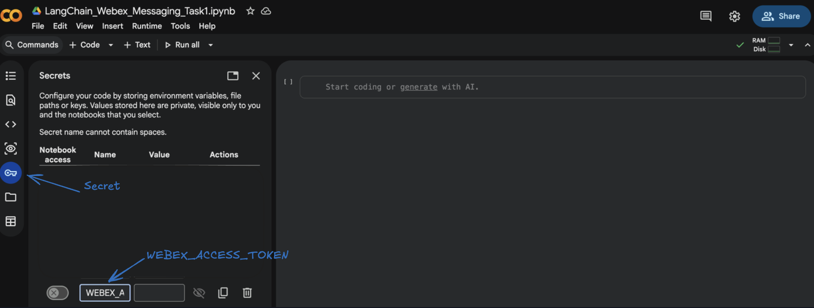{ loading=lazy }

/// caption
Add a new secret named WEBEX_ACCESS_TOKEN in the Colab Secrets panel.
///

Optional for later tasks (you can add it now to save time):

* `OPENAI_API_KEY`

We'll toggle **Notebook access** on for each secret in the next step.

!!! warning "Why use Secrets?"
    Storing your token as a Colab Secret avoids hardcoding it inside the notebook. Hardcoded tokens are easy to leak by accident: in screenshots, in shared notebooks, or when the notebook is pushed to a public repo.

##### Step 3: Get Your Webex Personal Access Token { #t2a-step-3 }

Open the [Webex Developer Portal](https://developer.webex.com){:target="_blank" rel="noopener"}, then:

1. Sign in with your Webex account.
2. Go to the **Getting Started** or **API Reference** section.
3. Locate your **Personal Access Token**.
4. Copy the token.

    { loading=lazy }

    /// caption
    Copy your Bearer token from the Webex Developer Portal.
    ///

5. Go back to your Colab notebook, open the **Secrets** panel from the left sidebar, find the `WEBEX_ACCESS_TOKEN` secret you created in [Step 2](#t2a-step-2), and paste the token into its **Value** field. Then turn on the **Notebook access** toggle next to it so this notebook can read the secret.

    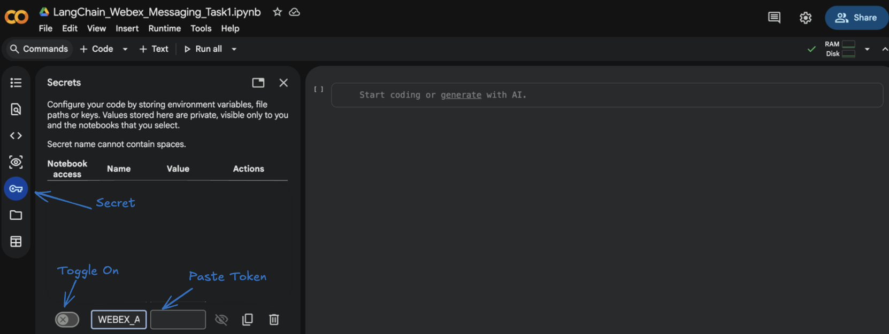{ loading=lazy }

    /// caption
    Paste your Webex token into the WEBEX_ACCESS_TOKEN secret value and toggle Notebook access on.
    ///

Webex REST API requests must include an access token in the `Authorization` header. For lab testing, the personal access token allows API calls to be made on your own behalf.

!!! warning "Tokens expire"
    Personal access tokens are short-lived. If your code suddenly stops working later, your token may have expired. Return to the Webex Developer Portal, copy a new token, and update your Colab secret.

##### Step 4: Create or Identify a Webex Space { #t2a-step-4 }

You now need a Webex space that contains some messages. You can use:

* the **Charles's Space** that was created as part of this lab (recommended)
* a new space you create yourself
* a direct space with another lab user

For the best experience, post a few messages in the space so the AI assistant has something to work with. For example:

```text
Hi team, we need to prepare the WebexOne LangChain demo.
Can someone confirm who owns the Webex API part?
I will test the Google Colab notebook today.
The main action item is to build a simple AMA experience.
```

These messages will become the data source for the AI assistant in later tasks.

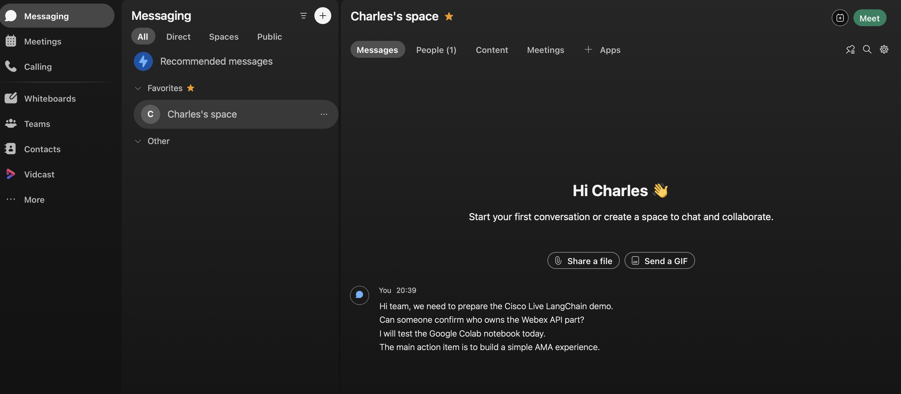{ loading=lazy }

/// caption
Sample messages posted in the Webex space to seed the AI assistant.
///

##### Step 5: Install Required Libraries { #t2a-step-5 }

In your Colab notebook, click **+ Code** to add a new cell, then run:

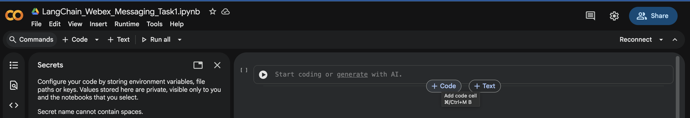{ loading=lazy }

/// caption
Add a new code cell with + Code in Colab.
///

```py linenums="1"
!pip install requests
!pip install langchain==0.3.27 langchain-core==0.3.72 langchain-community==0.3.27 langchain-openai==0.3.28 faiss-cpu
```

For Task 1 we only need:

* **`requests`** to call Webex APIs
* **`langchain-core`** to create LangChain `Document` objects

The other LangChain pieces (LLMs, retrievers, agents) come into play in the next tasks.

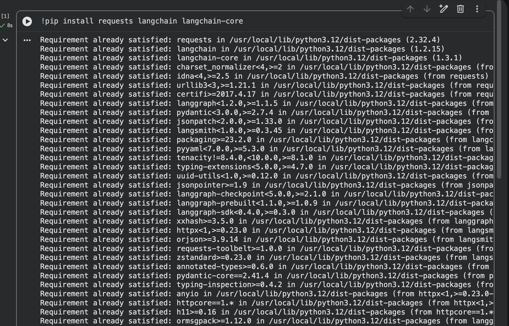{ loading=lazy }

/// caption
Successful pip install output in the Colab cell.
///

##### Step 6: Load the Webex Token from Colab Secrets { #t2a-step-6 }

In a new code cell, run:

```py linenums="1"
import os
from google.colab import userdata

WEBEX_ACCESS_TOKEN = userdata.get("WEBEX_ACCESS_TOKEN")

if WEBEX_ACCESS_TOKEN:
    print("Webex token loaded successfully.")
else:
    print("Webex token not found. Please check your Colab Secrets.")
```

`userdata.get(...)` reads the secret you stored in Step 2 without printing it to the screen. The `if/else` check is a quick sanity test so you don't move on with a missing or misnamed secret.

**Expected output:**

```text
Webex token loaded successfully.
```

##### Step 7: Test Webex Authentication { #t2a-step-7 }

Before we start reading messages, let's verify the token actually works by calling a simple endpoint that returns details about *you*.

In a new code cell, run:

```py linenums="1"
import requests

headers = {
    "Authorization": f"Bearer {WEBEX_ACCESS_TOKEN}",
    "Content-Type": "application/json"
}

response = requests.get(
    "https://webexapis.com/v1/people/me",
    headers=headers
)

print("Status Code:", response.status_code)
print(response.json())
```

What's happening here:

* **`headers`** carries your Bearer token in the format Webex expects.
* **`/v1/people/me`** is a Webex endpoint that returns the user identified by the token.
* **`response.status_code`** of `200` means the call succeeded.

**Expected output:**

```text
Status Code: 200
```

You'll also see a JSON object with details about the Webex user associated with the token. The example below shows what that JSON looks like for one lab pod (Charles Holland on `cb426.dc-01.com`):

```json
{
  "id": "Y2lzY29zcGFyazovL3VzL1BFT1BMRS9mZTNkNTQ1MC1hYmExLTRiOTUtOTNmMy1iYzMzYWVjNTNmZWI",
  "emails": ["cholland@cb426.dc-01.com"],
  "sipAddresses": [
    {"type": "cloud-calling", "value": "cholland@cb42601d.calls.webex.com", "primary": true},
    {"type": "personal-room", "value": "25346128042@cb42601.webex.com", "primary": false},
    {"type": "personal-room", "value": "cholland@cb42601.webex.com", "primary": false}
  ],
  "displayName": "Charles Holland",
  "nickName": "Charles",
  "firstName": "Charles",
  "lastName": "Holland",
  "orgId": "Y2lzY29zcGFyazovL3VzL09SR0FOSVpBVElPTi9jZjQzOGI4My1hMmY0LTQ0NjktYjUxZi00NGEwMTFmYThkYzU",
  "created": "2026-05-21T15:49:50.050Z",
  "status": "active",
  "type": "person",
  "siteUrls": ["cb42601.webex.com"]
}
```

!!! info "Your output will look slightly different"
    The values above are for example only. In your case, the `cb426` part of the email and site URLs will be replaced with **your own dCloud-assigned domain** (for example `cb123`, `cb789`, etc.). The shape of the response will be the same; only the IDs, emails, and domain will change.

If you get a `401`, your token is wrong or expired: re-do Step 3.

##### Step 8: List Your Webex Spaces { #t2a-step-8 }

Now retrieve the list of spaces (rooms) your Webex user can see.

In a new code cell, run:

```py linenums="1"
rooms_url = "https://webexapis.com/v1/rooms"

params = {
    "max": 20
}

response = requests.get(
    rooms_url,
    headers=headers,
    params=params
)

print("Status Code:", response.status_code)

rooms = response.json().get("items", [])

for index, room in enumerate(rooms):
    print(index, "-", room.get("title"), "-", room.get("id"))
```

A few notes:

* **`/v1/rooms`** lists spaces the authenticated user has access to.
* **`max=20`** asks Webex to return up to 20 rooms in one call.
* The loop prints an **index**, the **title**, and the **room ID**.

**Example output:**

```text
Status Code: 200
0 - Charles's space - Y2lzY29zcGFyazovL3VybjpURUFNOnVzLXdlc3QtMl9yL1JPT00vMWE2NTIyNDAtNTZkZS0xMWYxLTk1ZWMtZWQ2OGY4MmM4ZjJi
1 - Omer's - Y2lzY29zcGFyazovL3VzL1JPT00v...
2 - Anita Perez - Y2lzY29zcGFyazovL3VzL1JPT00v...
```

Find the space you want to use and copy its room ID for the next step. **For this lab, we will use Charles's Space.**

##### Step 9: Set the Room ID { #t2a-step-9 }

In a new code cell, paste your selected room ID:

```py linenums="1"
ROOM_ID = "PASTE-YOUR-WEBEX-ROOM-ID-HERE"

print("Using room ID:", ROOM_ID)
```

!!! warning "Use your own Room ID"
    Replace `PASTE-YOUR-WEBEX-ROOM-ID-HERE` with the **room ID from your own pod** (the value you copied from the previous step's output, next to **Charles's Space**). Every dCloud pod has a different room ID, so the example below will not work in your notebook.

##### Step 10: Read Recent Messages from the Webex Space { #t2a-step-10 }

Now retrieve recent messages from the selected space.

In a new code cell, run:

```py linenums="1"
messages_url = "https://webexapis.com/v1/messages"

params = {
    "roomId": ROOM_ID,
    "max": 20
}

response = requests.get(
    messages_url,
    headers=headers,
    params=params
)

print("Status Code:", response.status_code)

data = response.json()
messages = data.get("items", [])

print("Messages retrieved:", len(messages))
```

The Webex **List Messages** API retrieves messages from a room using the `roomId` query parameter. `max=20` keeps the lab fast: feel free to increase later.

**Expected output:**

```text
Status Code: 200
Messages retrieved: 20
```

If you see `Messages retrieved: 0`, post a few messages in your Webex space and run this cell again.

##### Step 11: Inspect the Raw Message Data { #t2a-step-11 }

Let's look at one message so you can see the shape of the data the API returns.

In a new code cell, run:

```py linenums="1"
messages[0]
```

You should see a JSON object similar to:

```json
{
    "id": "Y2lzY29zcGFyazovL3VzL01FU1NBR0Uv...",
    "roomId": "Y2lzY29zcGFyazovL3VzL1JPT00v...",
    "roomType": "group",
    "text": "The main action item is to build a simple AMA experience.",
    "personId": "Y2lzY29zcGFyazovL3VzL1BFT1BMRS8...",
    "personEmail": "user@example.com",
    "created": "2026-05-23T10:00:00.000Z"
}
```

This matters because it shows the type of data an AI assistant can use:

* **message text** (what was said)
* **sender** (who said it)
* **timestamp** (when)
* **room ID** and **message ID** (for citations later)

In later tasks, we'll use this information to generate summaries, answer questions, and even cite the original messages back to the user.

##### Step 12: Display Messages in a Cleaner Format { #t2a-step-12 }

Raw JSON is hard to read. Let's print the messages in a more human-friendly format.

In a new code cell, run:

```py linenums="1"
for message in messages:
    sender = message.get("personEmail", "Unknown sender")
    created = message.get("created", "Unknown time")
    text = message.get("text", "")

    if text:
        print(f"[{created}] {sender}: {text}")
        print("-" * 80)
```

The `if text:` check skips messages with no text body (file shares, reactions, system events).

**Example output:**

```text
[2026-05-23T10:00:00.000Z] anita@example.com: Can someone confirm who owns the Webex API part?
--------------------------------------------------------------------------------
[2026-05-23T10:02:00.000Z] charles@example.com: I will test the Google Colab notebook today.
--------------------------------------------------------------------------------
```

At this point, you've successfully connected to Webex and retrieved messaging data.

##### Step 13: Convert Webex Messages into LangChain Documents { #t2a-step-13 }

LangChain works with a common object called a **`Document`**. A `Document` has two parts:

* **`page_content`**: the main text the AI will read.
* **`metadata`**: any extra info about where the text came from.

For Webex messages, the mapping is straightforward:

* `page_content` = Webex message text
* `metadata` = sender, timestamp, message ID, room ID

In a new code cell, run:

```py linenums="1"
from langchain_core.documents import Document

webex_documents = []

for message in messages:
    text = message.get("text")

    if text:
        doc = Document(
            page_content=text,
            metadata={
                "message_id": message.get("id"),
                "room_id": message.get("roomId"),
                "sender": message.get("personEmail"),
                "created": message.get("created")
            }
        )

        webex_documents.append(doc)

print("LangChain documents created:", len(webex_documents))
```

**Expected output:**

```text
LangChain documents created: 20
```

##### Step 14: Inspect a LangChain Document { #t2a-step-14 }

In a new code cell, run:

```py linenums="1"
webex_documents[0]
```

You should see something like:

```text
Document(
    page_content='The main action item is to build a simple AMA experience.',
    metadata={
        'message_id': 'Y2lzY29...',
        'room_id': 'Y2lzY29...',
        'sender': 'user@example.com',
        'created': '2026-05-23T10:00:00.000Z'
    }
)
```

!!! success "This is the moment Webex data becomes AI-ready"
    The raw Webex messages are now structured in a format LangChain can use for:

    * **RAG** (retrieval-augmented generation)
    * **summarization**
    * **message rewriting**
    * **agent tools**
    * future **UI** experiences

##### Step 15: Quick Validation { #t2a-step-15 }

A short final check to confirm everything is wired up correctly.

In a new code cell, run:

```py linenums="1"
print("First message content:")
print(webex_documents[0].page_content)

print("\nMessage metadata:")
print(webex_documents[0].metadata)
```

**Expected output:**

```text
First message content:
The main action item is to build a simple AMA experience.

Message metadata:
{
  'message_id': '...',
  'room_id': '...',
  'sender': 'user@example.com',
  'created': '2026-05-23T10:00:00.000Z'
}
```

#### Summary

In this task, we connected Google Colab to Webex Messaging using the Webex APIs.

We:

* retrieved a Webex access token
* stored it securely in Google Colab Secrets
* tested authentication using `/people/me`
* listed Webex spaces
* selected a Webex room ID
* retrieved recent messages from that space
* inspected raw message JSON
* converted Webex messages into LangChain Documents

This is the **first building block** of our AI messaging system. The key idea is simple:

* **Webex** provides the conversation data.
* **LangChain** gives us the framework to transform that data into intelligent AI workflows.

<p class="eyebrow sub">Module 2b · Task 2 · ≈ 30 min</p>

### Ask Me Anything for Webex Spaces { #module-2b data-toc-label="2b · Ask Me Anything (RAG)" data-task="2b" }


<p class="lede">Build a Retrieval-Augmented Question Answering experience over your Webex space.</p>

#### Goal

In [Task 1](#module-2a) we connected to Webex Messaging, retrieved recent messages from a Webex space, and converted those messages into LangChain Documents.

Now we are going to take the next step. Instead of only displaying raw messages, we will build a simple **Ask Me Anything** experience, where a user can ask natural language questions about the conversation in their space.

For example:

* What was discussed in this space?
* What are the action items?
* Did anyone mention Cisco Live?
* Who is responsible for testing the lab?

This is similar to the native **Cisco AI Assistant** experience, where users can ask questions about recent activity in a space. The goal here is not to replace Cisco AI Assistant. The goal is to understand the building blocks behind this type of experience, so you can apply the same pattern to your own data later.

We will do this using **RAG** (Retrieval-Augmented Generation): pull only the most relevant Webex messages, hand them to the LLM as context, and let the LLM answer the question using that context instead of its own memory.

#### What you will learn

By the end of this task, you will understand:

* what **Retrieval-Augmented Generation**, or **RAG**, means
* why raw messages need to be prepared before sending to an LLM
* how to split Webex messages and create **embeddings**
* how to store Webex messages in a **vector database**
* how to retrieve relevant messages based on a user question
* how to ask an LLM to answer **only** from Webex message context

!!! info "Already covered in earlier tasks"
    * Webex token, Space ID, and Colab Secrets: see [1a](#module-1a) and [1c](#module-1c).
    * Calling the Webex Messages API and converting results into LangChain `Document` objects: see [2a](#module-2a).

#### Prerequisites

!!! danger "Stop: you must complete Task 1 in the same notebook first"
    **Task 2 cannot be run on its own.** It builds directly on the work you did in [Task 1 (2a)](#module-2a), and it relies on the `webex_documents` variable that Task 1 created in memory.

    Before you continue, make sure all of the following are true:

    * You completed every step of [Task 1](#module-2a).
    * You are working in the **same Google Colab notebook** you used for Task 1.
    * The notebook runtime is still connected (the **Connect** indicator in the top-right shows a green check). If the runtime disconnected or you reopened the notebook in a new session, **re-run all of the Task 1 cells from top to bottom** before starting Task 2.

    You can confirm everything is in place by running this in a new code cell:

    ```py linenums="1"
    print("webex_documents loaded:", len(webex_documents), "messages")
    ```

    If you see a `NameError: name 'webex_documents' is not defined` instead of a number, go back and re-run Task 1 first.

The only new thing Task 2 introduces is the **OpenAI API key**, which you already stored as `OPENAI_API_KEY` in [Module 1c](#module-1c).

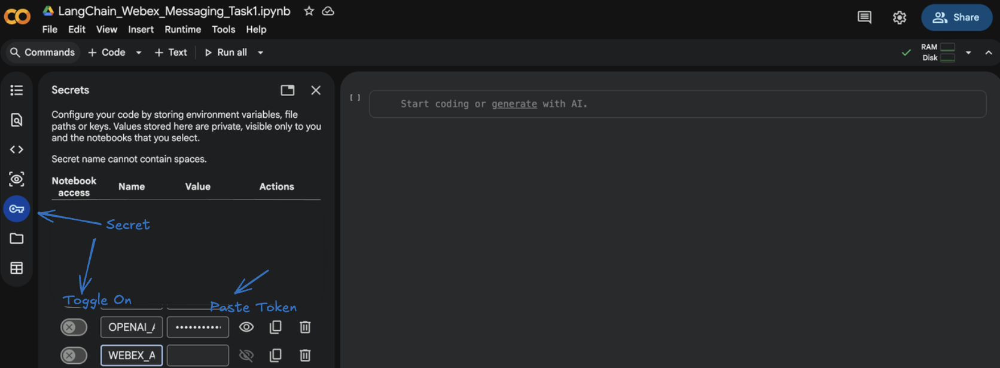{ loading=lazy }

/// caption
OPENAI_API_KEY stored in Colab Secrets with Notebook access enabled.
///

Everything else (your Webex token, the Charles's Space room ID, the Colab notebook itself) was set up during Task 1 and is reused here.

#### Steps

!!! warning "Quick check before you start"
    A reminder before you run the first cell:

    * You are working in the **same Google Colab notebook** you used for [Task 1](#module-2a).
    * The notebook **runtime is connected** (the **Connect** indicator in the top-right shows a green check).
    * Task 1 has been **run end-to-end**, so the variable `webex_documents` already exists in this notebook's memory.

    If any of those are not true, scroll back up and finish [Task 1](#module-2a) first. Task 2 will not work without it.

##### Step 1: Confirm `webex_documents` is available { #t2b-step-1 }

Before we add any new code, let's make sure the messages we collected in Task 1 are still loaded in this notebook.

In a new code cell, run:

{ loading=lazy }

/// caption
Add a new code cell with + Code in Colab.
///

```py linenums="1"
webex_documents
```

You should see a Python list of `Document` objects, one per Webex message, each with `page_content` (the message text) and `metadata` (sender, timestamp, message ID, room ID). This is the data Task 2 will use as the knowledge base for our Ask Me Anything experience.

!!! danger "If you see `NameError: name 'webex_documents' is not defined`"
    The variable does not exist in this notebook's memory, which means **Task 1 has not been run** in this session. Go back to [Task 1 (2a)](#module-2a) and run every cell from the top before continuing.

##### Step 2: Install the required libraries { #t2b-step-2 }

Task 1 only needed `requests` and `langchain-core`. Task 2 introduces the LLM, embeddings, and a vector store, so we need a few more packages.

If you already installed the LangChain packages back in Task 1 (Step 5), you do not need to install them again. Skip ahead to Step 3 of this task.

In a new code cell, run:

```py linenums="1"
!pip install langchain==0.3.27 langchain-core==0.3.72 langchain-community==0.3.27 langchain-openai==0.3.28 faiss-cpu
```

When the install finishes, Colab will print a few **dependency warning** messages near the end of the output. These are safe to ignore for this lab.

You will also see a banner at the bottom asking you to **restart the runtime** so the newly installed packages are picked up. Click **Restart session** (or **Restart runtime**) when prompted.

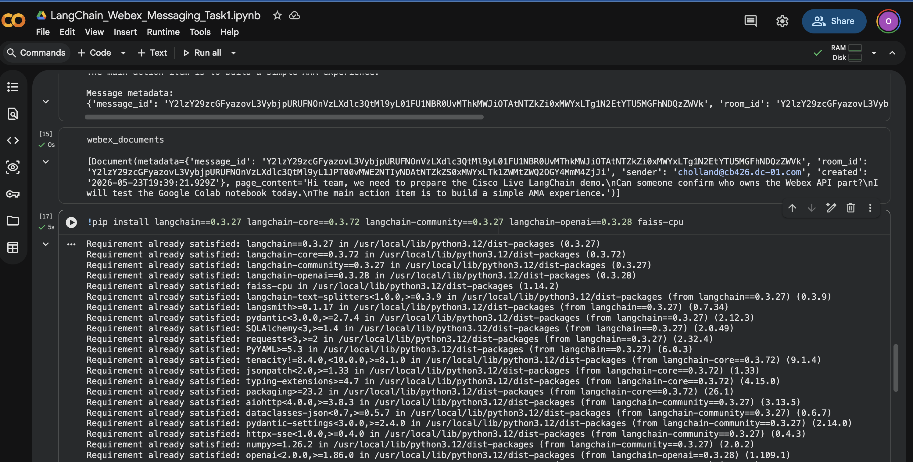{ loading=lazy }

/// caption
Colab prompt to restart the runtime after installing the LangChain packages.
///

After the restart, make sure the runtime reconnects (the **Connect** indicator in the top-right shows a green check) before you continue.

What we are installing and why:

* **`langchain`** for chains and retrieval workflows
* **`langchain-openai`** for OpenAI chat models and embeddings
* **`faiss-cpu`** for local vector search inside Google Colab

!!! note "Why pin the versions?"
    For a lab environment, pinning each package to a specific version helps avoid surprises during the session. If LangChain releases a new version mid-lab and changes an API, your code keeps working because you're locked to a version we've already tested.

##### Step 3: Load your OpenAI API key from Colab Secrets { #t2b-step-3 }

In Task 1 we loaded the Webex token from Colab Secrets. We will do the same thing for the OpenAI API key here, except this time we also expose it as an **environment variable** called `OPENAI_API_KEY`. LangChain and the OpenAI client both read that variable automatically, so once it is set, we don't have to pass the key around in our code.

In a new code cell, run:

```py linenums="1"
import os
from google.colab import userdata

os.environ["OPENAI_API_KEY"] = userdata.get("OPENAI_API_KEY")

if os.environ["OPENAI_API_KEY"]:
    print("OpenAI API key loaded successfully.")
else:
    print("OpenAI API key not found. Please check your Colab Secrets.")
```

What's happening here:

* **`userdata.get("OPENAI_API_KEY")`** reads the secret you saved in [Module 1c](#module-1c) without printing it on screen.
* **`os.environ["OPENAI_API_KEY"] = ...`** stores the key as an environment variable so that any LangChain or OpenAI call in this notebook can find it.
* The `if/else` is just a quick sanity check.

**Expected output:**

```text
OpenAI API key loaded successfully.
```

If you see `OpenAI API key not found. Please check your Colab Secrets.` instead, jump back to [Module 1c](#module-1c), confirm the secret name is exactly `OPENAI_API_KEY`, and make sure the **Notebook access** toggle is on for it.

##### Step 4: Review the Webex documents from Task 1 { #t2b-step-4 }

Before we start creating embeddings, let's take a quick look at the documents we are about to feed into the vector store. This is a sanity check, and it also makes the next steps easier to reason about.

In a new code cell, run:

```py linenums="1"
print("Number of Webex documents:", len(webex_documents))
print()
print("First document:")
print(webex_documents[0])
```

What's happening here:

* **`len(webex_documents)`** prints how many Webex messages were converted into LangChain `Document` objects in Task 1.
* **`webex_documents[0]`** shows the first one in detail, so you can see both the message text (`page_content`) and the metadata we attached (sender, timestamp, message ID, room ID).

**Example output:**

```text
Number of Webex documents: 1

First document:
page_content='Hi team, we need to prepare the Cisco Live LangChain demo.
Can someone confirm who owns the Webex API part?
I will test the Google Colab notebook today.
The main action item is to build a simple AMA experience.' metadata={'message_id': 'Y2lzY29zcGFyazovL3VybjpURUFNOnVzLXdlc3QtMl9yL01FU1NBR0UvMThkMWJiOTAtNTZkZi0xMWYxLTg1N2EtYTU5MGFhNDQzZWVk', 'room_id': 'Y2lzY29zcGFyazovL3VybjpURUFNOnVzLXdlc3QtMl9yL1JPT00vMWE2NTIyNDAtNTZkZS0xMWYxLTk1ZWMtZWQ2OGY4MmM4ZjJi', 'sender': 'cholland@cb426.dc-01.com', 'created': '2026-05-23T19:39:21.929Z'}
```

This confirms that our Webex messages are now in a format LangChain can process.

!!! note "Your output will be different"
    The example above shows **`Number of Webex documents: 1`** because that pod only had a single message in the space at the time. In your case, the count will match how many text messages exist in **Charles's Space** when you ran Task 1, so you may see `2`, `5`, `20`, or any other number. The IDs, the sender email, and the timestamps will also be specific to your dCloud pod.

##### Step 5: Split the Webex messages into chunks { #t2b-step-5 }

In most RAG systems, documents are split into smaller pieces before they are embedded. Each Webex message may already be small, but chunking is still worth doing because:

* some messages may be long
* future spaces may contain long pasted content (logs, code blocks, articles)
* chunking makes retrieval more consistent
* a small **overlap** between chunks helps preserve context across boundaries

In a new code cell, run:

```py linenums="1"
from langchain_text_splitters import RecursiveCharacterTextSplitter

text_splitter = RecursiveCharacterTextSplitter(
    chunk_size=500,
    chunk_overlap=100
)

message_chunks = text_splitter.split_documents(webex_documents)

print("Original documents:", len(webex_documents))
print("Message chunks:", len(message_chunks))
```

What's happening here:

* **`RecursiveCharacterTextSplitter`** breaks each document into pieces of at most **`chunk_size=500`** characters, preferring natural splits (paragraphs, sentences, then words) before forcing a hard cut.
* **`chunk_overlap=100`** copies the last 100 characters of each chunk into the start of the next one, so an idea split across two chunks is still readable on either side.
* **`split_documents(webex_documents)`** runs that on every Webex `Document` we built in Task 1 and returns a flat list of chunks.

**Expected output:**

```text
Original documents: 1
Message chunks: 1
```

##### Step 6: Inspect a chunk { #t2b-step-6 }

Now that we have a list of chunks, let's open one up and see what it actually looks like. This is the same shape of object we saw in Step 4, just narrower in size after the splitter ran.

In a new code cell, run:

```py linenums="1"
message_chunks[0]
```

You should see a LangChain `Document` with:

* **`page_content`**, the chunk text
* **`metadata`**, carried over from the original Webex message (sender, timestamp, message ID, room ID)

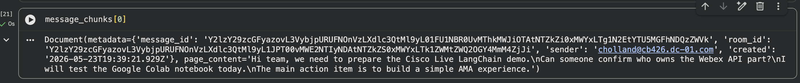{ loading=lazy }

/// caption
A single LangChain Document chunk shown in Colab, with page_content and metadata fields.
///

##### Step 7: Create the embedding model { #t2b-step-7 }

Embeddings convert text into numerical **vectors**. Each chunk becomes a list of numbers that represents the *meaning* of the text, not the exact words. Two pieces of text with similar meaning end up with similar vectors, even if they share no words in common. That is what lets semantic search find a relevant Webex message when the user's question is phrased completely differently.

We are not embedding any text yet, just creating the embedding model object. We'll use it in the next step.

In a new code cell, run:

```py linenums="1"
from langchain_openai import OpenAIEmbeddings

embeddings = OpenAIEmbeddings(model="text-embedding-3-small")

print("Embedding model ready.")
```

What's happening here:

* **`OpenAIEmbeddings`** is the LangChain wrapper around OpenAI's embedding API. It uses the `OPENAI_API_KEY` environment variable we set in [Step 3](#t2b-step-3) automatically.
* **`text-embedding-3-small`** is a great default for lab work and small datasets like Webex spaces.

**Expected output:**

```text
Embedding model ready.
```

##### Step 8: Store the Webex messages in a FAISS vector database { #t2b-step-8 }

Now we put the embedding model to work. We will run every Webex message chunk through the model, get back a vector for each one, and store all of those vectors in a local **FAISS** vector database. From that point on, we can ask "find me the chunks that are closest in meaning to this question" and FAISS will give us the best matches in milliseconds.

In a new code cell, run:

```py linenums="1"
from langchain_community.vectorstores import FAISS

vectorstore = FAISS.from_documents(
    documents=message_chunks,
    embedding=embeddings
)

print("FAISS vector database created successfully.")
```

What's happening here:

* **`FAISS.from_documents(...)`** takes our list of `message_chunks` from [Step 5](#t2b-step-5), runs each chunk through the embedding model from [Step 7](#t2b-step-7), and stores the resulting vectors in a local FAISS index.
* **`vectorstore`** is the in-memory database. It lives only in this Colab session, so we don't have to manage any external service.

**Expected output:**

```text
FAISS vector database created successfully.
```

At this stage, the Webex messages are now searchable by **meaning**, not just by keyword. That's the foundation for the Ask Me Anything experience.

##### Step 9: Test similarity search { #t2b-step-9 }

Before we bring an LLM into the picture, let's test retrieval directly against the vector store. This is a great way to see what the AMA experience will *see* before it asks the model to write an answer.

In a new code cell, run:

```py linenums="1"
query = "What are the action items?"

results = vectorstore.similarity_search(query, k=3)

for index, result in enumerate(results, start=1):
    print(f"Result {index}")
    print("Message:", result.page_content)
    print("Metadata:", result.metadata)
    print("-" * 80)
```

What's happening here:

* **`query`** is a natural-language question, the same kind of thing a user would type into the AMA UI.
* **`vectorstore.similarity_search(query, k=3)`** embeds the question, compares it against every chunk in FAISS, and returns the **top 3** closest matches.
* The `for` loop just prints each match nicely with its message text and metadata.

**Expected output:**

```text
Result 1
Message: Hi team, we need to prepare the Cisco Live LangChain demo.
Can someone confirm who owns the Webex API part?
I will test the Google Colab notebook today.
The main action item is to build a simple AMA experience.
Metadata: {'message_id': 'Y2lzY29zcGFyazovL3VybjpURUFNOnVzLXdlc3QtMl9yL01FU1NBR0UvMThkMWJiOTAtNTZkZi0xMWYxLTg1N2EtYTU5MGFhNDQzZWVk', 'room_id': 'Y2lzY29zcGFyazovL3VybjpURUFNOnVzLXdlc3QtMl9yL1JPT00vMWE2NTIyNDAtNTZkZS0xMWYxLTk1ZWMtZWQ2OGY4MmM4ZjJi', 'sender': 'cholland@cb426.dc-01.com', 'created': '2026-05-23T19:39:21.929Z'}
--------------------------------------------------------------------------------
```

!!! info "The model has not answered yet"
    At this point we are **only retrieving the most relevant Webex messages**. No LLM has been called, and no answer has been generated. The query just helps FAISS pull the chunks that are closest in meaning to the question. We'll hand those chunks to the LLM in the next step so it can write the actual answer.

##### Step 10: Create a retriever { #t2b-step-10 }

A **retriever** is the LangChain interface that searches the vector database. In Step 9 we called `similarity_search` directly. The retriever wraps that same idea in a standard object that the rest of LangChain (chains, agents, RAG pipelines) knows how to plug into.

In a new code cell, run:

```py linenums="1"
retriever = vectorstore.as_retriever(
    search_kwargs={"k": 5}
)

print("Retriever ready.")
```

What's happening here:

* **`vectorstore.as_retriever(...)`** turns our FAISS index from [Step 8](#t2b-step-8) into a retriever object.
* **`search_kwargs={"k": 5}`** tells the retriever to fetch the top **5** most relevant Webex message chunks every time a question is asked. We bumped this from `k=3` (used in the manual search) to give the LLM a bit more context to work with.

**Expected output:**

```text
Retriever ready.
```

From here on, every time a user asks a question, LangChain will hand the question to this retriever, get back the top 5 most relevant Webex message chunks, and pass them to the LLM as context.

##### Step 11: Create the LLM { #t2b-step-11 }

We have data, we have a way to find the right pieces of it, and now we need the brain that will read those pieces and write the answer. That's the **chat model**, also called the **LLM**.

In a new code cell, run:

```py linenums="1"
from langchain_openai import ChatOpenAI

llm = ChatOpenAI(
    model="gpt-4o",
    temperature=0
)

print("LLM ready.")
```

!!! note "GPT-4o is used for demo purposes only"
    OpenAI officially retired GPT-4o from ChatGPT on February 13, 2026. We use it in this lab for demo purposes only. For your own projects, switch the `model` value to one of OpenAI's current models.

What's happening here:

* **`ChatOpenAI`** is the LangChain wrapper around OpenAI's chat models. It uses the `OPENAI_API_KEY` environment variable we set in [Step 3](#t2b-step-3) automatically.
* **`model="gpt-4o"`** picks the GPT-4o chat model.
* **`temperature=0`** makes the answer more consistent and predictable. Higher temperatures make the model more creative, but in a Q&A scenario over real Webex messages, we want it to stick closely to the facts in front of it.

**Expected output:**

```text
LLM ready.
```

##### Step 12: Create the RAG prompt { #t2b-step-12 }

Now we tell the model **how to behave** when it answers. The retriever will hand it the most relevant Webex messages, and we want the model to answer only from those messages, not from anything it learned during training. The way we do that in LangChain is with a **prompt template**.

In a new code cell, run:

```py linenums="1"
from langchain_core.prompts import ChatPromptTemplate

rag_prompt = ChatPromptTemplate.from_template("""
You are a helpful Webex messaging assistant.

Answer the user's question using only the Webex message context provided below.

If the answer is not available in the context, say:
"I could not find that in the recent Webex messages."

Do not make up information.

Webex message context:
<context>
{context}
</context>

User question:
{input}
""")

print("RAG prompt created.")
```

What's happening here:

* **`ChatPromptTemplate.from_template(...)`** builds a reusable prompt with two placeholders: `{context}` for the Webex messages the retriever finds, and `{input}` for the user's question.
* The instructions in the prompt are doing the heavy lifting. We are explicitly telling the model:
    * use the provided Webex messages **only**
    * do not guess
    * say when it does not know

This is what stops the model from drifting off into general knowledge or inventing facts about your space.

**Expected output:**

```text
RAG prompt created.
```

##### Step 13: Create the document chain { #t2b-step-13 }

The **document chain** takes the Webex message chunks the retriever finds and inserts them into the `{context}` placeholder of the prompt we just built. In other words, it's the piece that hands the right messages to the LLM in the right shape.

In a new code cell, run:

```py linenums="1"
from langchain.chains.combine_documents import create_stuff_documents_chain

document_chain = create_stuff_documents_chain(
    llm=llm,
    prompt=rag_prompt
)

print("Document chain created.")
```

What's happening here:

* **`create_stuff_documents_chain`** is LangChain's built-in helper for the simplest combine-documents pattern: take all the retrieved chunks and **stuff** them straight into the prompt's `{context}` placeholder.
* It takes two pieces we already built: the **`llm`** from [Step 11](#t2b-step-11) and the **`rag_prompt`** from [Step 12](#t2b-step-12).

**Expected output:**

```text
Document chain created.
```

##### Step 14: Create the retrieval chain { #t2b-step-14 }

The document chain knows how to put messages into a prompt and call the LLM, but it doesn't know how to *find* those messages. That's the retriever's job. The **retrieval chain** is the piece that connects them: take a user question, hand it to the retriever, then hand the retrieved messages to the document chain.

In a new code cell, run:

```py linenums="1"
from langchain.chains import create_retrieval_chain

retrieval_chain = create_retrieval_chain(
    retriever,
    document_chain
)

print("Retrieval chain created.")
```

What's happening here:

* **`create_retrieval_chain`** wires the **`retriever`** from [Step 10](#t2b-step-10) together with the **`document_chain`** from [Step 13](#t2b-step-13).
* The result is `retrieval_chain`, a single object that handles the **complete RAG workflow** end to end: take the question, fetch the top relevant Webex messages, build the prompt, call the LLM, return the answer.

**Expected output:**

```text
Retrieval chain created.
```

##### Step 15: Ask a question about the Webex space { #t2b-step-15 }

This is the moment everything we've built so far comes together. We will hand a natural-language question to the retrieval chain, and it will run the **complete RAG pipeline** for us: fetch the most relevant Webex messages, drop them into the prompt, call the LLM, and return the answer.

In a new code cell, run:

```py linenums="1"
question = "What are the main action items from this space?"

response = retrieval_chain.invoke({
    "input": question
})

print(response["answer"])
```

What's happening here:

* **`retrieval_chain.invoke({"input": question})`** kicks off the whole RAG workflow. Behind the scenes, the retriever pulls the top 5 closest chunks for that question, the document chain stuffs them into the prompt template, and the LLM generates the answer.

##### Step 16: Ask more questions { #t2b-step-16 }

One question is fine, but the real test is asking the assistant a few different things and seeing how well the answers stay grounded in your Webex messages. Some of these will have a clear answer in the space, others will not, and the prompt we wrote in [Step 12](#t2b-step-12) is what tells the model how to handle both cases.

In a new code cell, run:

```py linenums="1"
questions = [
    "What was discussed in this space?",
    "Who is responsible for testing?",
    "Was Cisco Live mentioned?",
    "What decisions were made?",
    "Are there any blockers?"
]

for question in questions:
    print("Question:", question)

    response = retrieval_chain.invoke({
        "input": question
    })

    print("Answer:", response["answer"])
    print("-" * 80)
```

For questions that the messages can support, you should get a focused, factual answer. For questions the messages do not cover, the model should fall back to the line we baked into the prompt: *"I could not find that in the recent Webex messages."*

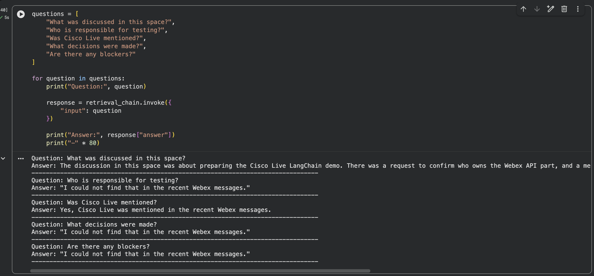{ loading=lazy }

/// caption
AMA running over the Webex space, with the model answering the questions that have context and falling back to "I could not find that in the recent Webex messages." for the rest.
///

##### Step 17: Create a simple reusable function { #t2b-step-17 }

Let's tidy things up by wrapping the whole workflow in a small Python function.

In a new code cell, run:

```py linenums="1"
def ask_webex_space(question):
    response = retrieval_chain.invoke({
        "input": question
    })

    answer = response["answer"]

    source_docs = retriever.invoke(question)

    print("Question:")
    print(question)

    print("\nAnswer:")
    print(answer)

    print("\nSources:")
    for index, doc in enumerate(source_docs, start=1):
        print(f"{index}. {doc.metadata.get('sender')} at {doc.metadata.get('created')}")
        print(f"   {doc.page_content}")
```

What's happening here:

* The function takes a single `question` string and runs the full RAG pipeline with **`retrieval_chain.invoke(...)`**, just like before.

Now let's test it. In a new code cell, run:

```py linenums="1"
ask_webex_space("What are the key points from this conversation?")
```

You'll see the question, the model's answer, and a numbered list of source Webex messages with the sender and timestamp for each one.

##### Step 18 (optional): Add a user input box in Colab { #t2b-step-18 }

For a more interactive experience inside Colab, you can ask the question through an input box instead of editing the code each time.

In a new code cell, run:

```py linenums="1"
user_question = input("Ask a question about your Webex space: ")

ask_webex_space(user_question)
```

When the cell runs, Colab will show a small text box right under the cell. Type your question and press **Enter** to send it through the same RAG pipeline you just built.

**Example:**

```text
Ask a question about your Webex space: What did the team agree to do next?
```

The notebook will then call `ask_webex_space(user_question)` for you, so you'll see the question, the answer, and the source Webex messages, exactly like the previous step.

#### Summary

In this task, we built a simplified **Ask Me Anything** experience for Webex messages.

We:

* reused the Webex messages we ingested in [Task 1](#module-2a)
* split those messages into smaller chunks
* turned each chunk into an embedding using OpenAI
* stored the embeddings in a local **FAISS** vector database
* wrote a **RAG prompt** that tells the LLM to answer only from the retrieved messages
* connected the retriever and the LLM together with a **retrieval chain**
* asked natural language questions about the Webex space and got back grounded answers
* wrapped the workflow in a small `ask_webex_space(...)` helper that also shows the **source messages** behind each answer

<p class="eyebrow sub">Module 2c · Task 3 · ≈ 20 min</p>

### Generate Space Summaries { #module-2c data-toc-label="2c · Space summaries" data-task="2c" }


<p class="lede">Build a Space Summary Assistant for your Webex space.</p>

#### Goal

In [Task 1](#module-2a) we connected to Webex Messaging and retrieved recent messages from a Webex space.

In [Task 2](#module-2b) we used those messages to build a simple **Ask Me Anything** experience with RAG.

Now, in **Task 3**, we will build a **Space Summary Assistant**. Instead of asking one question at a time, we will ask LangChain to **summarize** the recent Webex conversation and pull out the parts that actually matter:

* Key points
* Decisions
* Action items
* Risks or blockers
* Open questions

This is similar to the native **Cisco AI Assistant** space summary feature, where users can catch up on missed messages and recent conversation activity. The goal here is not to replace Cisco AI Assistant. The goal is to understand how this kind of workflow can be built using **LangChain prompt templates and chains**.

#### What you will learn

By the end of this task, you will understand:

* how to **reuse** Webex messages retrieved in Task 1
* how to **format** Webex messages for an LLM
* how **prompt templates** control the structure of the output
* how **LangChain chains** connect prompts, models, and output parsers
* how to generate **structured summaries** from conversation data
* how summarization differs from RAG-based question answering

#### Prerequisites

!!! danger "Stop: Task 1 must already be complete"
    Task 3 reuses the `webex_documents` variable that Task 1 created. It will not work without it.

    Before you continue, make sure all of the following are true:

    * You completed every step of [Task 1 (2a)](#module-2a).
    * Task 1 was run **in this same Google Colab notebook**, so `webex_documents` is still in memory.
    * The notebook runtime is still connected (the **Connect** indicator in the top-right shows a green check).

    You can confirm this with:

    ```py linenums="1"
    print("webex_documents loaded:", len(webex_documents), "messages")
    ```

    If you see a `NameError: name 'webex_documents' is not defined`, go back and re-run [Task 1](#module-2a) before continuing.

You can use the **same Colab notebook** you used for [Task 2](#module-2b). Everything we built there is still valid and we'll reuse it.

You should also have your **OpenAI API key** loaded from Colab Secrets, just like in Task 2.

!!! note "Starting a new notebook?"
    If you would prefer to start with a clean notebook for Task 3, that's fine, but you must run [Task 1](#module-2a) first in that new notebook so `webex_documents` exists. Without it, the cells in this task will fail.

#### Steps

!!! warning "Quick check before you start"
    A reminder before you run the first cell:

    * You are working in the **same Google Colab notebook** you used for [Task 1](#module-2a) and [Task 2](#module-2b).
    * The notebook **runtime is connected** (the **Connect** indicator in the top-right shows a green check).
    * Task 1 has been **run end-to-end**, so the variable `webex_documents` already exists in this notebook's memory.

    If any of those are not true, scroll back up and finish [Task 1](#module-2a) first. Task 3 will not work without it.

##### Step 1: Confirm the required libraries { #t2c-step-1 }

If you already installed the LangChain packages back in [Task 2 (Step 2)](#t2b-step-2), you do not need to install them again. Skip ahead to Step 2 of this task.

If you started a fresh notebook, in a new code cell, run:

```py linenums="1"
!pip install langchain==0.3.27 langchain-core==0.3.72 langchain-openai==0.3.28
```

Task 3 only needs `langchain`, `langchain-core`, and `langchain-openai`. We don't need FAISS or `langchain-community` here because we are summarizing the conversation, not running RAG.

##### Step 2: Load your OpenAI API key from Colab Secrets { #t2c-step-2 }

If you completed Task 2 in this notebook, the key is already loaded and you can skip ahead to Step 3.

To be safe, in a new code cell, run:

```py linenums="1"
import os
from google.colab import userdata

os.environ["OPENAI_API_KEY"] = userdata.get("OPENAI_API_KEY")

if os.environ["OPENAI_API_KEY"]:
    print("OpenAI API key loaded successfully.")
else:
    print("OpenAI API key not found. Please check your Colab Secrets.")
```

**Expected output:**

```text
OpenAI API key loaded successfully.
```

If you see the "not found" message, jump back to [Module 1c](#module-1c), confirm the secret name is exactly `OPENAI_API_KEY`, and make sure the **Notebook access** toggle is on.

##### Step 3: Review the Webex documents { #t2c-step-3 }

Let's quickly inspect the messages we retrieved earlier so we know what we are about to summarize.

In a new code cell, run:

```py linenums="1"
print("Total Webex documents:", len(webex_documents))

print("\nFirst Webex document:")
print(webex_documents[0])
```

Each `Document` should contain:

* **`page_content`**: the message text
* **`metadata`**: sender, created time, message ID, room ID

##### Step 4: Format Webex messages for summarization { #t2c-step-4 }

Right now `webex_documents` is a list of LangChain `Document` objects. The LLM needs them as a single block of text that reads like a real conversation transcript: who said what, and when.

In a new code cell, run:

```py linenums="1"
def format_webex_messages_for_summary(documents):
    formatted_messages = []

    for doc in documents:
        sender = doc.metadata.get("sender", "Unknown sender")
        created = doc.metadata.get("created", "Unknown time")
        text = doc.page_content

        formatted_message = f"[{created}] {sender}: {text}"
        formatted_messages.append(formatted_message)

    return "\n".join(formatted_messages)


conversation_text = format_webex_messages_for_summary(webex_documents)

print(conversation_text[:2000])
```

The function turns each Webex message into a `[timestamp] sender: text` line, then joins them with newlines so the LLM sees the whole conversation in chronological order.

**Example output:**

```text
[2026-05-23T19:39:21.929Z] cholland@cb426.dc-01.com: Hi team, we need to prepare the Cisco Live LangChain demo.
Can someone confirm who owns the Webex API part?
I will test the Google Colab notebook today.
The main action item is to build a simple AMA experience.
```

!!! note "Your output may look slightly different"
    If your Webex space has more messages, you'll see more `[timestamp] sender: text` lines, one per message, in the same shape as the example above.

##### Step 5: Create the LLM { #t2c-step-5 }

If you already created the `llm` in Task 2, you can reuse it here, no new cell needed.

To be safe, in a new code cell, run:

```py linenums="1"
from langchain_openai import ChatOpenAI

llm = ChatOpenAI(
    model="gpt-4o",
    temperature=0
)

print("LLM ready.")
```

`temperature=0` keeps the summary focused and consistent. We don't want the model getting creative with the action items.

**Expected output:**

```text
LLM ready.
```

##### Step 6: Create the summary prompt template { #t2c-step-6 }

This is the heart of Task 3. The prompt is what tells the model **how** to summarize, **what sections** to include, and **what to do** when information isn't in the conversation.

In a new code cell, run:

```py linenums="1"
from langchain_core.prompts import ChatPromptTemplate

summary_prompt = ChatPromptTemplate.from_template("""
You are a helpful Webex space summary assistant.

Your task is to summarize the recent Webex conversation provided below.

Create a clear and useful summary with the following sections:

1. Quick Summary
A short paragraph explaining what the conversation was about.

2. Key Points
Bullet points covering the most important discussion points.

3. Decisions
List any decisions that were made. If there were no clear decisions, say "No clear decisions identified."

4. Action Items
List action items with owners if mentioned. If no owner is mentioned, say "Owner not specified."

5. Risks or Blockers
List any risks, blockers, or concerns. If none were mentioned, say "No risks or blockers identified."

6. Open Questions
List any unanswered questions or follow-ups. If none were mentioned, say "No open questions identified."

Important rules:
- Use only the Webex conversation below.
- Do not invent details.
- Keep the summary concise and easy to read.
- If information is not available, clearly say so.

Webex conversation:
<context>
{conversation}
</context>
""")

print("Summary prompt created.")
```

Notice that the **structure of the output is controlled entirely by the prompt**. If we change the section names or rules in here, the answer changes shape too. That's the whole idea behind prompt engineering.

**Expected output:**

```text
Summary prompt created.
```

##### Step 7: Add an output parser { #t2c-step-7 }

The output parser takes whatever the model returns and converts it into a clean Python string we can print or post somewhere else.

In a new code cell, run:

```py linenums="1"
from langchain_core.output_parsers import StrOutputParser

output_parser = StrOutputParser()

print("Output parser ready.")
```

**Expected output:**

```text
Output parser ready.
```

##### Step 8: Create the summary chain { #t2c-step-8 }

Now we connect the prompt, the LLM, and the output parser using **LangChain Expression Language** (the `|` operator).

In a new code cell, run:

```py linenums="1"
summary_chain = summary_prompt | llm | output_parser

print("Summary chain created.")
```

The flow is simply:

```text
Prompt Template  →  LLM  →  Output Parser
```

When we call `summary_chain.invoke(...)`, the input flows through each piece in order, and we get a clean string back at the end.

**Expected output:**

```text
Summary chain created.
```

##### Step 9: Generate the space summary { #t2c-step-9 }

This is the moment everything comes together, hand the formatted conversation to the chain and watch it produce a structured summary.

In a new code cell, run:

```py linenums="1"
summary = summary_chain.invoke({
    "conversation": conversation_text
})

print(summary)
```

**Example output:**

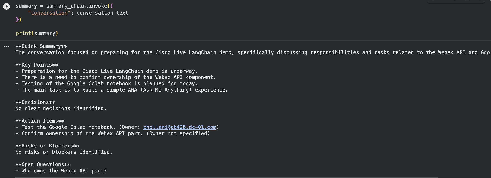{ loading=lazy }

/// caption
Structured Webex space summary printed in Colab with Quick Summary, Key Points, Decisions, Action Items, Risks or Blockers, and Open Questions sections.
///

Your output will be different because it depends on what's actually in your space. The shape and the section headings will match.

##### Step 10: Create a reusable summary function { #t2c-step-10 }

Let's wrap the whole flow into a small helper so we can call it any time without copy-pasting the same lines.

In a new code cell, run:

```py linenums="1"
def summarize_webex_space(documents):
    conversation = format_webex_messages_for_summary(documents)

    summary = summary_chain.invoke({
        "conversation": conversation
    })

    return summary
```

Now test it. In a new code cell, run:

```py linenums="1"
space_summary = summarize_webex_space(webex_documents)

print(space_summary)
```

You should see the same kind of structured summary as Step 9.

##### Step 11: Summarize only the most recent messages { #t2c-step-11 }

A real Webex space can have hundreds or thousands of messages. For this lab and for most "catch me up" use cases, we only care about the most **recent** ones.

In a new code cell, run:

```py linenums="1"
recent_documents = webex_documents[:10]

recent_summary = summarize_webex_space(recent_documents)

print(recent_summary)
```

This works because Task 1 retrieved messages in **most-recent-first order** from the Webex API, so `webex_documents[:10]` gives us the 10 newest.

You can adjust the number to suit:

```py linenums="1"
recent_documents = webex_documents[:20]
```

or:

```py linenums="1"
recent_documents = webex_documents[:50]
```

##### Step 12: Create a more executive-style summary { #t2c-step-12 }

Same Webex messages, same model, but a different prompt produces a very different summary. Let's prove it by writing a second prompt aimed at a senior leader who only has 30 seconds.

In a new code cell, run:

```py linenums="1"
executive_summary_prompt = ChatPromptTemplate.from_template("""
You are an executive assistant summarizing a Webex conversation for a senior leader.

Summarize the conversation in a concise executive format.

Use this structure:

Executive Summary:
Decision / Outcome:
Actions Required:
Concerns:
Recommended Next Step:

Rules:
- Use only the Webex conversation provided.
- Do not invent missing information.
- Keep the tone professional and concise.

Webex conversation:
<context>
{conversation}
</context>
""")

executive_summary_chain = executive_summary_prompt | llm | output_parser

executive_summary = executive_summary_chain.invoke({
    "conversation": conversation_text
})

print(executive_summary)
```

!!! tip "Teaching moment"
    Same Webex messages. Same model. **Different prompt.** Different output. This is the cleanest way to feel what prompt engineering actually does.

##### Step 13: Create a stand-up style summary { #t2c-step-13 }

One more variation. This one is shaped for a daily team stand-up.

In a new code cell, run:

```py linenums="1"
standup_summary_prompt = ChatPromptTemplate.from_template("""
You are summarizing a Webex conversation for a team stand-up.

Use this format:

Yesterday / Previous Discussion:
Today / Next Steps:
Blockers:
Owners:

Rules:
- Use only the Webex conversation provided.
- If owners are not clearly mentioned, say "Owner not specified."
- Keep it short and practical.

Webex conversation:
<context>
{conversation}
</context>
""")

standup_summary_chain = standup_summary_prompt | llm | output_parser

standup_summary = standup_summary_chain.invoke({
    "conversation": conversation_text
})

print(standup_summary)
```

Three different chains, three different summaries, all from the same Webex space. The prompt is doing all the work.

!!! note "Example, add the following to the rules in the prompt"
    Try adding this line to the **Rules** section of the stand-up prompt to give the summary a bit of personality:

    ```text
    - Make jokes based on the content, so we can have a laugh as well.
    ```

    Re-run the cell and notice how the same Webex conversation produces a noticeably different tone. Same chain, same model, just one extra rule in the prompt.

##### Step 14 (optional): Let the user choose the summary type { #t2c-step-14 }

For a more interactive Colab experience, you can let the user pick which summary they want.

In a new code cell, run:

```py linenums="1"
summary_type = input("Choose summary type: standard, executive, standup: ").strip().lower()

if summary_type == "executive":
    result = executive_summary_chain.invoke({
        "conversation": conversation_text
    })
elif summary_type == "standup":
    result = standup_summary_chain.invoke({
        "conversation": conversation_text
    })
else:
    result = summary_chain.invoke({
        "conversation": conversation_text
    })

print(result)
```

**Example:**

```text
Choose summary type: standard, executive, standup: executive
```

The notebook will run the matching chain and print the result.

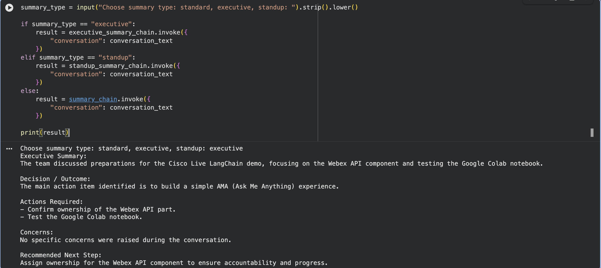{ loading=lazy }

/// caption
Colab cell prompting for the summary type and printing the matching chain's output.
///

##### Step 15 (optional): Add a simple message limit { #t2c-step-15 }

LLMs have a finite **context window**, which means a very long Webex space could blow past what the model can read in one shot. For a small lab dataset this isn't a problem.

##### Step 16 (optional): Send the summary back to Webex { #t2c-step-16 }

Since [Task 1](#module-2a) already wired us up to Webex, we can post the summary back into the same space and let the team see it.

!!! warning "Only do this if your lab proctor allows posting into the lab space"
    The cell below will send a real Webex message to the room ID you set in Task 1. Make sure you are happy posting into that space before running it.

In a new code cell, run:

```py linenums="1"
import requests

def send_message_to_webex(room_id, text):
    url = "https://webexapis.com/v1/messages"

    headers = {
        "Authorization": f"Bearer {WEBEX_ACCESS_TOKEN}",
        "Content-Type": "application/json"
    }

    payload = {
        "roomId": room_id,
        "text": text
    }

    response = requests.post(
        url,
        headers=headers,
        json=payload
    )

    print("Status Code:", response.status_code)

    if response.status_code in [200, 201]:
        print("Summary sent to Webex successfully.")
    else:
        print("Failed to send summary.")
        print(response.text)
```

Then, in a new code cell, send the summary:

```py linenums="1"
send_message_to_webex(
    ROOM_ID,
    "AI Generated Space Summary:\n\n" + space_summary
)
```

You should see `Status Code: 200` (or `201`) and a confirmation, and the message will appear in **Charles's Space** in your Webex App.

#### Summary

In this task, we built a **Space Summary Assistant** for Webex messages.

We:

* reused the Webex messages we ingested in [Task 1](#module-2a)
* formatted the messages into a clean conversation transcript
* created a **summary prompt template** with the sections we wanted
* connected the prompt to the LLM with **LangChain Expression Language**
* parsed the model's response into clean text with `StrOutputParser`
* created different **summary styles** (executive, stand-up) by changing only the prompt
* optionally sent the summary back into the Webex space

<p class="eyebrow sub">Module 2d · Task 4 · ≈ 25 min</p>

### AI Rewrite Assistant { #module-2d data-toc-label="2d · Rewrite assistant" data-task="2d" }


<p class="lede">Build an AI Rewrite Assistant that takes a draft Webex message and rewrites it in different tones.</p>

#### Goal

In [Task 1](#module-2a) we connected to Webex Messaging and retrieved recent messages.

In [Task 2](#module-2b) we built an **Ask Me Anything** experience using RAG.

In [Task 3](#module-2c) we generated structured **space summaries** using LangChain prompt chains.

Now, in **Task 4**, we will build an **AI Rewrite Assistant**. This assistant will take a draft message and rewrite it in different tones, such as:

* **Executive**
* **Friendly**
* **Technical**
* **Customer-ready**
* **Concise**

This is similar to the native **Cisco Smart Rewrite** capability, where AI can help improve a message before it is sent. The goal here is not to replace the built-in Webex AI feature. The goal is to understand how LangChain chains can be used to build this type of experience.

#### What you will learn

By the end of this task, you will understand:

* how **prompt engineering** changes AI output
* how to build **reusable prompt templates**
* how to use **LCEL** (LangChain Expression Language) to wire prompt, model, and parser together

#### Prerequisites

!!! danger "Stop: Tasks 1, 2, and 3 must already be complete in this notebook"
    Task 4 builds on the work you did in Tasks 1, 2, and 3. It will not work without them.

    Before you continue, make sure all of the following are true:

    * You completed [Task 1](#module-2a), [Task 2](#module-2b), and [Task 3](#module-2c).
    * You are working in the **same Google Colab notebook** you used for those tasks.
    * The notebook runtime is still connected (the **Connect** indicator in the top-right shows a green check).

You should already have the following in memory from earlier tasks:

* **`WEBEX_ACCESS_TOKEN`** (loaded in [Task 1](#module-2a))
* **`ROOM_ID`** (set in [Task 1](#module-2a))
* **`llm`** (created in [Task 2](#module-2b))
* **`output_parser`** (created in [Task 3](#module-2c))

!!! note "Don't have `llm` and `output_parser` yet?"
    No problem. This task re-runs the setup for you in [Step 3](#t2d-step-3) below, so you can start cleanly even if you skipped one of the earlier tasks.

#### Steps

!!! warning "Quick check before you start"
    A reminder before you run the first cell:

    * You are working in the **same Google Colab notebook** you used for [Task 1](#module-2a), [Task 2](#module-2b), and [Task 3](#module-2c).
    * The notebook **runtime is connected** (the **Connect** indicator in the top-right shows a green check).
    * Your `OPENAI_API_KEY` is loaded as an environment variable from earlier tasks.

    If any of those are not true, scroll back and finish the earlier tasks first.

##### Step 1: Confirm the required libraries { #t2d-step-1 }

If you already installed the LangChain packages back in [Task 2 (Step 2)](#t2b-step-2) or [Task 3 (Step 1)](#t2c-step-1), you can skip this step.

Otherwise, in a new code cell, run:

```py linenums="1"
!pip install langchain==0.3.27 langchain-core==0.3.72 langchain-openai==0.3.28
```

Task 4 only needs `langchain`, `langchain-core`, and `langchain-openai`.

##### Step 2: Load your OpenAI API key from Colab Secrets { #t2d-step-2 }

If your `OPENAI_API_KEY` was already loaded in an earlier task, you can skip this step.

Otherwise, in a new code cell, run:

```py linenums="1"
import os
from google.colab import userdata

os.environ["OPENAI_API_KEY"] = userdata.get("OPENAI_API_KEY")

if os.environ["OPENAI_API_KEY"]:
    print("OpenAI API key loaded successfully.")
else:
    print("OpenAI API key not found. Please check your Colab Secrets.")
```

**Expected output:**

```text
OpenAI API key loaded successfully.
```

If you see the "not found" message, jump back to [Module 1c](#module-1c), confirm the secret name is exactly `OPENAI_API_KEY`, and make sure the **Notebook access** toggle is on.

##### Step 3: Create the LLM and output parser { #t2d-step-3 }

If you already created `llm` and `output_parser` in [Task 3](#module-2c), you can reuse them and skip this step.

Otherwise, in a new code cell, run:

```py linenums="1"
from langchain_openai import ChatOpenAI
from langchain_core.output_parsers import StrOutputParser

llm = ChatOpenAI(
    model="gpt-4o",
    temperature=0.3
)

output_parser = StrOutputParser()

print("LLM and output parser ready.")
```

For rewrite tasks, a small amount of creativity is useful, so `temperature=0.3` is a good middle ground. It is high enough to vary phrasing, but low enough to keep the meaning faithful.

**Expected output:**

```text
LLM and output parser ready.
```

##### Step 4: Create the rewrite prompt template { #t2d-step-4 }

This is the heart of Task 4. We will write **one** prompt template that can rewrite any Webex message in any tone, for any audience. The prompt is the only thing that knows how to do the rewrite. The model and parser stay the same.

In a new code cell, run:

```py linenums="1"
from langchain_core.prompts import ChatPromptTemplate

rewrite_prompt = ChatPromptTemplate.from_template("""
You are a helpful Webex messaging assistant.

Rewrite the message below using the requested tone and audience.

Tone:
{tone}

Audience:
{audience}

Original message:
{message}

Rules:
- Preserve the original meaning.
- Do not add facts that are not present in the original message.
- Make the message clear, polished, and ready to send in Webex.
- Keep it concise unless the requested tone requires more detail.
- Return only the rewritten message.
""")

print("Rewrite prompt created.")
```

The prompt has three variables:

* **`tone`** (for example "executive", "friendly", "concise")
* **`audience`** (for example "internal team", "customer", "Cisco Live attendees")
* **`message`** (the draft text the user wants rewritten)

Because all three are template variables, the same prompt object will work for any rewrite request.

**Expected output:**

```text
Rewrite prompt created.
```

##### Step 5: Create the rewrite chain { #t2d-step-5 }

Now we connect the prompt, the LLM, and the output parser using **LCEL** (LangChain Expression Language).

In a new code cell, run:

```py linenums="1"
rewrite_chain = rewrite_prompt | llm | output_parser

print("Rewrite chain created.")
```

The flow is:

```text
Prompt Template  →  LLM  →  Output Parser
```

Same LCEL pattern we used for the summary chain in [Task 3](#t2c-step-8). Only the prompt is different.

**Expected output:**

```text
Rewrite chain created.
```

##### Step 6: Test a simple rewrite { #t2d-step-6 }

Let's give it something rough and see what comes back.

In a new code cell, run:

```py linenums="1"
draft_message = "need this done asap can someone check the webex api bit"

rewritten_message = rewrite_chain.invoke({
    "tone": "professional and polite",
    "audience": "internal project team",
    "message": draft_message
})

print(rewritten_message)
```

**Example output:**

```text
Could someone please review the Webex API section at your earliest convenience? Thank you.
```

The original meaning stayed the same. The tone changed.

!!! note "Your output may look different"
    LLMs don't produce the exact same text twice, even at low temperatures. Your rewrite will read a little differently, that's expected. What should stay the same is the **meaning** and the **tone** you asked for.

##### Step 7: Try different tones { #t2d-step-7 }

Now let's keep the message the same and only change the tone, so we can see exactly how much influence the tone variable has.

In a new code cell, run:

```py linenums="1"
tones = [
    "executive",
    "friendly",
    "technical",
    "customer-ready",
    "concise"
]

draft_message = "we are still waiting for the api token and this might delay the demo"

for tone in tones:
    result = rewrite_chain.invoke({
        "tone": tone,
        "audience": "Cisco internal team",
        "message": draft_message
    })

    print("Tone:", tone)
    print(result)
    print("-" * 80)
```

You will see five different versions of the same message, each one shaped by the tone you asked for. Same draft, same model, same audience: only the tone variable changed.

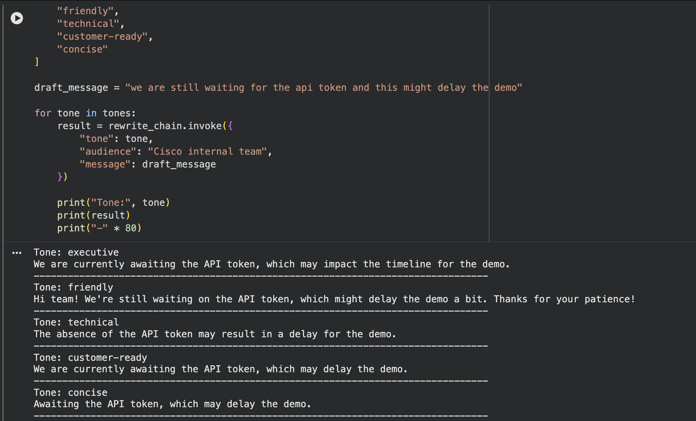{ loading=lazy }

/// caption
Five versions of the same Webex draft message rewritten in different tones (executive, friendly, technical, customer-ready, concise).
///

##### Step 8: Create a reusable rewrite function { #t2d-step-8 }

Let's wrap the chain in a small helper so you don't have to type the dictionary every time.

In a new code cell, run:

```py linenums="1"
def rewrite_webex_message(message, tone="professional", audience="internal team"):
    rewritten_message = rewrite_chain.invoke({
        "tone": tone,
        "audience": audience,
        "message": message
    })

    return rewritten_message
```

Now test it. In a new code cell, run:

```py linenums="1"
result = rewrite_webex_message(
    message="i dont think this is ready yet we need to fix the lab",
    tone="constructive and professional",
    audience="lab delivery team"
)

print(result)
```

You should see a polished, constructive version of the same message.

##### Step 9: Add an interactive input box { #t2d-step-9 }

For a more hands-on Colab experience, you can ask for the message, tone, and audience straight from an input box.

In a new code cell, run:

```py linenums="1"
user_message = input("Enter the message you want to rewrite: ")
user_tone = input("Enter the tone, for example executive, friendly, technical: ")
user_audience = input("Enter the audience, for example manager, customer, internal team: ")

result = rewrite_webex_message(
    message=user_message,
    tone=user_tone,
    audience=user_audience
)

print("\nRewritten message:")
print(result)
```

**Example:**

```text
Enter the message you want to rewrite: can you send the room id now
Enter the tone: polite and professional
Enter the audience: lab participant

Rewritten message:
Could you please share the room ID when you have a moment?
```

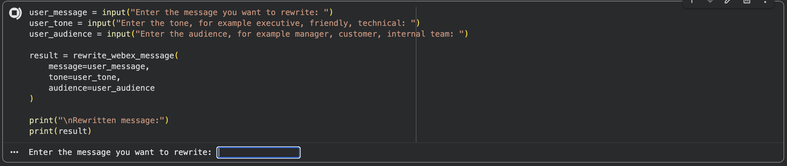{ loading=lazy }

/// caption
Colab interactive rewrite flow with input boxes for the message, tone, and audience, then printing the rewritten output.
///

##### Step 10: Create predefined Webex rewrite styles { #t2d-step-10 }

To make this feel a little closer to a real product experience (think a "Smart Rewrite" menu), let's offer the user a numbered list of preset styles instead of asking them to type a freeform tone.

In a new code cell, run:

```py linenums="1"
rewrite_styles = {
    "1": "professional and polite",
    "2": "executive and concise",
    "3": "friendly and collaborative",
    "4": "technical and precise",
    "5": "customer-ready",
    "6": "short and direct"
}

print("Choose a rewrite style:")
for key, value in rewrite_styles.items():
    print(f"{key}. {value}")
```

Then, in a new code cell, run:

```py linenums="1"
style_choice = input("Select a style number: ")
selected_tone = rewrite_styles.get(style_choice, "professional and polite")

user_message = input("Enter the message you want to rewrite: ")

result = rewrite_webex_message(
    message=user_message,
    tone=selected_tone,
    audience="Webex space participants"
)

print("\nSelected tone:", selected_tone)
print("\nRewritten message:")
print(result)
```

This is a tiny "Smart Rewrite" experience inside Colab: pick a style, paste a message, get a polished version back.

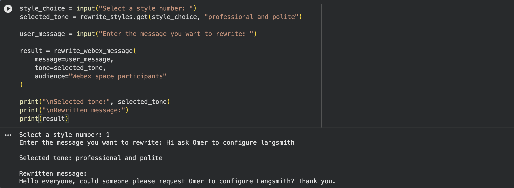{ loading=lazy }

/// caption
Colab Smart Rewrite menu showing the numbered list of preset styles, the user picking one, and the rewritten message printed below.
///

##### Step 11: Create a message improvement chain { #t2d-step-11 }

Sometimes a user doesn't want a *new tone*. They just want their original message cleaned up: spelling, grammar, clarity. That's a different prompt.

In a new code cell, run:

```py linenums="1"
improve_prompt = ChatPromptTemplate.from_template("""
You are a Webex message improvement assistant.

Improve the message below for:
- spelling
- grammar
- clarity
- readability
- professional tone

Rules:
- Preserve the original meaning.
- Do not add new information.
- Keep it suitable for a Webex message.
- Return only the improved message.

Original message:
{message}
""")

improve_chain = improve_prompt | llm | output_parser

print("Message improvement chain created.")
```

Test it. In a new code cell, run:

```py linenums="1"
improved = improve_chain.invoke({
    "message": "hi team omer here, i have craeted the lab and will test a few more things with you before we sent"
})

print(improved)
```

**Example output:**

```text
Hi team, Omer here. I have created the lab and will test a few more things with you before we send.
```

This maps cleanly to the "fix mistakes, polish wording" half of native Smart Rewrite.

##### Step 12 (optional): Generate multiple rewrite options { #t2d-step-12 }

In real Webex-style AI experiences, the user often gets a few rewrite options to pick from instead of just one.

In a new code cell, run:

```py linenums="1"
multi_rewrite_prompt = ChatPromptTemplate.from_template("""
You are a Webex messaging assistant.

Rewrite the original message in three different ways.

Original message:
{message}

Return exactly three options:

Option 1 - Professional:
Option 2 - Friendly:
Option 3 - Concise:

Rules:
- Preserve the original meaning.
- Do not add new facts.
- Keep each option suitable for a Webex message.
""")

multi_rewrite_chain = multi_rewrite_prompt | llm | output_parser

options = multi_rewrite_chain.invoke({
    "message": "can someone test this today i need to know if it works"
})

print(options)
```

**Example output:**

```text
Option 1 - Professional:
Could someone please test this today? I would like to confirm whether it is working as expected.

Option 2 - Friendly:
Could someone give this a quick test today and let me know if it works?

Option 3 - Concise:
Can someone test this today and confirm if it works?
```

!!! note "Your output may look different"
    Because the LLM generates fresh wording every time, your three options will read a little differently. The shape (three labelled options, same meaning, different style) is what stays the same.

##### Step 13 (optional): Rewrite using recent Webex context { #t2d-step-13 }

Here's a nice bridge between **Task 3** and **Task 4**. We can take the **space summary** we generated in [Task 3](#module-2c) and use it as background context, so the rewrite stays consistent with what is actually happening in the space.

This step assumes you still have `space_summary` in memory from Task 3. If not, jump back and re-run [Step 10 of Task 3](#t2c-step-10).

In a new code cell, run:

```py linenums="1"
contextual_rewrite_prompt = ChatPromptTemplate.from_template("""
You are a helpful Webex messaging assistant.

Use the recent Webex space summary as context, then rewrite the draft message.

Recent Webex space summary:
{summary}

Draft message:
{message}

Tone:
{tone}

Rules:
- Preserve the user's intent.
- Use the summary only for context.
- Do not invent new commitments.
- Keep the response suitable for Webex.

Return only the rewritten message.
""")

contextual_rewrite_chain = contextual_rewrite_prompt | llm | output_parser

contextual_message = contextual_rewrite_chain.invoke({
    "summary": space_summary,
    "message": "i will fix this and send it later",
    "tone": "professional and clear"
})

print(contextual_message)
```

**Example output:**

```text
I will review and fix the remaining items in the lab, then share the updated version once it is ready.
```

The point of this step is to show that AI messaging workflows can chain together: the output of one task (a summary) becomes the input of the next (a context-aware rewrite).

##### Step 14 (optional): Send the rewritten message to Webex { #t2d-step-14 }

Since [Task 1](#module-2a) already wired us up to Webex, we can post the rewritten message back into the same space.

!!! warning "Only do this if your lab proctor allows posting into the lab space"
    The cell below will send a real Webex message to the room ID you set in Task 1. Make sure you are happy posting into that space before running it.

First, in a new code cell, define the helper:

```py linenums="1"
import requests

def send_message_to_webex(room_id, text):
    url = "https://webexapis.com/v1/messages"

    headers = {
        "Authorization": f"Bearer {WEBEX_ACCESS_TOKEN}",
        "Content-Type": "application/json"
    }

    payload = {
        "roomId": room_id,
        "text": text
    }

    response = requests.post(
        url,
        headers=headers,
        json=payload
    )

    print("Status Code:", response.status_code)

    if response.status_code in [200, 201]:
        print("Message sent to Webex successfully.")
    else:
        print("Failed to send message.")
        print(response.text)
```

Then, in a new code cell, send the rewritten message:

```py linenums="1"
send_message_to_webex(
    ROOM_ID,
    result
)
```

If you want a small safety net so you don't post by accident, in a new code cell, run:

```py linenums="1"
confirm = input("Send this rewritten message to Webex? Type yes to continue: ")

if confirm.lower() == "yes":
    send_message_to_webex(ROOM_ID, result)
else:
    print("Message not sent.")
```

You should see `Status Code: 200` (or `201`) and a confirmation, and the rewritten message will appear in **Charles's Space** in your Webex App.

#### Summary

In this task, we built an **AI Rewrite Assistant** for Webex messages.

We:

* created a reusable **rewrite prompt template**
* passed variables such as **tone**, **audience**, and **message** into the prompt
* connected the prompt to an LLM and an output parser using **LCEL**
* generated rewritten messages in different styles (executive, friendly, technical, customer-ready, concise)
* created reusable **helper functions** like `rewrite_webex_message(...)`
* added a separate **message improvement chain** for spelling, grammar, and clarity
* optionally generated **multiple rewrite options** at once
* optionally used the previous **space summary** from Task 3 as context for a smarter rewrite
* optionally sent the rewritten message back to Webex


<p class="eyebrow">Wrap-up</p>

## You've built it { #wrap-up data-toc-label="Wrap-up" }

That completes the lab. Across the three parts you went from **using** AI in Webex to **building** it:

- **Part 1:** you turned on the Cisco AI Assistant and used AI across Webex Messaging, Calling and Meetings.
- **Part 2:** you connected Webex Messaging to Codex through the **Webex MCP server**, with Control Hub deciding which tools an AI client may use.
- **Part 3:** you read Webex messages through the API, turned them into LangChain documents, and built your own **Ask Me Anything** (RAG), **space summary** and **rewrite** assistants on top of them.

The pattern you used (**get context → prepare it → prompt an LLM → return a grounded answer**) is the same one behind the native Cisco AI Assistant features. You can now apply it to your own data and workflows.

!!! note "About the lab API key"
    The OpenAI API key provided to you is for **lab use only** and is valid only for the duration of this session. To keep exploring after the lab, use your own OpenAI API key in place of the one provided here.

<a class="next-card" href="../">
  <span class="nc-k">Back to Part 1 · Lab guide</span>
  <span class="nc-t">AI by Design for Collaboration: Webex AI</span>
  <span class="nc-u">← Part 1</span>
</a>
